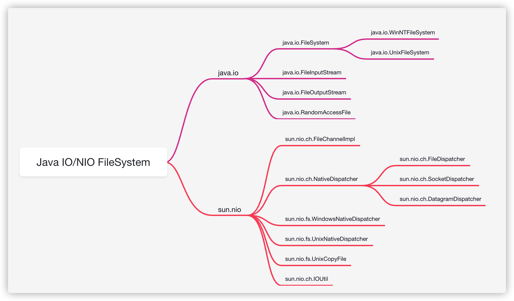

# Java文件系统

## 概念

在Java SE中内置了两类文件系统：`java.io`和`java.nio`，`java.nio`的实现是`sun.nio`，文件系统底层的API实现如下图：


Java存在一个文件系统的对象：`java.io.FileSystem`，对于不同的操作系统有不一样的文件系统,例如`Windows`和`Unix`就是两种不一样的文件系统： `java.io.UnixFileSystem`、`java.io.WinNTFileSystem`。

Java 7 提出了一个基于 NIO 的文件系统，这个 NIO 文件系统和阻塞 IO 文件系统两者是完全独立的。`java.nio.file.spi.FileSystemProvider`对文件的封装和`java.io.FileSystem`同理。NIO 的文件操作在不同的系统的最终实现类也是不一样的，比如 Mac 的实现类是: `sun.nio.fs.UnixNativeDispatcher`,而 Windows 的实现类是`sun.nio.fs.WindowsNativeDispatcher`。

对于一些只防御了`java.io.FileSystem`的 waf，我们可以采用 NIO 文件系统去实现绕过。

## 多种读写文件的方式

### FileInputStream

使用`FileInputStream`实现文件读取：
```java
import java.io.ByteArrayOutputStream;
import java.io.File;
import java.io.FileInputStream;

public class Main extends ClassLoader {
    public static void main(String[] args) throws Exception{
        File file = new File("/etc/passwd");
        // 打开文件对象并创建文件输入流
        FileInputStream fileInputStream = new FileInputStream(file);
        // 定义每次输入流读取到的字节数对象
        int a = 0;
        // 定义缓冲区大小
        byte[] bytes = new byte[1024];
        // 创建二进制输出对象
        ByteArrayOutputStream out = new ByteArrayOutputStream();
        // 循环读取文件内容
        while((a = fileInputStream.read(bytes)) !=-1){
            // 截取缓冲区数组中的内容,(bytes, 0, a)其中的0表示从bytes数组的下标0开始截取，a表示输入流read到的字节数。
            out.write(bytes, 0, a);
        }
        System.out.println(out);
    }
}
```

###  FileOutputStream

使用` FileOutputStream`实现文件写入：
```java
import java.io.File;
import java.io.FileOutputStream;

public class Main extends ClassLoader {
    public static void main(String[] args) throws Exception{
        // 定义写入文件路径
        File file = new File("exp.txt");
        // 定义待写入文件内容
        String content = "exp test";
        // 创建FileOutputStream对象
        FileOutputStream fileOutputStream = new FileOutputStream(file);
        // 写入内容到文件中
        fileOutputStream.write(content.getBytes());
        fileOutputStream.flush();
        fileOutputStream.close();
    }
}
```

###  RandomAccessFile

通过` RandomAccessFile`可以实现读取和写入文件，实现文件读取如下：
```java
import java.io.*;

public class Main extends ClassLoader {
    public static void main(String[] args) throws Exception{
        // 定义文件路径
        File file = new File("/etc/passwd");
        try{
            // 创建RandomAccessFile对象，并设置模式 r
            //r(只读)、rw(读写)、rws(读写内容同步)、rwd(读写内容或元数据同步)四种模式。
            RandomAccessFile randomAccessFile = new RandomAccessFile(file, "r");
            int a = 0;
            byte[] bytes = new byte[1024];
            ByteArrayOutputStream out = new ByteArrayOutputStream();
            while((a = randomAccessFile.read(bytes)) != -1){
                out.write(bytes, 0, a);
            }
            System.out.println(out);

        }catch (IOException e){
            e.printStackTrace();
        }
    }
}
```

实现文件写入如下：
```java
import java.io.*;

public class Main extends ClassLoader {
    public static void main(String[] args) throws Exception{
        // 定义文件路径
        File file = new File("exp.txt");
        // 定义写入内容
        String content = "exp test";
        try{
            // 创建
            RandomAccessFile randomAccessFile = new RandomAccessFile(file, "rw");
            //写入内容
            randomAccessFile.write(content.getBytes());
            randomAccessFile.close();

        }catch (IOException e){
            e.printStackTrace();
        }
    }
}
```

### FileSystemProvider

JDK7新增了 NIO 的`java.nio.file.spi.FileSystemProvider`，利用`FileSystemProvider`我们可以利用支持异步的通道(`Channel`)模式读取文件内容。

`FileSystemProvider`读取文件内容示例：

```java
import java.io.*;
import java.nio.file.Files;
import java.nio.file.Path;
import java.nio.file.Paths;

public class Main extends ClassLoader {
    public static void main(String[] args) throws Exception{
        // 定义文件路径
        Path path = Paths.get("/etc/passwd");
        try{
            byte[] bytes = Files.readAllBytes(path);
            System.out.println(new String(bytes));

        }catch (Exception e){
            e.printStackTrace();
        }
    }
}
```

`java.nio.file.Files`是 JDK7 开始提供的一个对文件读写取非常便捷的 API，其底层是通过调用了`java.nio.file.spi.FileSystemProvider`来实现对文件的读写的。最为底层的实现类则是`sun.nio.ch.FileDispatcherImpl#read0`。

基于NIO的文件读取逻辑是：打开 FileChannel->读取 Channel 内容。

`FileSystemProvider`写入文件内容示例：

```java
import java.nio.file.Files;
import java.nio.file.Path;
import java.nio.file.Paths;

public class Main extends ClassLoader {
    public static void main(String[] args) throws Exception{
        // 定义文件路径
        Path path = Paths.get("exp.txt");
        // 定义文件内容
        String content = "exp test";
        try{
            Files.write(path, content.getBytes());

        }catch (Exception e){
            e.printStackTrace();
        }
    }
}
```

