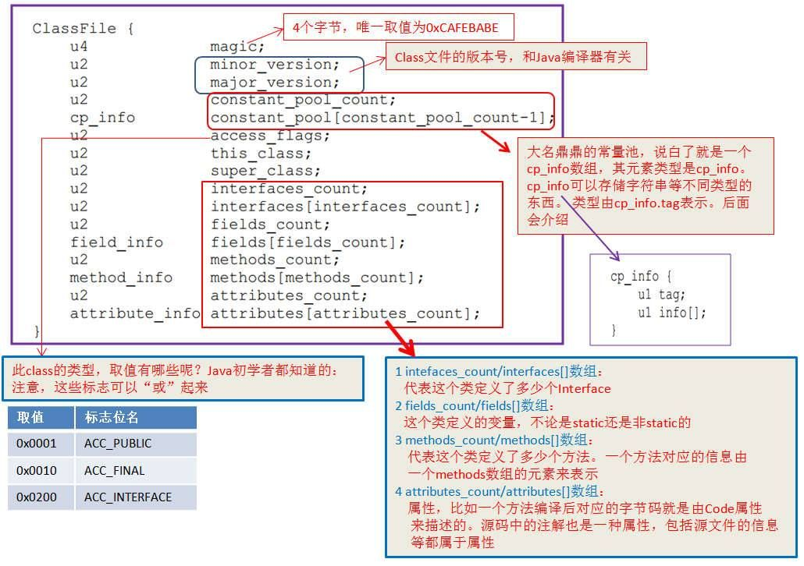

# Java字节码

## 前言

在前面学习已经知道`Java`文件`*.java`通过编译后会产生`*.class`文件，`class`文件有固定的二进制格式，其结构在[第四章：The class File Format](https://docs.oracle.com/javase/specs/jvms/se15/html/jvms-4.html)中写了详细说明。

示例文件`HelloWorld.java`
```java
package com.classfile;

/**
 * Created by dotast on 2022/9/27 16:46
 */
public class HelloWorld{
    public String hello(){
        return "Hello World!";
    }
}
```

编译解析流程为：`HelloWorld.java`-->（经过编译）-->`Java字节码`-->（编译/解析）-->`机器码`

## class文件格式

class 文件的结构是固定的，如下所示：
```java
ClassFile {
    u4 magic;
    u2 minor_version;
    u2 major_version;
    u2 constant_pool_count;
    cp_info constant_pool[constant_pool_count-1];
    u2 access_flags;
    u2 this_class;
    u2 super_class;
    u2 interfaces_count;
    u2 interfaces[interfaces_count];
    u2 fields_count;
    field_info fields[fields_count];
    u2 methods_count;
    method_info methods[methods_count];
    u2 attributes_count;
    attribute_info attributes[attributes_count];
}
```

在 JVM 规范中`u1`、`u2`和`u4`分别表示的是1、2、4个字节的无符号数，可以使用`java.io.DataInputStream`类中的对应方法：`readUnsignedByte`、`readUnsignedShort`、`readInt`方法读取。

除此之外，表结构可以由任意数量的可变长度的项组成，用于表示 class 中的复杂结构，如上述的：`cp_info`、`field_info`、`method_info`和`attribute_info`。

`HelloWorld.class`文件十六进制内容：


下面我们根据上面固定的`class`文件结构分析

### Magic

`class`文件的标识符，也就是文件头，固定值为：`0xCAFEBABE`

### Minor/Major_Version

`class`文件的版本号由主版本号和副版本号组成，`minor_version`为副版本号，`major_version`为主版本号。这里`0x00000037`可以知道版本号为`JDK.11`

版本对应表如下所示：

| JDK版本 | **十进制** | **十六进制** | 发布时间 |
| ------- | ---------- | ------------ | -------- |
| JDK1.1  | 45         | 2D           | 1996-05  |
| JDK1.2  | 46         | 2E           | 1998-12  |
| JDK1.3  | 47         | 2F           | 2000-05  |
| JDK1.4  | 48         | 30           | 2002-02  |
| JDK1.5  | 49         | 31           | 2004-09  |
| JDK1.6  | 50         | 32           | 2006-12  |
| JDK1.7  | 51         | 33           | 2011-07  |
| JDK1.8  | 52         | 34           | 2014-03  |
| Java9   | 53         | 35           | 2017-09  |
| Java10  | 54         | 36           | 2018-03  |
| Java11  | 55         | 37           | 2018-09  |
| Java12  | 56         | 38           | 2019-03  |
| Java13  | 57         | 39           | 2019-09  |
| Java14  | 58         | 3A           | 2020-03  |
| Java15  | 59         | 3B           | 2020-09  |

### constant_pool_count

`constant_pool_count(常量池计数器)`的值等于常量池中的数量加1，注意的是`long`和`double`类型的常量池对象占用两个常量位。

### constant_pool

`constant_pool(常量池)`是一种结构表，代表各种字符串常量、类和接口名称、字段名称以及其他在结构及其子结构中被引用的常量。

其中`cp_info`表示的是常量池对象，数据结构如下：
```java
cp_info {
   u1 tag;
   u1 info[];
}
```

`u1 tag;`表示的是常量池中的存储类型，常量池中的`tag`说明：

| Constant Kind                 | Tag  | `class` file format | Java SE |
| ----------------------------- | ---- | ------------------- | ------- |
| `CONSTANT_Utf8`               | 1    | 45.3                | 1.0.2   |
| `CONSTANT_Integer`            | 3    | 45.3                | 1.0.2   |
| `CONSTANT_Float`              | 4    | 45.3                | 1.0.2   |
| `CONSTANT_Long`               | 5    | 45.3                | 1.0.2   |
| `CONSTANT_Double`             | 6    | 45.3                | 1.0.2   |
| `CONSTANT_Class`              | 7    | 45.3                | 1.0.2   |
| `CONSTANT_String`             | 8    | 45.3                | 1.0.2   |
| `CONSTANT_Fieldref`           | 9    | 45.3                | 1.0.2   |
| `CONSTANT_Methodref`          | 10   | 45.3                | 1.0.2   |
| `CONSTANT_InterfaceMethodref` | 11   | 45.3                | 1.0.2   |
| `CONSTANT_NameAndType`        | 12   | 45.3                | 1.0.2   |
| `CONSTANT_MethodHandle`       | 15   | 51.0                | 7       |
| `CONSTANT_MethodType`         | 16   | 51.0                | 7       |
| `CONSTANT_Dynamic`            | 17   | 55.0                | 11      |
| `CONSTANT_InvokeDynamic`      | 18   | 51.0                | 7       |
| `CONSTANT_Module`             | 19   | 53.0                | 9       |
| `CONSTANT_Package`            | 20   | 53.0                | 9       |

每一种`tag`都对应了不同的数据结构

### access_flags

`access_flags(访问标志)`表示的是某个类或者接口的访问权限和属性。

| 标志名         | 十六进制值 | 描述                                                   |
| -------------- | ---------- | ------------------------------------------------------ |
| ACC_PUBLIC     | 0x0001     | 声明为public                                           |
| ACC_FINAL      | 0x0010     | 声明为final                                            |
| ACC_SUPER      | 0x0020     | 废弃/仅JDK1.0.2前使用                                  |
| ACC_INTERFACE  | 0x0200     | 声明为接口                                             |
| ACC_ABSTRACT   | 0x0400     | 声明为abstract                                         |
| ACC_SYNTHETIC  | 0x1000     | 声明为synthetic，表示该class文件并非由Java源代码所生成 |
| ACC_ANNOTATION | 0x2000     | 标识注解类型                                           |
| ACC_ENUM       | 0x4000     | 标识枚举类型                                           |

同时这些标记可以通过或运算进行组合

###  this_class

`this_class(当前类名称)`表示的是当前`class`文件的类名所在常量池中的索引位置。

### super_class

`super_class(当前类的父类名称)`表示的是当前`class`文件的父类类名所在常量池中的索引位置。`java/lang/Object`类的`super_class`的为0，其他任何类的`super_class`都必须是一个常量池中存在的索引位置。

### interfaces_count

`interfaces_count(当前类继承或实现的接口数)`表示的是当前类继承或实现的接口数。

### interfaces[]

`interfaces[interface_count](接口名称数组)`表示的是所有接口数组。

### fields_count

`fields_count(当前类的成员变量数)`表示的是当前`class`中的成员变量个数。

### fields[]

`field_info fields[fields_count](成员变量数组)`表示的是当前类的所有成员变量，`field_info`表示的是成员变量对象。

`field_info`数据结构：

```java
field_info {
   u2 access_flags;
   u2 name_index;
   u2 descriptor_index;
   u2 attributes_count;
   attribute_info attributes[attributes_count];
}
```

属性结构：

1. `u2 access_flags;`表示的是成员变量的修饰符；
2. `u2 name_index;`表示的是成员变量的名称；
3. `u2 descriptor_index;`表示的是成员变量的描述符；
4. `u2 attributes_count;`表示的是成员变量的属性数量；
5. `attribute_info attributes[attributes_count];`表示的是成员变量的属性信息；

### methods_count

`methods_count(当前类的成员方法数)`表示的是当前`class`中的成员方法个数。

### methods[]

`method_info methods[methods_count](成员方法数组) `表示的是当前`class`中的所有成员方法，`method_info`表示的是成员方法对象

`method_info`数据结构：

```java
method_info {
   u2 access_flags;
   u2 name_index;
   u2 descriptor_index;
   u2 attributes_count;
   attribute_info attributes[attributes_count];
}
```

属性结构：

1. `u2 access_flags;`表示的是成员方法的修饰符；
2. `u2 name_index;`表示的是成员方法的名称；
3. `u2 descriptor_index;`表示的是成员方法的描述符；
4. `u2 attributes_count;`表示的是成员方法的属性数量；
5. `attribute_info attributes[attributes_count];`表示的是成员方法的属性信息；

### attributes_count

`attributes_count(当前类的属性数)`表示当前`class`文件属性表的成员个数。

### attributes[]

`attribute_info attributes[attributes_count](属性数组)`表示的是当前`class`文件的所有属性，`attribute_info`是一个非常复杂的数据结构，存储着各种属性信息。
`attribute_info`数据结构：

```java
attribute_info {
   u2 attribute_name_index;
   u4 attribute_length;
   u1 info[attribute_length];
}
```

`u2 attribute_name_index;`表示的是属性名称索引，读取`attribute_name_index`值所在常量池中的名称可以得到属性名称。

### 总结



