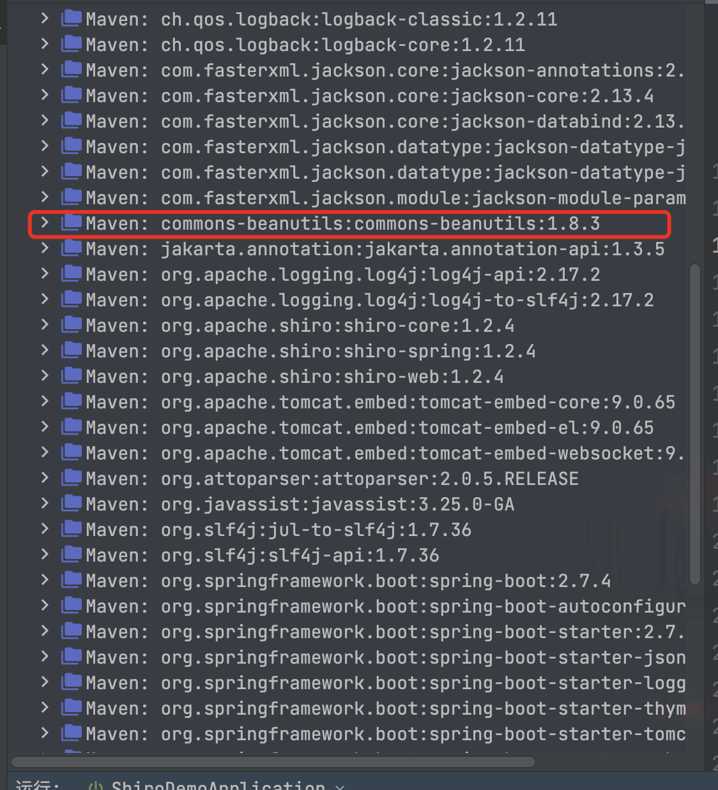
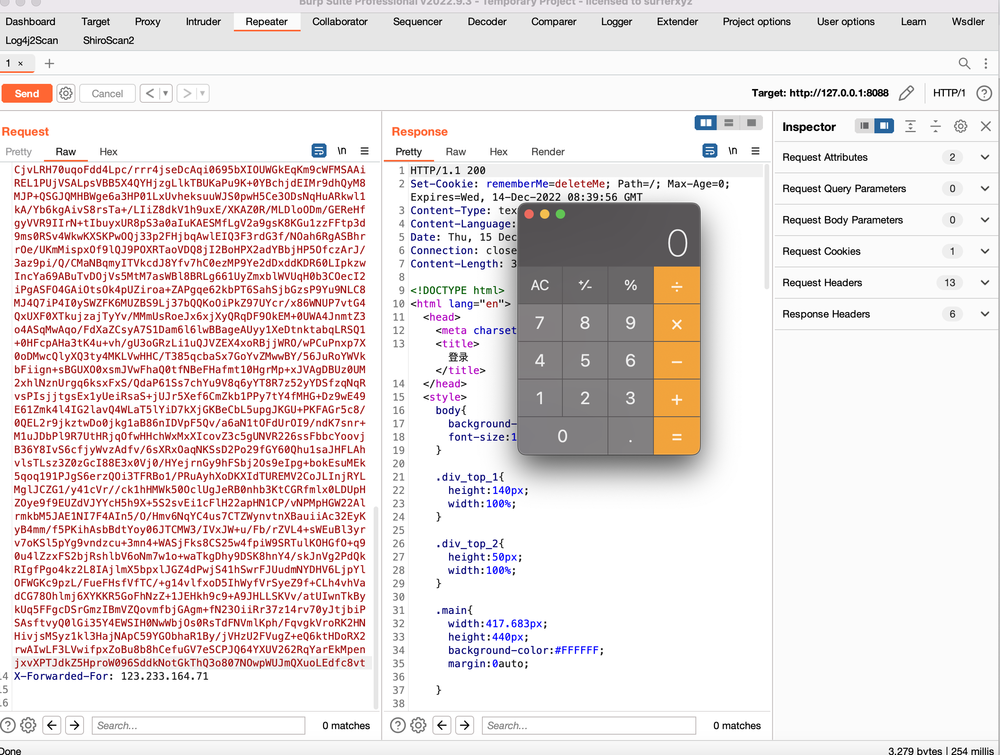

# Shiro自身反序列化利用链

实际场景下，目标系统可能并没有使用`commonc-collections`组件依赖，那么 Shiro-550 漏洞还能利用吗？答案是肯定的。我们把之前的环境中的关于`commonc-collections`的环境删除后，只保留原生 Shiro 依赖，重新加载 pom.xml 文件后，来看看项目的组件库

赫然发现`commons-beanutils`组件库位于其中，那么岂不是可以使用前面 [CommonsBeanutils](../../03-反序列化专区/12-CommonsBeanutils/index.md) 一文中所学习到的 CB 链构造反序列化链 exp？

构造好利用链打过去，结果没有按预期的弹出计算器，查看一下报错

报错是因为本地`BeanComparator`类 serialVersionUID 与目标 serialVersionUID 不一致的原因，最简单的做法就是把本地的依赖版本改成和目标一样的，这里我改成和 Shiro 环境一样的 1.8.3 版本

再次生成 CB 链的序列化 exp 打过去

成功执行我们恶意类中的弹出计算器的命令