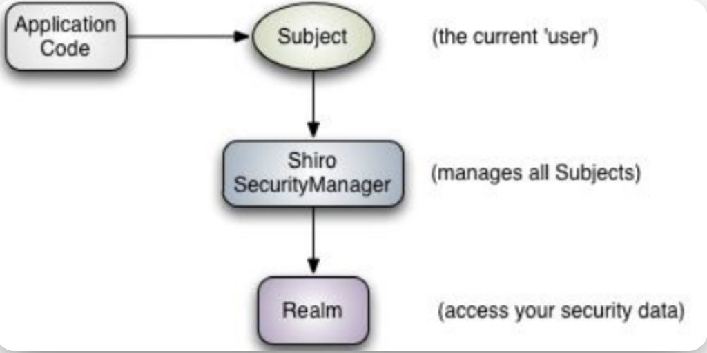
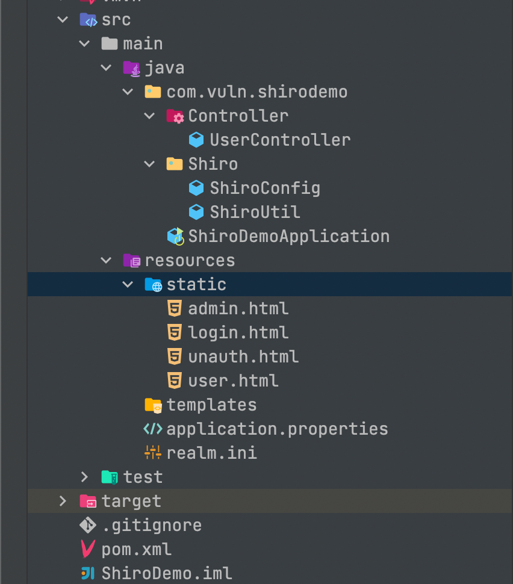
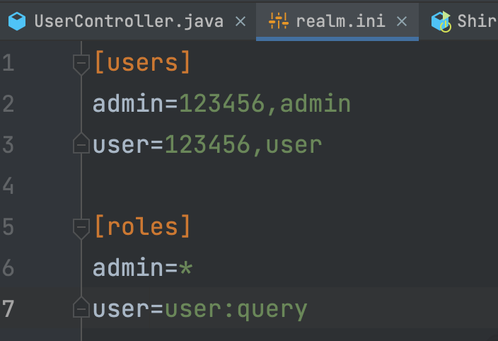
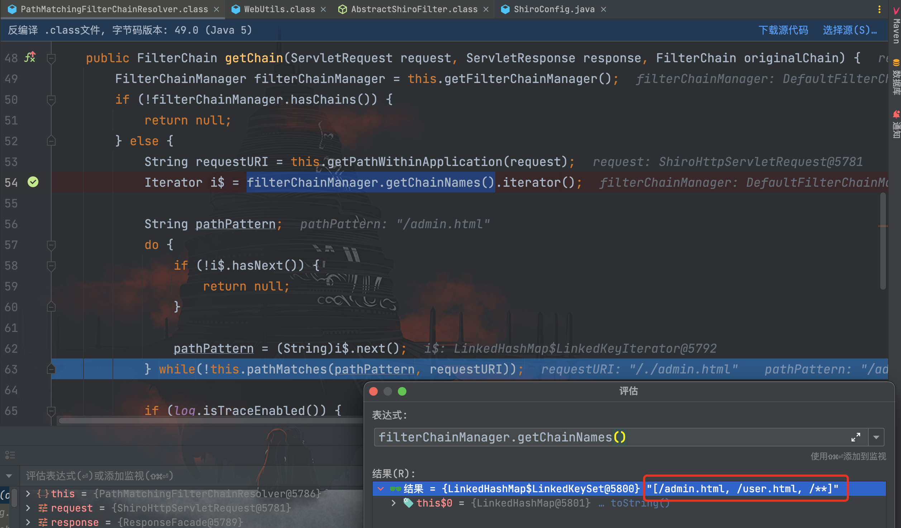
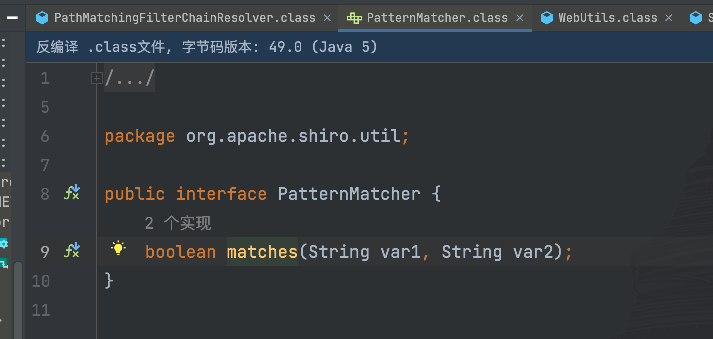
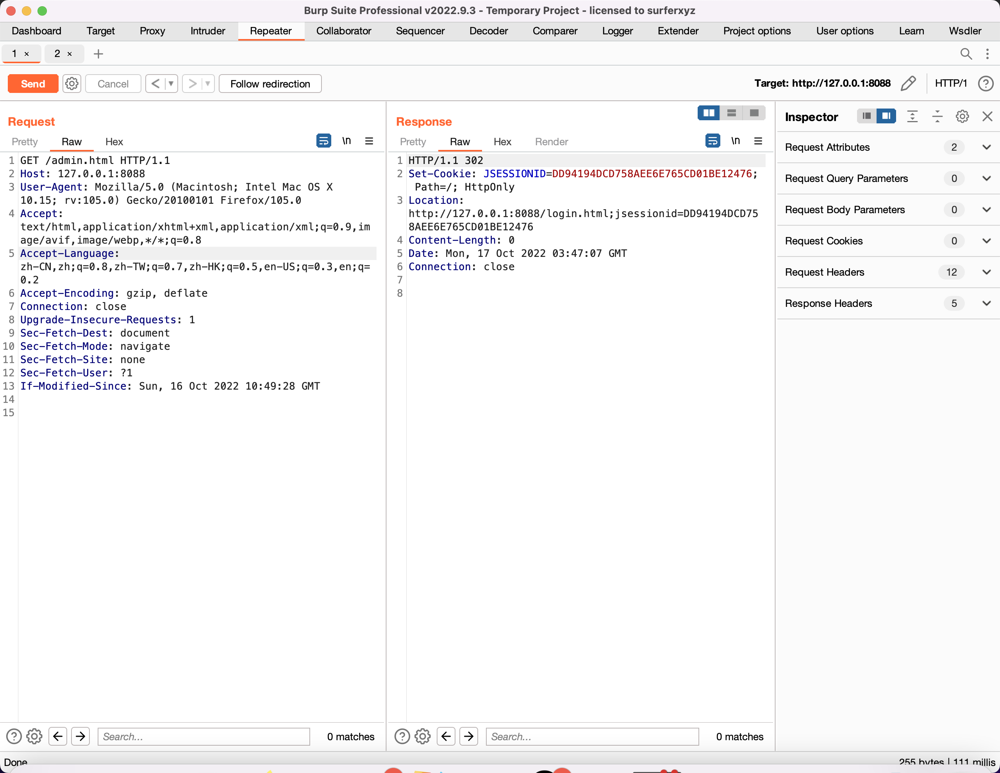

# CVE-2010-3863权限绕过分析

## 初识shiro

> **Apache Shiro™**是一个功能强大且易于使用的 Java 安全框架，它执行身份验证、授权、加密和会话管理。借助 Shiro 易于理解的 API，您可以快速轻松地保护任何应用程序——从最小的移动应用程序到最大的 Web 和企业应用程序。

从官方简介中可以得知 shiro 是一套权限管理框架，在 shiro 框架中有以下三个核心概念模块：`Subject`、`SecurityManger`和`Realms`

- `Subject`：当前正在执行的用户
- `SecurityManger`：安全管理器，管理所有用户的操作，是 shiro 架构的核心
- `Realm`：封装数据源，充当 shiro 与应用程序安全数据之间的桥梁，当需要与安全相关的数据(如用户帐户)进行实际交互以执行身份验证(登录)和授权(访问控制)时，为其提供身份验证或者授权。

因此一次 请求--> 认证 --> 授权的流程为：

1. web 应用程序获取当前的`Subject`并调用该`Subject`的校验方法；
2. `Subject`传递校验到`SecurityManger`进行处理并进行判断；
3. `SecurityManger`调用`Realm`获取配置信息，通过该配置信息判断当前的`Subject`所属角色是否能够进行操作。

## 漏洞环境

该漏洞环境已经上传到 github 仓库上：https://github.com/dota-st/vulnEnv


首先在配置文件`realm.ini`中定义了用户账号密码以及对应角色权限


ShiroConfig
```java
@Configuration
public class ShiroConfig {

    @Bean
    public IniRealm getIniRealm(){
        return new IniRealm("classpath:realm.ini");
    }

    @Bean
    public DefaultWebSecurityManager getDefaultWebSecurityManager(Realm realm){
        return new DefaultWebSecurityManager(realm);
    }


    /*
     * anon：无需认证就可以访问
     * authc：必须认证才能访问
     * user：必须拥有记住我功能才能访问
     * perms：拥有某个资源的权限才能访问
     * role：拥有某个角色的权限才能访问
     * */
    @Bean
    ShiroFilterFactoryBean getShiroFilterFactoryBean(DefaultWebSecurityManager defaultWebSecurityManager) {
        ShiroFilterFactoryBean bean = new ShiroFilterFactoryBean();
        bean.setSecurityManager(defaultWebSecurityManager);
        bean.setLoginUrl("/login.html");
        LinkedHashMap<String, String> map = new LinkedHashMap<String, String>();
        map.put("/admin.html", "authc, roles[admin]");
        map.put("/user.html", "authc, roles[user]");
        map.put("/**", "anon");
        bean.setFilterChainDefinitionMap(map);
        return bean;
    }
}
```

UserController
```java
@Controller
public class UserController {

    @PostMapping("/doLogin")
    public String doLoginPage(@RequestParam("username") String username, @RequestParam("password") String password, @RequestParam(name="rememberme", defaultValue="") String rememberMe){
        if(ShiroUtil.login(username, password)){
            if(ShiroUtil.hasRole("admin")){
                return "redirect:/admin.html";
            } else if (ShiroUtil.hasRole("user")) {
                return "redirect:/user.html";
            }
        }
        return "redirect:/unauth.html";
    }

    @RequestMapping(value={"/"})
    public String helloPage() throws Exception {

        return "redirect:/login.html";
    }
}
```

## 漏洞分析

影响版本：shiro < 1.1.0

shiro 使用`org.apache.shiro.web.filter.mgt.PathMatchingFilterChainResolver#getChain()`方法获取和调用执行的`filter`


在上图中可以看到，通过`getPathWithinApplication()`方法获取到我们传入的请求路径`/./admin.html`，接着通过`filterChainManager.getChainNames()`方法取出我们的配置
```
[/admin.html, /user.html, /**]
```

我们这里跟进一下`getPathWithinApplication()`方法


继续跟进`getPathWithinApplication()`方法


在`getRequestUri()`方法中返回了`/./admin.html`，继续跟进`getRequestUri()`方法


最后会 return 到`decodeAndCleanUriString()`方法，继续跟进该方法


首先对 URL 进行 URL 解码，并对`;`进行截取，查了一下

> `decodeAndCleanUriString()` 是 URL Decode 及针对 JBoss/Jetty 等中间件在 url 处添加 `;jsessionid` 之类的字符串的适配，对 `;` 进行了截取。

接下来`getChain()`方法往下走进行`while`循环，通过`pathMatches()->pathMatcher.matches()`方法进行匹配


通过前面对请求处理的跟踪，可以发现在匹配之前没有对传进来的`URL`进行标准化路径处理，如果构造一下请求路径就有可能绕过权限校验。

回顾一下，我们的配置如下所示，设置`admin.html`文件只有`amdin`用户角色才能访问，同时设置`/**`为`anon`

```java
@Bean
    ShiroFilterFactoryBean getShiroFilterFactoryBean(DefaultWebSecurityManager defaultWebSecurityManager) {
        ShiroFilterFactoryBean bean = new ShiroFilterFactoryBean();
        bean.setSecurityManager(defaultWebSecurityManager);
        bean.setLoginUrl("/login.html");
        LinkedHashMap<String, String> map = new LinkedHashMap<String, String>();
        map.put("/admin.html", "authc, roles[admin]");
        map.put("/user.html", "authc, roles[user]");
        map.put("/**", "anon");
        bean.setFilterChainDefinitionMap(map);
        return bean;
    }
```

访问`admin.html`，因为没有`admin`权限，校验失败故 302 跳转到了`login.html`


访问`/./admin.html`或者`/aa/../admin.html`，在`while`循环中，与前面的`/admin.html`和`/user.html`匹配失败，进而进入了`/**`的匹配范围，成功访问到`admin.html`文件
